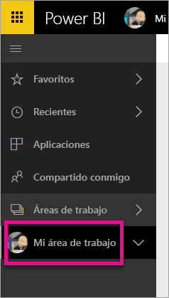
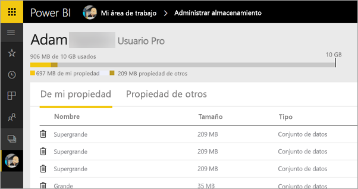
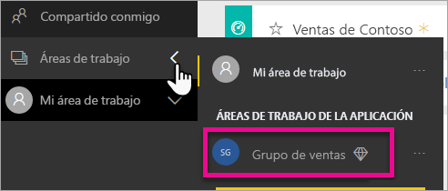
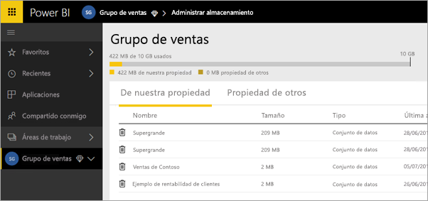
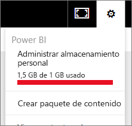

# Administración del almacenamiento de datos en las áreas de trabajo de Power BI

Obtenga información sobre cómo administrar el almacenamiento de datos en el área de trabajo individual o en la nueva, de tal forma que pueda seguir publicando informes y conjuntos de datos.

## Límites de capacidad

Los límites de almacenamiento del área de trabajo, ya sea en Mi área de trabajo o en un área de trabajo de la aplicación, dependen de si dicha área de trabajo está en una [capacidad compartida o Premium](../fundamentals/service-basic-concepts.md#capacities).

### Límites de la capacidad compartida
En el caso de las áreas de trabajo en una capacidad compartida: 

- Hay un límite de almacenamiento de 100 GB por área de trabajo.
- En el caso de las áreas de trabajo de la aplicación, el uso total no puede superar el límite de almacenamiento del inquilino de 10 GB multiplicado por el número de licencias Pro del inquilino.

### Límites de la capacidad Premium
En el caso de áreas de trabajo en una capacidad Premium:
- Hay un límite de 100 TB por capacidad Premium.
- No hay ningún límite de almacenamiento por usuario.

Obtenga información sobre otras características del [modelo de precios de Power BI](https://powerbi.microsoft.com/pricing).

## Qué se incluye en el almacenamiento

Los conjuntos de datos e informes de Excel propios y aquellos elementos que los demás comparten con usted se encuentran incluidos en el almacenamiento de datos. Los conjuntos de datos son cualquiera de los orígenes de datos que ha cargado o a los que se ha conectado. Estos orígenes de datos incluyen los libros de Excel y los archivos de Power BI Desktop que usa. Los siguientes también se incluyen en la capacidad de datos.

* Rangos de Excel anclados al panel.
* Visualizaciones locales de Reporting Services ancladas a un panel de Power BI.
* Imágenes cargadas.

El tamaño del panel que comparta varía en función de lo que tenga anclado. Por ejemplo, si ancla elementos de dos informes que forman parte de dos conjuntos de datos diferentes, el tamaño incluirá ambos conjuntos de datos.

<a name="manage"/>

## Administrar elementos de su propiedad

Consulte el almacenamiento de datos que usa en su cuenta de Power BI y administre su cuenta.

1. Para administrar su propio almacenamiento, vaya a **Mi área de trabajo** en el panel de navegación.
   
    

2. Seleccione el icono de engranaje  en la esquina superior derecha de \> **Administrar almacenamiento personal**.
   
    La barra superior muestra la cantidad del límite de almacenamiento que se ha usado.
   
    
   
    Los informes y los conjuntos de datos se dividen en dos pestañas:
   
    **De mi propiedad:** son informes y conjuntos de datos que ha cargado en la cuenta de Power BI, incluidos los conjuntos de datos de servicio como Salesforce y Dynamics CRM.  

    **Propiedad de otros:** son informes y conjuntos de datos que otras personas han compartido con usted.
1. Para eliminar un informe o un conjunto de datos, seleccione el .

Tenga en cuenta que usted u otra persona puede tener informes y paneles basados en un conjunto de datos. Si elimina el conjunto de datos, los informes y paneles no volverán a funcionar.

## Administración del área de trabajo
1. Seleccione la flecha situada junto a **Áreas de trabajo** \> y el nombre del área de trabajo.
   
    
2. Seleccione el icono de engranaje  de la esquina superior derecha de \> **Administrar almacenamiento del grupo**.
   
    La barra superior muestra la cantidad del límite de almacenamiento del grupo que se ha usado.
   
    
   
    Los informes y los conjuntos de datos se dividen en dos pestañas:
   
    **De nuestra propiedad:** son informes y conjuntos de datos que usted u otra persona han cargado en la cuenta de Power BI del grupo, incluidos los conjuntos de datos de servicio como Salesforce y Dynamics CRM.

    **Propiedad de otros:** son informes y conjuntos de datos que otras personas han compartido con el grupo.

3. Para eliminar un informe o un conjunto de datos, seleccione el .
   
   > [!NOTE]
   > Tenga en cuenta que usted u otra persona en el grupo puede tener informes y paneles basados en un conjunto de datos. Si elimina el conjunto de datos, los informes y paneles no volverán a funcionar.
   
   Cualquier miembro de un área de trabajo con el rol de administrador, miembro o colaborador tiene permisos para eliminar conjuntos de datos e informes de esta.

## Límites de conjunto de datos
Hay un límite de 1 GB por conjunto de datos que se importa en Power BI. Si ha optado por mantener la experiencia de Excel, en lugar de importar los datos, el límite del conjunto de datos será de 250 MB.

## Qué ocurre cuando se alcanza un límite
Cuando alcance el límite de capacidad de datos de lo que puede hacer, se muestran mensajes en el servicio. 

Al seleccionar el icono de engranaje , se ve una barra roja que le indica que ha superado su límite de capacidad de datos.

Este límite también aparece indicado dentro de **Administrar almacenamiento personal**.

 

 Cuando intente realizar una acción que alcance uno de los límites, verá un mensaje que le indicará que está por encima del límite. Puede [administrar](#manage) su almacenamiento para reducir el volumen de almacenamiento y no superar el límite.

 

 ## Pasos siguientes

 ¿Tiene más preguntas? [Pruebe a preguntar a la comunidad de Power BI](https://community.powerbi.com/)
