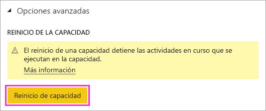
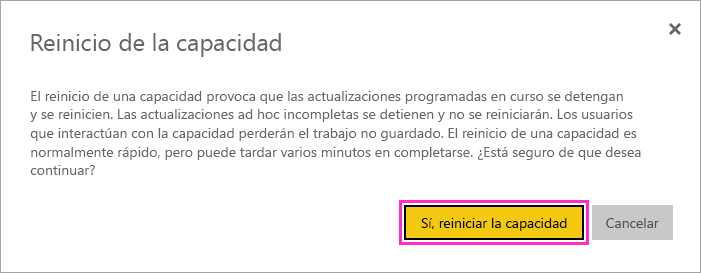

# Reinicio de una capacidad de Power BI Premium

Como administrador de Power BI, es posible que deba reiniciar una capacidad Premium. En este artículo se explica cómo reiniciar una capacidad y se abordan una serie de preguntas sobre el reinicio y el rendimiento.

## ¿Por qué proporciona esta opción Power BI?

Power BI ofrece a los usuarios la posibilidad de realizar análisis complejos en enormes cantidades de datos. Lamentablemente, los usuarios pueden provocar problemas de rendimiento sobrecargando el servicio Power BI con trabajos, escribiendo consultas excesivamente complejas y creando referencias circulares, entre otros.

La capacidad compartida de Power BI ofrece algo de protección en estos casos, imponiendo para ello límites de tamaños de archivo, programaciones de actualización y otros aspectos del servicio. En una capacidad de Power BI Premium, por el contrario, la mayoría de estos límites son más amplios. En consecuencia, un solo informe con una expresión DAX incorrecta o con un modelo muy complejo puede causar problemas de rendimiento enormes. Cuando se procese, el informe puede consumir todos los recursos disponibles en la capacidad. 

Power BI está mejorando constantemente en cuanto al modo en que se protege a los usuarios de la capacidad Premium de estos problemas. También estamos capacitando a los administradores con herramientas para detectar cuándo hay una sobrecarga en las capacidades y el motivo. Para obtener más información, vea la [sesión de formación breve](https://www.youtube.com/watch?v=UgsjMbhi_Bk&feature=youtu.be) y la [sesión de formación prolongada](https://powerbi.tips/2018/07/). Al mismo tiempo, se necesita capacidad para mitigar los problemas importantes cuando se producen. La forma más rápida de mitigar estos problemas consiste en reiniciar la capacidad.

## ¿Es seguro el proceso de reinicio? ¿Se pierden datos?

Todos los datos, definiciones, informes y paneles guardados en la capacidad permanecen totalmente intactos después del reinicio. Cuando se reinicia una capacidad, el motor de actualización detiene temporalmente las actualizaciones programadas y ad hoc en curso, en la mayoría de los casos. Después, se reinician debido a la lógica de reintento de actualización integrada en Power BI. El servicio trata de reintentar cualquier actualización afectada una vez que la capacidad esté disponible. El estado de las actualizaciones no puede cambiar en la interfaz de usuario durante el proceso de reinicio. 

Los usuarios que interactúen con la capacidad perderán el trabajo no guardado durante un proceso de reinicio. Tendrán que actualizar sus exploradores una vez que se haya completado el reinicio.

## ¿Cómo se reinicia una capacidad?

Haga lo siguiente para reiniciar una capacidad.

1. En el portal de administración de Power BI, en la pestaña **Configuración de la capacidad**, vaya a la capacidad. 

1. Agregue la **marca de característica** *CapacityRestart* a la dirección URL de la capacidad: `https://app.powerbi.com/admin-portal/capacities/<YourCapacityId>?capacityRestartButton=true`.

1. En **Configuración avanzada** > **REINICIO DE LA CAPACIDAD**, seleccione **Reinicio de capacidad**.

    

1. En el cuadro de diálogo **Reinicio de capacidad**, seleccione **Sí, reiniciar la capacidad**.

    

## ¿Cómo se puede evitar que surjan problemas en el futuro?

La mejor manera de evitar problemas es concienciar a los usuarios de la importancia de un modelado de datos eficaz. Para más información, vea nuestra [sesión de formación](https://powerbi.tips/2018/07/).

También aconsejamos que [supervise sus capacidades](service-admin-premium-monitor-capacity.md) con regularidad para hallar tendencias que señalen problemas subyacentes. Tenemos previsto lanzar regularmente versiones de la aplicación de supervisión y otras herramientas para que pueda supervisar y administrar las capacidades de forma más eficaz.

## Pasos siguientes

[¿Qué es Power BI Premium?](service-premium-what-is.md)

¿Tiene más preguntas? [Pruebe a preguntar a la comunidad de Power BI](https://community.powerbi.com/)
