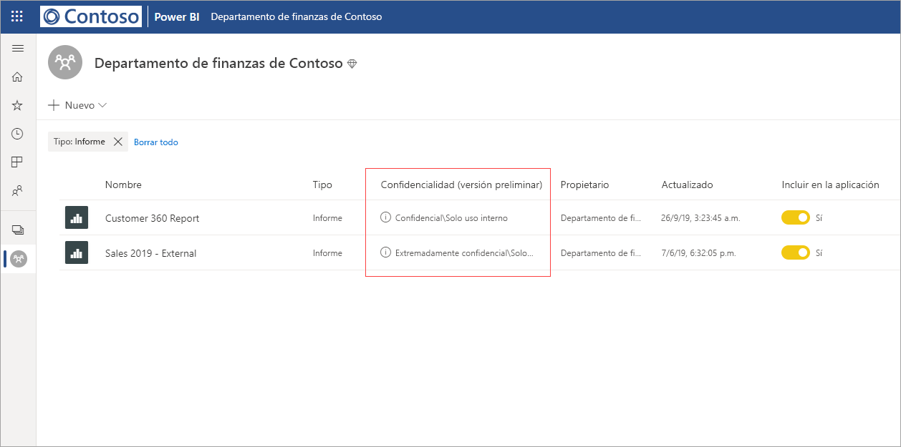
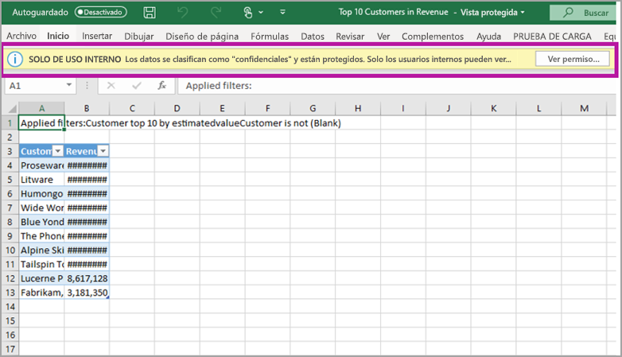

# Protección de datos en Power BI (versión preliminar)

Las empresas modernas tienen normas y requisitos empresariales estrictos sobre cómo administrar y proteger los datos confidenciales. Power BI se puede integrar con Microsoft Information Protection y Microsoft Cloud App Security para proporcionar un mayor control y visibilidad sobre los datos confidenciales en Power BI. 

Con la protección de datos para Power BI, puede hacer lo siguiente:

* Usar las etiquetas de confidencialidad de Microsoft para clasificar y etiquetar el contenido del servicio Power BI (paneles, informes, conjuntos de datos y flujos de datos) con la misma taxonomía usada para clasificar y proteger archivos en Office 365. 

* Aplicar la configuración de protección, como el cifrado o las marcas de agua, cuando exporte los datos desde el servicio Power BI a archivos mediante la aplicación de la etiqueta de confidencialidad y la protección del contenido (Excel, PowerPoint y PDF). 

  Por ejemplo, los usuarios pueden aplicar una etiqueta confidencial a un informe en Power BI. A continuación, cuando los datos se exportan a un archivo de Excel, Power BI aplicará la etiqueta confidencial al archivo. La etiqueta puede cifrar el contenido y aplicar una marca de agua confidencial.

* Usar Microsoft Cloud App Security para supervisar las actividades de Power BI, investigar problemas de seguridad y proteger el contenido de Power BI con Control de aplicaciones de acceso condicional de Microsoft Cloud App Security. 

## Etiquetas de confidencialidad en Power BI

Las etiquetas de confidencialidad se crean y administran en el [Centro de seguridad de Microsoft 365](https://security.microsoft.com/) o el [Centro de cumplimiento de Microsoft 365](https://compliance.microsoft.com/).

Para acceder a las etiquetas de confidencialidad en cualquiera de estos centros, vaya a **Clasificación > Etiquetas de confidencialidad**. Estas etiquetas de confidencialidad se pueden usar en varios servicios de Microsoft, como Azure Information Protection, las aplicaciones de Office y los servicios de Office 365.

> [!IMPORTANT]
> Los clientes de Azure Information Protection tendrán que migrar las etiquetas a uno de los servicios enumerados anteriormente para que las etiquetas de confidencialidad se utilicen en Power BI. Además, las etiquetas de confidencialidad solo se admiten en nubes públicas y no se admiten para los inquilinos de nubes como las nubes soberanas.
>
> Más información sobre la [migración de etiquetas de confidencialidad a Microsoft Information Protection](https://docs.microsoft.com/azure/information-protection/configure-policy-migrate-labels).

## Cómo funcionan las etiquetas de confidencialidad

Cuando se aplica una etiqueta de confidencialidad a un panel, un informe, un conjunto de datos o un flujo de datos de Power BI, es similar a aplicar una *etiqueta* a ese recurso que aporta las ventajas siguientes:
* **Personalizable**: puede crear categorías para diferentes niveles de contenido confidencial en su organización, como personal, público, general, confidencial y extremadamente confidencial.
* **Texto no cifrado**: como la etiqueta está en texto sin cifrar, es fácil que los usuarios sepan cómo tratar el contenido de acuerdo con las instrucciones de la etiqueta de confidencialidad.
* **Persistente**: después de aplicar una etiqueta de confidencialidad al contenido, se aplica a dicho contenido cuando se exporta a los siguientes tipos de archivo admitidos: Excel, PowerPoint y PDF. 

  Esto significa que la etiqueta de confidencialidad sigue al contenido, incluida la configuración de protección y se convierte en la base para la aplicación y el cumplimiento de las directivas. 

## Ejemplo de etiqueta de confidencialidad 

A continuación se muestra un ejemplo rápido de cómo funciona una etiqueta de confidencialidad en Power BI.

1. En el servicio Power BI, se aplica una etiqueta de confidencialidad **Extremadamente confidencial: solo uso interno** a un informe.

   

2. Cuando los datos se exportan a un archivo de Excel desde este informe, la etiqueta de confidencialidad y la protección se aplican al archivo de Excel exportado.

   

En las aplicaciones de Microsoft Office, una etiqueta de confidencialidad aparece como una etiqueta en el correo electrónico o el documento, de forma similar a la imagen anterior.

También puede asignar una clasificación al contenido (como un adhesivo) que se conserva y se mueve con el contenido a medida que se usa y se comparte. Puede usar esta clasificación para generar informes de uso y ver los datos de actividad del contenido confidencial. En función de esta información, siempre puede elegir más adelante aplicar la configuración de protección.

## Uso de etiquetas de confidencialidad en Power BI

Antes de que se puedan habilitar las etiquetas de confidencialidad en Power BI, primero debe completar los siguientes requisitos previos: 

* Asegúrese de que las etiquetas de confidencialidad se han definido en el [Centro de seguridad de Microsoft 365](https://security.microsoft.com/) o el [Centro de cumplimiento de Microsoft 365](https://compliance.microsoft.com/). 
* [Habilite las etiquetas de confidencialidad](service-security-enable-data-sensitivity-labels.md) (versión preliminar) en Power BI.
* Asegúrese de que los usuarios tienen la licencia adecuada:
  * Para ver o aplicar etiquetas en Power BI, los usuarios deben tener una licencia de Azure Information Protection Premium P1 o Premium P2. Microsoft Azure Information Protection se puede adquirir de forma independiente o mediante uno de los conjuntos de licencias de Microsoft. Consulte [Precios de Azure Information Protection](https://azure.microsoft.com/pricing/details/information-protection/) para más detalles.
  * Para aplicar etiquetas a recursos de Power BI, un usuario debe tener una licencia de Power BI Pro además de una de las licencias de Azure Information Protection mencionadas anteriormente. 

## Protección del contenido con Microsoft Cloud App Security

Puede proteger el contenido de Power BI contra fugas o infracciones imprevistas mediante el uso de Microsoft Cloud App Security. Una vez que se ha configurado Microsoft Cloud App Security, los administradores de seguridad pueden supervisar el acceso y la actividad de los usuarios, realizar análisis de riesgos en tiempo real y establecer controles específicos de la etiqueta.

Por ejemplo, las organizaciones pueden usar Microsoft Cloud App Security para configurar una directiva que impida a los usuarios descargar datos confidenciales de Power BI a dispositivos no administrados. Esta configuración permite a los usuarios seguir siendo productivos y conectarse a Power BI desde cualquier lugar, mientras se usa Microsoft Cloud App Security para evitar poner en peligro las acciones del usuario, todo en tiempo real. 

### Requisitos

Para que las etiquetas de confidencialidad puedan usar Microsoft Cloud App Security, se deben cumplir los siguientes requisitos previos: 

* Cloud App Security y Azure Information Protection [deben estar habilitados para el inquilino](https://docs.microsoft.com/cloud-app-security/azip-integration).
* La aplicación [debe estar conectada a Microsoft Cloud App Security](https://docs.microsoft.com/cloud-app-security/enable-instant-visibility-protection-and-governance-actions-for-your-apps).

## Consideraciones y limitaciones

En la lista siguiente se proporcionan algunas limitaciones de las etiquetas de confidencialidad en Power BI:

* Para ver o aplicar las etiquetas de confidencialidad de Microsoft Information Protection en Power BI, es necesaria una licencia de Azure Information Protection Premium P1 o Premium P2. Microsoft Azure Information Protection se puede adquirir de forma independiente o mediante uno de los conjuntos de licencias de Microsoft. Consulte [Precios de Azure Information Protection](https://azure.microsoft.com/pricing/details/information-protection/) para más detalles.
* Las etiquetas de confidencialidad solo se pueden aplicar en paneles, informes, conjuntos de datos y flujos de datos.
* El cumplimiento de los controles de protección y las etiquetas en los archivos exportados solo se admite para los archivos de Excel, PowerPoint y PDF. La etiqueta y la protección no se aplican cuando los datos se exportan a archivos .CSV, suscripción a un correo electrónico, inserción de objetos visuales o impresión.
* Un usuario que exporta un archivo de Power BI tiene permisos para acceder al archivo y editarlo según la configuración de la etiqueta de confidencialidad. El usuario que exporta los datos no obtiene permisos de propietario en el archivo. 
* Actualmente, las etiquetas de confidencialidad no están disponibles para los [informes paginados]( https://docs.microsoft.com/power-bi/paginated-reports-report-builder-power-bi) y los libros.
* Las etiquetas de confidencialidad de los recursos de Power BI solo son visibles en la lista de áreas de trabajo y en las vistas de linaje; las etiquetas no están visibles actualmente en las vistas favoritos, compartido conmigo, reciente o aplicación. Tenga en cuenta, sin embargo, que una etiqueta aplicada a un recurso de Power BI, incluso si no está visible, siempre se conservará en los datos exportados a archivos de Excel, PowerPoint y PDF.
* La *configuración de cifrado de archivos* de la etiqueta de confidencialidad, configurada en el [Centro de seguridad de Microsoft 365](https://security.microsoft.com/) o el [Centro de cumplimiento de Microsoft 365](https://compliance.microsoft.com/), se aplica solo a los archivos que son *exportados desde* Power BI; no se aplica *dentro de* Power BI.
* La [Protección HYOK](https://docs.microsoft.com/azure/information-protection/configure-adrms-restrictions) no se admite para las etiquetas aplicadas en Power BI.
* La visualización y la aplicación de etiquetas en las aplicaciones de Office tienen [requisitos de licencias](https://docs.microsoft.com/microsoft-365/compliance/get-started-with-sensitivity-labels#subscription-and-licensing-requirements-for-sensitivity-labels).
* Las etiquetas de confidencialidad solo se admiten para los inquilinos en la nube global (pública). No se admiten las etiquetas de confidencialidad para los inquilinos de otras nubes.
* No se admiten las etiquetas de confidencialidad para las aplicaciones de plantilla. Las etiquetas de confidencialidad establecidas por el creador de la aplicación de plantilla se quitan cuando se extrae la aplicación y se instala. Asimismo, al actualizar la aplicación, las etiquetas de confidencialidad agregadas a los artefactos de una aplicación de plantilla instalada por el consumidor de la aplicación se pierden (se restablecen vacías).
* Power BI no admite etiquetas de confidencialidad de los tipos de protección **No reenviar** y **Ad hoc**.

## Pasos siguientes

En este artículo se proporciona una introducción a la protección de datos en Power BI. En los artículos siguientes se proporcionan más detalles acerca de la protección de datos en Power BI. 

* [Habilitación de etiquetas de confidencialidad de datos en Power BI](service-security-enable-data-sensitivity-labels.md)
* [Aplicación de etiquetas de confidencialidad de datos en Power BI](../designer/service-security-apply-data-sensitivity-labels.md)
* [Uso de controles de Microsoft Cloud App Security en Power BI](service-security-using-microsoft-cloud-app-security-controls.md)
* [Informe de métricas de protección de datos](service-security-data-protection-metrics-report.md)