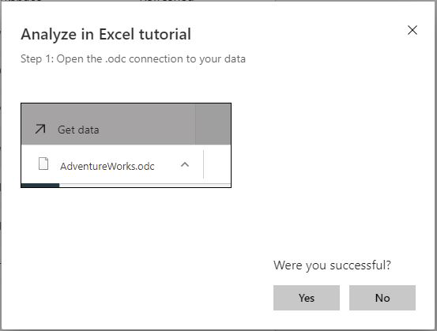

# Tutorial: Uso de la característica Analizar en Excel de Power BI partiendo de Excel

Su organización usa Power BI para compartir el acceso a los datos. La característica Analizar en Excel de Power BI se inicia desde Excel para crear tablas dinámicas y gráficos dinámicos en Excel. Estos elementos pueden aportar más contexto al análisis o reducir el tiempo necesario para encontrar e importar conjuntos de datos relevantes.

Para empezar a trabajar con un conjunto de datos de Power BI, en Excel, seleccione "Analizar en Excel". Se le guiará por los pasos para crear una tabla dinámica que use los datos.  

Vuelva a la página Conjuntos de datos para encontrar conjuntos de datos adicionales compartidos por su organización.

Si encuentra problemas en cualquier momento, seleccione **No** en el paso correspondiente del flujo siguiente y proporcione comentarios en el formulario vinculado.  

En este tutorial, obtendrá información sobre cómo:

> [!div class="checklist"]
> * Descargue un archivo ODC de la página Conjuntos de datos de Power BI.
> * Habilite el acceso al conjunto de datos desde Excel.
> * Empezar a usar el conjunto de datos para crear tablas dinámicas, gráficos y hojas de cálculo

## Requisitos previos

Para completar este tutorial, necesita:

* Una cuenta de Power BI. Si no está registrado en Power BI, [regístrese para obtener una evaluación gratuita](https://app.powerbi.com/signupredirect?pbi_source=web) antes de empezar.

* Asegúrese de que está familiarizado con todos los pasos indicados en el tutorial [Introducción al servicio Power BI](https://docs.microsoft.com/power-bi/service-get-started).

* Necesitará un conjunto de datos de Power BI Premium y una licencia de Power BI Pro. Para más información, visite [¿Qué es Power BI Premium?](https://docs.microsoft.com/power-bi/service-premium-what-is).

* Puede encontrar una lista completa de los requisitos previos en el documento completo [Analizar en Excel](https://docs.microsoft.com/power-bi/service-analyze-in-excel#requirements).

* Una [suscripción a Microsoft Office E5](https://www.microsoft.com/microsoft-365/business/office-365-enterprise-e5-business-software?activetab=pivot%3aoverviewtab) activa

## Comenzar

A partir de Excel, seleccione la opción para crear tablas dinámicas con datos compartidos de Power BI y vaya a la página Conjuntos de datos de Power BI.

Al usar el flujo de trabajo de Analizar en Excel, verá varios mensajes que le guían; indique si ha completado cada paso para continuar. Si surgen problemas en cualquier paso, seleccione **No** y proporcione sus comentarios en el formulario correspondiente.

## Descarga y apertura del archivo ODC

Elija el conjunto de datos de la lista y el área de trabajo asociado correspondientes y, luego, haga clic en Analizar en Excel. Power BI crea un archivo ODC y lo descarga del explorador al equipo.

Cuando abre el archivo en Excel, aparece una lista vacía de tablas dinámicas y campos con las tablas, los campos y las medidas del conjunto de datos de Power BI. Puede crear tablas dinámicas o gráficos y analizar ese conjunto de datos igual que lo haría con un conjunto de datos local en Excel.

## Habilitación de conexiones de datos

Para analizar los datos de Power BI en Excel, es posible que se le pida que confíe en la conexión. Los administradores pueden deshabilitar el uso de Analizar en Excel con conjuntos de datos locales en bases de datos de Analysis Services desde el portal de administración de Power BI.

## Instalación de actualizaciones y autenticación

Es posible que también tenga que autenticarse con su cuenta de Power BI la primera vez que abra un nuevo archivo ODC.  Si tiene problemas, consulte el documento completo [Analizar en Excel](https://docs.microsoft.com/power-bi/service-analyze-in-excel#sign-in-to-power-bi ) para más información o haga clic en No durante el flujo de trabajo.

## Analizar todo

De forma similar a otros libros locales, Analizar en Excel permite crear tablas dinámicas y gráficos, agregar datos y crear diferentes hojas de cálculo con vistas de los datos. Analizar en Excel expone todos los datos de nivel de detalle a cualquier usuario con permiso para el conjunto de datos. Puede guardar este libro, pero no puede publicarlo ni importarlo en Power BI ni compartirlo con otros usuarios de su organización. Para más información y conocer otros casos de uso, consulte [Analizar en Excel](https://docs.microsoft.com/power-bi/service-analyze-in-excel#analyze-away).

## Limpieza de recursos

Las interacciones con el servicio Power BI y la página Conjuntos de datos se deben limitar a descargar el archivo ODC y hacer clic en el flujo de trabajo. Si tiene problemas con cualquiera de estos pasos, indique **No** en el paso adecuado y proporcione comentarios en el formulario vinculado. El formulario contiene un vínculo para informarse mejor sobre el problema. Vuelva a visitar la página Conjuntos de datos para procesar o seleccionar otro conjunto de datos.

## Pasos siguientes

Puede que también esté interesado en los siguientes artículos:

* [Uso de la obtención de detalles de varios informes en Power BI Desktop](https://docs.microsoft.com/power-bi/desktop-cross-report-drill-through)

* [Uso de segmentaciones de datos en Power BI Desktop](https://docs.microsoft.com/power-bi/visuals/power-bi-visualization-slicers)
