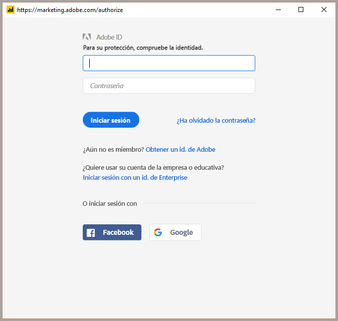
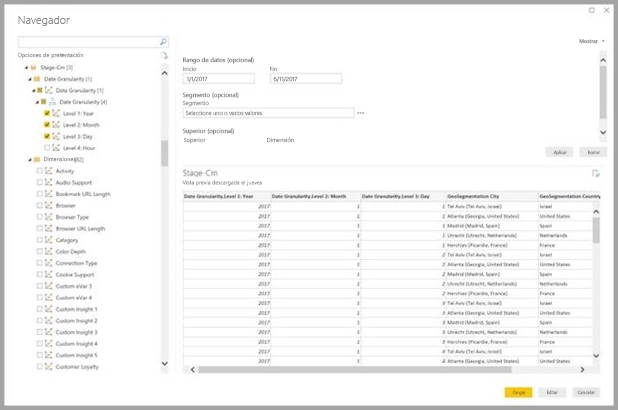
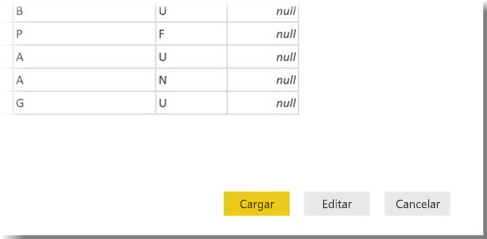

# Conectarse a Adobe Analytics en Power BI Desktop 
En **Power BI Desktop** puede conectarse a **Adobe Analytics** y usar los datos subyacentes igual que cualquier otro origen de datos en Power BI Desktop. 

## Conectarse a los datos de Adobe Analytics
Para conectarse a datos de **Adobe Analytics**, seleccione **Obtener datos** en la cinta **Inicio** de Power BI Desktop. Seleccione **Servicios en línea** en las categorías de la izquierda y verá **Conector de Adobe Analytics**.

En la ventana de **Adobe Analytics** que aparecerá, haga clic en el botón **Iniciar sesión** y proporcione sus credenciales para iniciar sesión en su cuenta de Adobe Analytics. Aparecerá la ventana de inicio de sesión de Adobe, como se muestra en la siguiente imagen.

Cuando se le pida, escriba su nombre de usuario y contraseña. Una vez establecida la conexión, puede seleccionar varias dimensiones y medidas y obtener una vista previa de ellas en el cuadro de diálogo **Navegador** de Power BI para crear una salida tabular. También puede proporcionar los parámetros de entrada necesarios para los elementos seleccionados. 

Puede **Cargar** la tabla seleccionada, que muestra la tabla completa en **Power BI Desktop**, o bien puede **Editar** la consulta, que abre **Editor de consultas** para que pueda filtrar y refinar el conjunto de datos que desea utilizar y, a continuación, cargar ese conjunto de datos refinado en **Power BI Desktop**.

## Pasos siguientes
Hay todo tipo de datos a los que puede conectarse con Power BI Desktop. Para obtener más información sobre orígenes de datos, consulte los siguientes recursos:

* [¿Qué es Power BI Desktop?](../fundamentals/desktop-what-is-desktop.md)
* [Orígenes de datos en Power BI Desktop](desktop-data-sources.md)
* [Combinar datos y darles forma con Power BI Desktop](desktop-shape-and-combine-data.md)
* [Connect to Excel workbooks in Power BI Desktop (Conectarse a libros de Excel en Power BI Desktop)](desktop-connect-excel.md)   
* [Especificar datos directamente en Power BI Desktop](desktop-enter-data-directly-into-desktop.md)   
