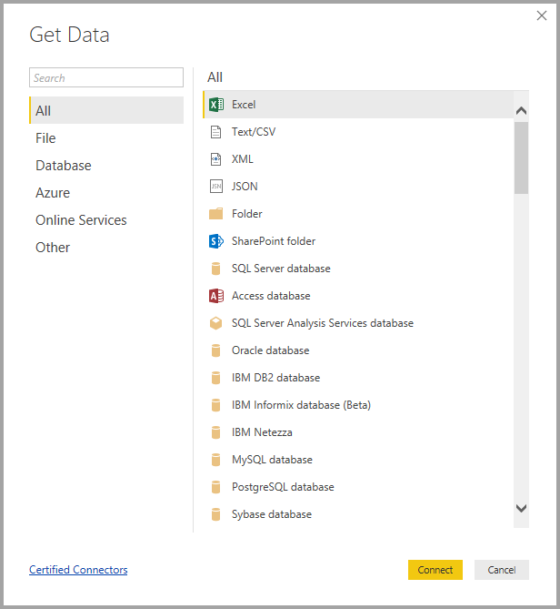

# Inicio rápido: Conectarse a los datos en Power BI Desktop

En este inicio rápido, se conecta a datos mediante Power BI Desktop, que es el primer paso para compilar modelos de datos y crear informes.

Si no está registrado para Power BI, [registrarse para obtener una versión de prueba gratuita](https://app.powerbi.com/signupredirect?pbi_source=web) antes de empezar.

## Requisitos previos

Para completar los pasos de este artículo, necesitará los siguientes recursos:

* Descargar e instalar Power BI Desktop, que es una aplicación gratuita que se ejecuta en el equipo local. Puede [descargar Power BI Desktop](https://powerbi.microsoft.com/desktop) directamente,o bien puede obtenerlo en [Microsoft Store](https://aka.ms/pbidesktopstore).
* [Descargue este libro de Excel de ejemplo](https://go.microsoft.com/fwlink/?LinkID=521962) y cree una carpeta denominada *C:\PBID-qs* donde puede almacenar el archivo de Excel. En los pasos posteriores de este inicio rápido se supone que esa es la ubicación del archivo para el libro de Excel descargado.
* Para muchos conectores de datos de Power BI Desktop, se requiere Internet Explorer 10 (o posterior) para la autenticación.

## Inicio de Power BI Desktop

Una vez que instale Power BI Desktop, inicie la aplicación, para que se ejecute en el equipo local. Se le mostrará un tutorial de Power BI. Siga el tutorial o cierre el cuadro de diálogo para empezar con un lienzo en blanco. En el lienzo se crean objetos visuales e informes a partir de los datos.

## Conexión a datos

Con Power BI Desktop puede conectarse a muchos tipos de datos diferentes. Estos orígenes incluyen orígenes de datos básicos, como un archivo de Microsoft Excel. Puede conectarse a servicios en línea que contienen todo tipo de datos, como Salesforce, Microsoft Dynamics, Azure Blob Storage y muchos más.

Para conectarse a datos, seleccione **Obtener datos** desde la cinta de opciones **Inicio**.

Aparecerá la ventana **Obtener datos**. Puede elegir entre muchos orígenes de datos diferentes a los que poder conectar Power BI Desktop. En este inicio rápido, use el libro de Excel que descargó en [Requisitos previos](#prerequisites).

Como este origen de datos es un archivo de Excel, seleccione **Excel** en la ventana **Obtener datos** y luego elija el botón **Conectar**.

Power BI le pedirá que proporcione la ubicación del archivo de Excel al que se quiere conectar. El archivo descargado se denomina *Ejemplo financiero*. Seleccione el archivo y luego elija **Abrir**.

Power BI Desktop carga el libro, lee su contenido y muestra los datos disponibles en el archivo en la ventana **Navegador**. En esa ventana, puede elegir qué datos quiere cargar en Power BI Desktop. Seleccione las tablas marcando las casillas situadas junto a cada tabla que quiere importar. Importe ambas tablas disponibles.

Una vez realizadas las selecciones, haga clic en **Cargar** para importar los datos en Power BI Desktop.

## Visualización de los datos en el panel Campos

Una vez cargadas las tablas, se muestran los datos en el panel **Campos**. Seleccione la flecha que está junto al nombre de cada tabla para expandirlas. En la siguiente imagen, se expande la tabla *financials*, que muestra cada uno de sus campos.

Y ya está. Se ha conectado a los datos de Power BI Desktop, ha cargado esos datos y ahora puede ver todos los campos disponibles en las tablas.

## Pasos siguientes

Puede hacer muchísimas cosas con Power BI Desktop tras conectarse a los datos. Puede crear objetos visuales e informes. Eche un vistazo a los siguientes recursos para ayudarlo a empezar:

* [Introducción a Power BI Desktop](../fundamentals/desktop-getting-started.md)
