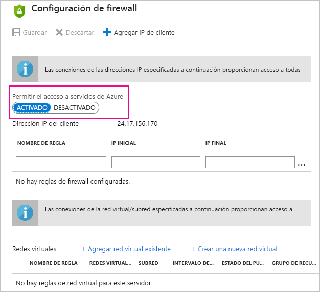

# Solución de problemas de actualización programada de bases de datos SQL de Azure en Power BI

Para obtener información detallada sobre la actualización, consulte [Actualizar datos en Power BI](refresh-data.md) y [Configuración de actualización programada](refresh-scheduled-refresh.md).

Al configurar la actualización programada de una base de datos de Azure SQL, si se produce un error con el código de error 400 al editar las credenciales, intente lo siguiente para configurar la regla de firewall apropiada:

1. Inicie sesión en [Azure Portal](https://portal.azure.com).

1. Vaya a la base de datos de Azure SQL para la que está configurando la actualización.

1. En la parte superior de la hoja **Información general**, seleccione **Establecer el firewall del servidor**.

1. En la hoja **Configuración del firewall**, asegúrese de que la opción **Permitir el acceso a servicios de Azure** esté establecida en **Activar**.

      

¿Tiene más preguntas? [Pruebe la comunidad de Power BI](https://community.powerbi.com/)
