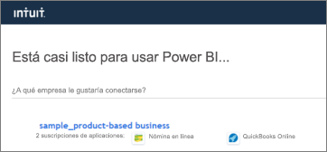

# Conexión a QuickBooks Online con Power BI
Cuando conecta sus datos de QuickBooks Online en Power BI, inmediatamente obtiene un panel de Power BI e informes de Power BI que ofrecen información sobre el flujo de efectivo, la rentabilidad y los clientes de su negocio. Use el panel y los informes como están, o bien personalícelos para resaltar la información que más le interesa. Los datos se actualizan automáticamente una vez al día.

Conéctese a la [aplicación de plantilla de QuickBooks Online](https://dxt.powerbi.com/getdata/services/quickbooks-online) para Power BI.

>[!NOTE]
>Para importar los datos de QuickBooks Online en Power BI, debe ser administrador en su cuenta de QuickBooks Online e iniciar sesión con sus credenciales de cuenta de administrador. No se puede usar este conector con el software QuickBooks Desktop. 

## Cómo conectarse

[!INCLUDE [powerbi-service-apps-get-more-apps](../includes/powerbi-service-apps-get-more-apps.md)]

3. Seleccione **QuickBooks Online** y luego **Obtener**.
   
   

4. En **¿Quiere instalar esta aplicación de Power BI?** , seleccione **Instalar**.

    

4. En el panel **Aplicaciones**, seleccione el icono de **QuickBooks**.

   

6. En **Empezar a trabajar con la nueva aplicación**, seleccione **Conectar**.

    

4. Seleccione **oAuth2** en el Método de autenticación y seleccione **Iniciar sesión**. 
5. Cuando se le solicite, escriba sus credenciales de QuickBooks Online y siga el proceso de autenticación de QuickBooks Online. Si ya inició sesión en QuickBooks Online con el explorador, no se le solicitarán las credenciales.
   >[!NOTE]
   >Necesita credenciales de administrador para su cuenta de QuickBooks Online.
6. Seleccione la compañía que le gustaría conectar con Power BI en la pantalla siguiente.
   
   

7. Seleccione **Autorizar** en la pantalla siguiente para empezar el proceso de importación. Este proceso puede tardar varios minutos según el tamaño de los datos de su compañía. 
   
   
   
8. Una vez que Power BI importe los datos, verá la lista de contenidos de su aplicación de QuickBooks: un nuevo panel, el informe y el conjunto de datos.
9. Seleccione el panel de QuickBooks para iniciar el proceso de exploración. Este es el panel que Power BI creó automáticamente para mostrar los datos importados.

    

**¿Qué más?**

* Pruebe a [hacer una pregunta en el cuadro de preguntas y respuestas](../consumer/end-user-q-and-a.md), en la parte superior del panel.
* [Cambie los iconos](../create-reports/service-dashboard-edit-tile.md) en el panel.
* [Seleccione un icono](../consumer/end-user-tiles.md) para abrir el informe subyacente.
* Aunque el conjunto de datos se programará para actualizarse diariamente, puede cambiar la programación de actualización o intentar actualizar a petición mediante **Actualizar ahora**

## Solución de problemas
**"Vaya, se ha producido un error.**

Si recibe este mensaje después de seleccionar **Autorizar**:

"Lo sentimos, se ha producido un error. Cierre esta ventana y vuelva a intentarlo.

Otro usuario de la compañía ya se suscribió a la aplicación. Póngase en contacto con [correo electrónico del administrador] para realizar cambios en esta suscripción".

Este error significa que otro administrador de su compañía ya se conectó a los datos de su compañía con Power BI. Pídale a dicho administrador que le comparta el panel. Actualmente, solo un usuario administrador puede conectar determinado conjunto de datos empresarial de QuickBooks Online con Power BI. Después de que Power BI crea el panel, el administrador puede compartirlo con varios colegas en los mismos inquilinos de Power BI.

**"Esta aplicación no está configurada para permitir conexiones desde su país"**

Actualmente Power BI solo admite las ediciones de Estados Unidos de QuickBooks Online. 

## Pasos siguientes
[¿Qué es Power BI?](../fundamentals/power-bi-overview.md)

[Conceptos básicos para diseñadores en el servicio Power BI](../fundamentals/service-basic-concepts.md)
