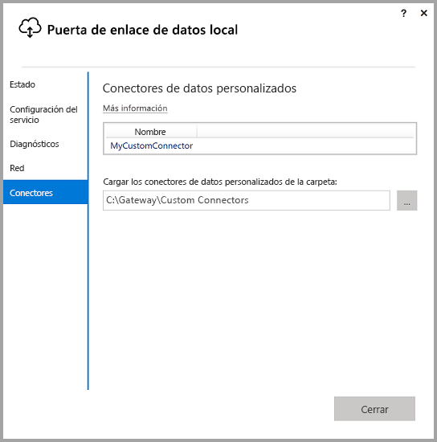

# Uso de conectores de datos personalizados con la puerta de enlace de datos local

[!INCLUDE [gateway-rewrite](../includes/gateway-rewrite.md)]

Con los conectores de datos de Power BI, puede conectarse y acceder a datos desde una aplicación, un servicio o un origen de datos. Puede desarrollar conectores de datos personalizados y usarlos en Power BI Desktop.

Para obtener más información sobre cómo desarrollar conectores de datos personalizados para Power BI, consulte la [página de GitHub del SDK del conector de datos](https://aka.ms/dataconnectors). En este sitio se incluye información sobre cómo empezar a trabajar y ejemplos para Power BI y Power Query.

Al compilar informes en Power BI Desktop en los que se usan conectores de datos personalizados, puede utilizar la puerta de enlace de datos local para actualizar esos informes desde el servicio Power BI.

## Habilitación y uso de esta funcionalidad

Al instalar la versión de julio de 2018 de la puerta de enlace de datos local o una versión posterior, aparece una pestaña **Conectores** en la aplicación de puerta de enlace de datos local. En el cuadro **Cargar los conectores de datos personalizados de la carpeta**, seleccione la carpeta a la que puede acceder el usuario que ejecuta el servicio de puerta de enlace. El usuario predeterminado es *NT SERVICE\PBIEgwService*. La puerta de enlace carga automáticamente los archivos de conector personalizados ubicados en esa carpeta. Aparecen en la lista de conectores de datos.

Si usa la puerta de enlace de datos local (modo personal), puede cargar el informe de Power BI en el servicio Power BI y usar la puerta de enlace para actualizarlo.

Para la puerta de enlace de datos local, tiene que crear un origen de datos para el conector personalizado. En la página de configuración de la puerta de enlace en el servicio Power BI, debería ver una opción al seleccionar el clúster de puerta de enlace para permitir el uso de conectores personalizados con este clúster. Asegúrese de que todas las puertas de enlace del clúster tienen la versión de actualización de julio de 2018 o una posterior para que esta opción esté disponible. Seleccione esa opción para habilitar el uso de conectores personalizados con este clúster.

Si esta opción está habilitada, verá los conectores personalizados como orígenes de datos disponibles que se pueden crear en este clúster de puerta de enlace. Una vez que cree un origen de datos que use el nuevo conector personalizado, podrá actualizar los informes de Power BI mediante ese conector personalizado en el servicio Power BI.

## Consideraciones y limitaciones

* Asegúrese de que el servicio de la puerta de enlace en segundo plano puede acceder a la carpeta que cree. Normalmente, no se puede acceder a las carpetas que hay en la carpeta de Windows o del sistema de los usuarios. La aplicación de puerta de enlace de datos local muestra un mensaje si no se puede acceder a la carpeta. Esta instrucción no se aplica a la puerta de enlace de datos local (modo personal).
* Para que los conectores personalizados funcionen con la puerta de enlace de datos local, tienen que implementar una sección "TestConnection" en el código del conector personalizado. Esta sección no es necesaria al usar conectores personalizados con Power BI Desktop. Por este motivo, puede tener un conector que funciona con Power BI Desktop, pero no con la puerta de enlace. Para obtener más información sobre cómo implementar una sección TestConnection, vea [esta documentación](https://github.com/Microsoft/DataConnectors/blob/master/docs/m-extensions.md#implementing-testconnection-for-gateway-support).
* OAuth para conectores personalizados mediante puertas de enlace solo se admite actualmente para administradores de puerta de enlace, pero no para otros usuarios de orígenes de datos.

## Pasos siguientes

* [Administrar el origen de datos: Analysis Services](service-gateway-enterprise-manage-ssas.md)  
* [Administrar el origen de datos: SAP HANA](service-gateway-enterprise-manage-sap.md)  
* [Administrar el origen de datos: SQL Server](service-gateway-enterprise-manage-sql.md)  
* [Administrar el origen de datos: Oracle](service-gateway-onprem-manage-oracle.md)  
* [Administrar el origen de datos: importación o actualización programada](service-gateway-enterprise-manage-scheduled-refresh.md)
* [Configuración de los valores del proxy para la puerta de enlace de datos local](/data-integration/gateway/service-gateway-proxy)
* [Uso de Kerberos para el inicio de sesión único (SSO) de Power BI a orígenes de datos locales](service-gateway-sso-kerberos.md)  

¿Tiene más preguntas? Pruebe a preguntar a la [Comunidad de Power BI](https://community.powerbi.com/).
