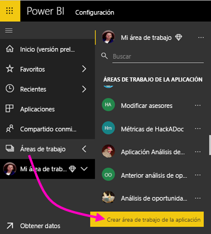
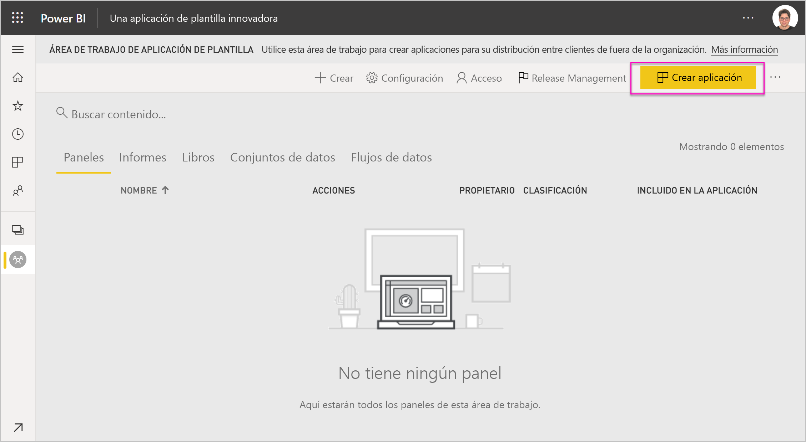
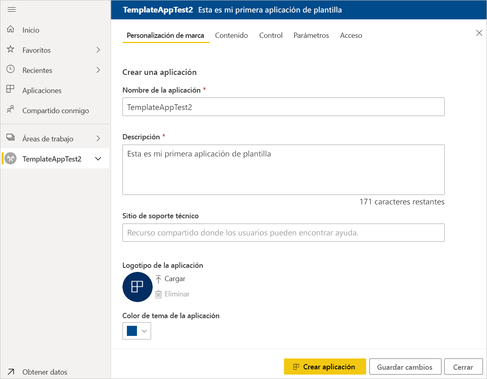
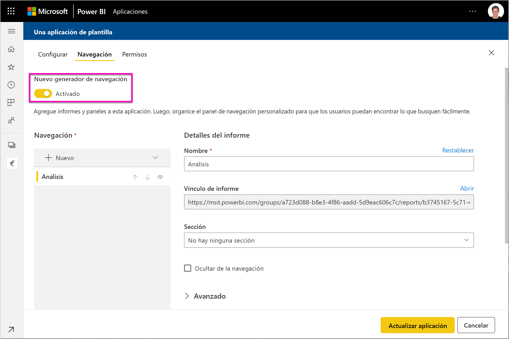

# Creación de una aplicación de plantilla en Power BI

Las nuevas *aplicaciones de plantilla* de Power BI permiten a los asociados de Power BI crear aplicaciones de Power BI con poca o ninguna codificación, e implementarlas en cualquier cliente de Power BI.  Este artículo contiene instrucciones paso a paso para crear una aplicación de plantilla de Power BI.

Si puede crear paneles e informes de Power BI, puede convertirse en un *desarrollador de aplicaciones de plantilla* que compila y empaqueta contenido analítico en una *aplicación*. Puede implementar la aplicación en otros inquilinos de Power BI mediante cualquier plataforma disponible, como AppSource o bien usarla en un servicio web propio. Como desarrollador, tiene la posibilidad de crear un paquete de análisis protegido para su distribución.

Los administradores de inquilinos de Power BI controlan quién de la organización puede crear aplicaciones de plantilla y quién puede instalarlas. Los usuarios autorizados pueden instalar la aplicación de plantilla y después modificarla y distribuirla a los consumidores de Power BI en la organización.

## Requisitos previos

Estos son los requisitos para crear una aplicación la plantilla:  

- Una [licencia de Power BI Pro](../fundamentals/service-self-service-signup-for-power-bi.md).
- Una [instalación de Power BI Desktop](../fundamentals/desktop-get-the-desktop.md) (opcional).
- Estar familiarizado con los [conceptos básicos de Power BI](../fundamentals/service-basic-concepts.md).
- Permisos para compartir una aplicación de plantilla públicamente (para más información, vea [Portal de administración de Power BI, Configuración de aplicación de plantilla](../admin/service-admin-portal.md#template-apps-settings)

## Creación del área de trabajo de plantilla

Para crear una aplicación de plantilla que se pueda distribuir a otros inquilinos de Power BI, tendrá que crearla en una de las nuevas áreas de trabajo.

1. En el servicio Power BI, haga clic en **Áreas de trabajo** > **Crear área de trabajo**.

    

2. En **Crear un área de trabajo**, seleccione **Actualizar a nueva**.

    

3. Proporcione un nombre, una descripción (opcional) y un logotipo de imagen (opcional) para el área de trabajo.

4. Expanda la sección **Avanzado** y seleccione **Desarrollar una aplicación de plantilla**.

    

5. Seleccione **Guardar**.
>[!NOTE]
>Necesita permisos del administrador de Power BI para promocionar las aplicaciones de plantilla.

## Creación del contenido en la plantilla de aplicación

Como sucede con un área de trabajo estándar de Power BI, el siguiente paso consiste en crear el contenido en el área de trabajo.  

- [Cree el contenido de Power BI](index.yml) en el área de trabajo de la aplicación.

Si va a usar parámetros en Power Query, asegúrese de que tengan tipos bien definidos (por ejemplo, Texto). Los tipos Todo y Binario no se admiten.

En [Sugerencias para la creación de aplicaciones de plantilla en Power BI](service-template-apps-tips.md) se proporcionan sugerencias que puede tener en cuenta al crear informes y paneles para la aplicación de plantilla.

## Creación de la aplicación de plantilla de prueba

Ahora que tiene contenido en el área de trabajo, está listo para empaquetarlo en una aplicación de plantilla. El primer paso consiste en crear una aplicación de plantilla de prueba, accesible únicamente desde dentro de la organización en su inquilino.

1. En el área de trabajo de plantilla, haga clic en **Crear aplicación**.

    

    Aquí, tendrá que rellenar opciones de creación adicionales para la aplicación de plantilla, en cinco categorías:

    **Personalización de marca**

    
    - Nombre de la aplicación
    - Descripción
    - Sitio de soporte técnico (el vínculo se presenta en la información de la aplicación después de redistribuir la aplicación de plantilla como aplicación de la organización)
    - Logotipo de la aplicación (límite de tamaño de archivo de 45 K, relación de aspecto 1:1, formatos .png .jpg .jpeg)
    - Color de tema de la aplicación

    **Navegación**

    Active el **Nuevo generador de navegación**, donde puede definir el panel de navegación de la aplicación (para más información, consulte [Diseño de la experiencia de navegación](../collaborate-share/service-create-distribute-apps.md#design-the-navigation-experience) en este artículo).

   
    
    **Página de inicio de la aplicación:** Si decide no participar en el generador de navegación, tiene la opción de seleccionar la página de aterrizaje de la aplicación. defina un informe o panel como la página de aterrizaje de la aplicación. Use una página de aterrizaje que proporcione la impresión correcta.

    **Control**

    Establezca las limitaciones y restricciones que tendrán los usuarios de la aplicación con el contenido de esta. Puede usar este control para proteger la propiedad intelectual que la aplicación pueda contener.

    

    >[!NOTE]
    >Siempre está bloqueada la exportación a formato .pbix para los usuarios que instalen la aplicación.

    **Parámetros**

    Use esta categoría para administrar el comportamiento de los parámetros al conectarse a orígenes de datos. Más información sobre la [creación de parámetros de consulta](https://powerbi.microsoft.com/blog/deep-dive-into-query-parameters-and-power-bi-templates/).

    
    - **Valor**: valor predeterminado del parámetro.
    - **Requerido**: úselo para requerir al instalador la entrada de un parámetro específico del usuario.
    - **Bloqueado**: el bloqueo impide que el instalador actualice un parámetro.

    **Acceso**: en la fase de pruebas, decida qué otros usuarios de la organización pueden instalar y probar la aplicación. No se preocupe, siempre puede volver y cambiar estas opciones más adelante. La configuración no afecta al acceso de la aplicación de plantilla distribuida.

2. Haga clic en **Crear aplicación**.

    Verá un mensaje que indica que la aplicación de prueba está lista, con un vínculo para copiar y compartir con los evaluadores de la aplicación.

    

    También ha realizado el primer paso del proceso de administración de versiones, que se muestra a continuación.

## Administración de la versión de la plantilla de aplicación

Antes de publicar esta aplicación de plantilla, querrá asegurarse de que esté lista. Power BI ha creado el panel de administración de versiones, donde puede realizar el seguimiento e inspeccionar la ruta de versiones completa de la aplicación. También puede desencadenar la transición de una etapa a otra. Las fases comunes son:

- Generar la aplicación de prueba: solo para realizar pruebas en la organización.
- Promover el paquete de prueba a la fase de preproducción: para realizar pruebas fuera de la organización.
- Promover el paquete de preproducción a producción: la versión de producción.
- Eliminar todos los paquetes o comenzar de nuevo desde la fase anterior.

La dirección URL no cambia cuando alterna entre las fases de la versión. La promoción no afecta a la propia dirección URL.

A continuación se analizan las fases:

1. En el área de trabajo de plantilla, seleccione **Administración de versiones**.

    

2. Haga clic en **Crear aplicación**.

    Si anteriormente ha creado la aplicación de prueba en **Creación de la aplicación de plantilla de prueba**, el punto de color amarillo junto a **Pruebas** ya está rellenado y no es necesario hacer clic en **Crear aplicación** aquí. Si hace clic, retrocederá al proceso de creación de la aplicación de plantilla.

3. Haga clic en **Obtener vínculo**.

    

4. Para probar la experiencia de instalación de la aplicación, copie el vínculo de la ventana de notificación y péguelo en otra ventana del explorador.

    Desde aquí, seguirá los mismos pasos que seguirán los clientes. Vea [Instalación y distribución de aplicaciones de plantilla en la organización](service-template-apps-install-distribute.md) para obtener su versión.

5. En el cuadro de diálogo, haga clic en **Instalar**.

    Cuando la instalación se realice correctamente, verá una notificación en la que se indica que la nueva aplicación está lista.

6. Haga clic en **Ir a la aplicación**.
7. En **Empezar a trabajar con la nueva aplicación**, verá la aplicación como la ven los clientes.

    
8. Haga clic en **Explorar la aplicación** para comprobar la aplicación de prueba con los datos de ejemplo.
9. Para realizar cambios, vuelva a la aplicación en el área de trabajo original. Actualice la aplicación de prueba hasta que esté satisfecho.
10. Cuando esté listo para promover la aplicación al entorno de preproducción para realizar más pruebas fuera del inquilino, vuelva al panel **Administración de versiones** y seleccione **Promover aplicación**. 

    
    >[!NOTE]
    > Cuando se promueve la aplicación, esta pasa a estar públicamente disponible fuera de la organización.

    Si no ve esta opción, póngase en contacto con el administrador de Power BI para que le conceda [permisos para el desarrollo de aplicaciones de plantilla](../admin/service-admin-portal.md#template-apps-settings) en el portal de administración.
11. Haga clic en **Promover** para confirmar la elección.
12. Copie esta nueva dirección URL para compartir fuera del inquilino con el fin de realizar pruebas. Este vínculo también es el que se envía para comenzar el proceso de distribución de la aplicación en AppSource mediante la creación de una [nueva oferta del Centro de partners](https://docs.microsoft.com/azure/marketplace/partner-center-portal/create-power-bi-app-offer). Solo debe enviar al Centro de partners vínculos del entorno de preproducción. Solo después de que la aplicación se apruebe y reciba la notificación de que está publicada en AppSource podrá promover este paquete a producción en Power BI.
13. Cuando la aplicación esté lista para producción o para compartirla a través de AppSource, vuelva al panel **Release Management** y haga clic en **Promover aplicación** junto a **Preproducción**.
14. Haga clic en **Promover** para confirmar la elección.

    Ahora la aplicación está en producción, lista para su distribución.

    

Para hacer que la aplicación esté disponible a miles de usuarios de Power BI en todo el mundo, le animamos a enviarla a AppSource. Vea [Oferta de aplicación de Power BI](https://docs.microsoft.com/azure/marketplace/partner-center-portal/create-power-bi-app-offer) para obtener más información.

## Pasos siguientes

Vea cómo interactúan los clientes con la aplicación de plantilla en [Instalación, personalización y distribución de aplicaciones de plantilla en la organización](service-template-apps-install-distribute.md).

Vea [Oferta de aplicación de Power BI](https://docs.microsoft.com/azure/marketplace/partner-center-portal/create-power-bi-app-offer) para obtener información sobre cómo distribuir la aplicación.
