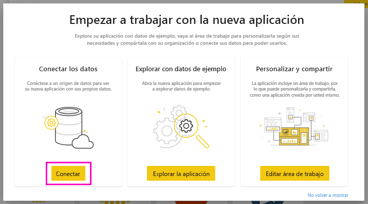
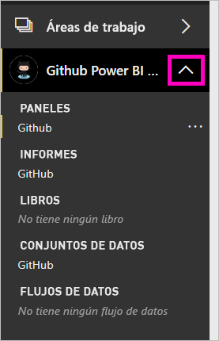
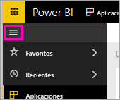

# Tutorial: conectarse a un repositorio de GitHub con Power BI
En este tutorial, nos conectaremos a datos reales en el servicio de GitHub con Power BI. Power BI creará automáticamente paneles e informes. Puede conectarse al repositorio público de contenido de Power BI (también conocido como *repo*) y ver respuestas a preguntas como: ¿Cuántas personas contribuyen al contenido público de Power BI? ¿Quiénes contribuyen en mayor medida? ¿Qué día de la semana ha habido más contribuciones? Además de otras preguntas. 

En este tutorial, realizaremos los siguientes pasos:

> [!div class="checklist"]
> * Registrar una cuenta de GitHub, si aún no hay una 
> * Iniciar sesión en la cuenta de Power BI (o registrar una, si aún no la hay)
> * Abrir el servicio Power BI
> * Buscar la aplicación de GitHub
> * Indicar la información del repositorio de GitHub público de Power BI
> * Ver el panel y el informe con datos de GitHub
> * Eliminar la aplicación limpiando los recursos

Si no está registrado en Power BI, [regístrese para obtener una evaluación gratuita](https://app.powerbi.com/signupredirect?pbi_source=web) antes de empezar.

## Requisitos previos

Para completar este tutorial, se necesita una cuenta de GitHub, si aún no tiene una. 

- Regístrese para obtener una [cuenta de GitHub](https://docs.microsoft.com/contribute/get-started-setup-github).

## Cómo conectarse
1. Inicie sesión en el servicio Power BI (`https://app.powerbi.com`). 
2. En el panel de navegación, seleccione **Aplicaciones** y, después, **Obtener aplicaciones**.
   
    

3. Seleccione **Aplicaciones**, escriba **GitHub** en el cuadro de búsqueda > **Obtenerla ahora**.
   
    

4. En **¿Instalar esta aplicación de Power BI?** , seleccione **Instalar**.
5. En **La nueva aplicación está lista**, seleccione **Ir a la aplicación**.
6. En **Empezar a trabajar con la nueva aplicación**, seleccione **Conectar**.

    

7. Escriba el nombre del repositorio y el propietario del repositorio. La dirección URL de este repositorio es https://github.com/MicrosoftDocs/powerbi-docs, por lo que **Propietario del repositorio** es **MicrosoftDocs** y **Repositorio**, **powerbi-docs**. 
   
    

5. Escriba las credenciales de GitHub que ha creado. Puede que Power BI omita este paso si ya ha iniciado sesión en GitHub en el explorador. 

6. En **Método de autenticación**, deje seleccionada la opción **OAuth2**\>**Iniciar sesión**.

7. Siga las pantallas de autenticación de GitHub. Conceda permisos de Power BI a los datos de GitHub.
   
   Ahora, Power BI se puede conectar a GitHub y a los datos.  Los datos se actualizan una vez al día.

8. Cuando Power BI haya importado los datos, verá el contenido de la nueva área de trabajo de GitHub. 
9. Seleccione la flecha junto al nombre del área de trabajo en el panel de navegación. Verá que el área de trabajo contiene un panel y un informe. 

    

10. Seleccione **Más opciones** (…) junto al nombre del panel > **Cambiar nombre** > escriba **Panel de GitHub**.
 
     

8. Haga clic en el icono de navegación global para minimizar el panel de navegación y, así, disponer de más espacio.

    

10. Seleccione su panel de GitHub.
    
    El panel de GitHub contiene datos activos, por lo que es posible que los valores que vea sean distintos.

    

    

## Hacer una pregunta

1. Coloque el cursor sobre **Pregunte algo sobre sus datos**. Power BI le ofrece **Preguntas para empezar**. 

1. Seleccione **cuántos usuarios hay**.
 
    

13. Entre **cuántos** y **usuarios hay**, escriba **solicitudes de incorporación de cambios por**. 

     Power BI creará un gráfico de barras, donde se mostrará el número de solicitudes de incorporación de cambios por persona.

    

13. Seleccione el icono de chincheta para anclarlo al panel y, después, haga clic en **Salir de Preguntas y respuestas**.

## Ver el informe de GitHub 

1. En el panel de GitHub, seleccione el gráfico de columnas **Solicitudes de incorporación de cambios por mes** para abrir el informe relacionado.

    

2. Seleccione un nombre de usuario en el gráfico **Total de solicitudes de incorporación de cambios por usuario**. En este ejemplo, vemos que la mayoría de las horas tuvieron lugar en febrero.

    

3. Seleccione la pestaña **Tarjeta perforada** para ver la siguiente página en el informe. 
 
    

    Parece ser que los martes a las 15:00 es el momento de la semana en que suelen realizarse más *confirmaciones* (cuando los usuarios registran su trabajo).

## Limpieza de recursos

Ahora que ya hemos finalizado el tutorial, podemos eliminar la aplicación de GitHub. 

1. En el panel de navegación, seleccione **Aplicaciones**.
2. Mantenga el puntero sobre el icono de GitHub y seleccione la papelera (**Eliminar**).

    

## Pasos siguientes

En este tutorial, nos hemos conectado a un repositorio público de GitHub y hemos obtenido datos, a los que Power BI ha dado formato de panel y de informe. Explorando ese panel y ese informe, hemos hallado respuesta a algunas preguntas sobre los datos. Ahora podemos pasar a obtener más información sobre cómo conectarnos a otros servicios, como Salesforce, Microsoft Dynamics y Google Analytics. 
 
> [!div class="nextstepaction"]
> [Conexión a los servicios que usa](service-connect-to-services.md)

