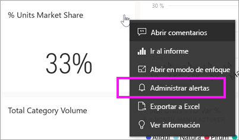
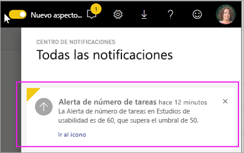
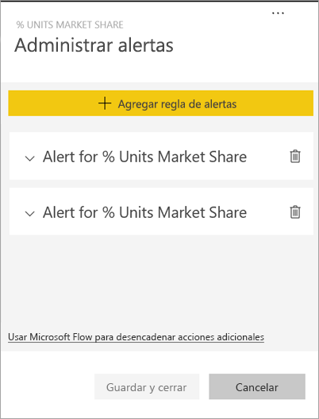

# Tutorial: Establecer alertas del panel en paneles de Power BI
Establezca alertas que le envíen notificaciones cada vez que los datos de sus paneles cambien por encima o por debajo de los límites establecidos. Las alertas funcionan en medidores, KPI y tarjetas. Esta característica sigue evolucionando, así que vea la sección [Sugerencias y solución de problemas](#tips-and-troubleshooting) más adelante.

Nadie más podrá ver las alertas que establezca, aunque comparta el panel. Las alertas de datos están completamente sincronizadas en las plataformas; establezca y vea las alertas de datos [en las aplicaciones móviles de Power BI](mobile/mobile-set-data-alerts-in-the-mobile-apps.md) y en el servicio Power BI. 

> [!WARNING]
> Estas alertas proporcionan información sobre los datos. Si consulta sus datos de Power BI en un dispositivo móvil y le roban ese dispositivo, se recomienda usar el servicio Power BI para desactivar todas las alertas.
> 

En este artículo se tratan los temas siguientes:
> [!div class="checklist"]
> * ¿Quién puede establecer alertas?
> * ¿Qué objetos visuales admiten alertas?
> * ¿Quién puede ver mis alertas?
> * ¿Las alertas funcionan en Power BI Desktop y en la versión para móviles?
> * Cómo crear una alerta
> * ¿Dónde recibiré mis alertas?

Si no está registrado en Power BI, [regístrese para obtener una evaluación gratuita](https://app.powerbi.com/signupredirect?pbi_source=web) antes de empezar.

En este ejemplo se usa un icono de tarjeta de panel de la aplicación de ejemplo Sales & Marketing. Esta aplicación está disponible en [Microsoft AppSource](https://appsource.microsoft.com). Para averiguar cómo obtener la aplicación, vea [Instalación y uso de aplicaciones con Power BI](end-user-app-view.md).

1. En un icono de tarjeta, KPI o medidor del panel, seleccione los puntos suspensivos.
   
   
2. Haga clic en el icono de campana , o bien en **Administrar alertas**, para agregar una o varias alertas para **Total de tiendas**.

   

   
1. En el panel **Administrar alertas**, haga clic en **+ Agregar regla de alertas**.  Asegúrese de que el control deslizante esté **activado** y asigne un título a la alerta. Los títulos le ayudan a reconocer fácilmente las alertas.
   
   
4. Desplácese hacia abajo y escriba los detalles de la alerta.  En este ejemplo, vamos a crear una alerta que nos enviará una notificación una vez al día si nuestra cuota de mercado es 35 o superior. Las alertas aparecen en nuestro Centro de notificaciones. Y haremos que Power BI nos envíe también un correo electrónico.
   
   
5. Haga clic en **Guardar y cerrar**.
 
   > [!NOTE]
   > Las alertas solo funcionan en los datos que se actualizan. Cuando los datos se actualizan, Power BI busca si se ha configurado una alerta para esos datos. Si los datos han alcanzado un umbral de alerta, se activará una alerta. 
   > 

## Recibir alertas
Si los datos de seguimiento llegan a uno de los umbrales que ha establecido, se realizan varias acciones. En primer lugar, Power BI comprueba si han pasado más de una hora, o de 24 horas (según la opción seleccionada), desde que se ha enviado la última alerta. Siempre que los datos superen el umbral, recibirá una alerta.

Después, Power BI envía una alerta al centro de notificaciones y, opcionalmente, un correo electrónico. Cada alerta contiene un vínculo directo a los datos. Seleccione el enlace para ver el icono pertinente.  

1. Si ha configurado la alerta para que se envíe un correo electrónico, encontrará algo parecido a esto en su bandeja de entrada. Esta alerta se configura en un panel diferente. En este panel se realiza un seguimiento de las tareas completadas por el equipo de facilidad de uso.
   
   
2. Power BI añade un mensaje a su **Centro de notificaciones** y una nueva alerta en el icono aplicable.
   
   
3. Abra el Centro de notificaciones para ver los detalles de la alerta.
   
    
   
  

## Administración de alertas

Hay muchas maneras de administrar las alertas: desde el icono del panel, desde el menú de configuración de Power BI y en un icono individual en la [aplicación móvil de Power BI en el iPhone](mobile/mobile-set-data-alerts-in-the-mobile-apps.md) o en la [aplicación móvil de Power BI para Windows 10](mobile/mobile-set-data-alerts-in-the-mobile-apps.md).

### Desde el icono

1. Si necesita cambiar o quitar una alerta de un icono, vuelva a abrir la ventana **Administrar alertas** al seleccionar el icono de campana . Se muestran todas las alertas que ha configurado para ese icono.
   
    .
2. Para modificar una alerta, seleccione la flecha situada a la izquierda del nombre de la alerta.
   
    .
3. Para eliminar una alerta, seleccione la papelera situada a la derecha del nombre de la alerta.
   
      

### Desde el menú de configuración de Power BI

1. Seleccione el icono de engranaje de la barra de menús de Power BI.
   
    .
2. En **Configuración**, seleccione **Alertas**.
   
    
3. Desde aquí, puede activar y desactivar alertas, abrir la ventana **Administrar de alertas** para realizar cambios o eliminar alertas.

## Sugerencias y solución de problemas 

* Las alertas solo se pueden establecer en medidores, KPI y tarjetas.
* Si no puede establecer una alerta para un medidor, KPI o tarjeta, póngase en contacto con el administrador del sistema para pedir ayuda. A veces, las alertas se desactivan o no están disponibles para el panel o para tipos específicos de iconos del panel.
* Las alertas solo funcionan en los datos que se actualizan. No funcionan con datos estáticos. La mayoría de los ejemplos proporcionados por Microsoft son estáticos. 

## Limpieza de recursos
A continuación se dan instrucciones para eliminar alertas. En resumen, debe seleccionar el icono de engranaje de la barra de menús de Power BI. En **Configuración**, seleccione **Alertas** y elimine la alerta.

> [!div class="nextstepaction"]
> [Establecer alertas de datos en dispositivos móviles](mobile/mobile-set-data-alerts-in-the-mobile-apps.md)

