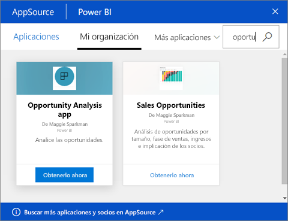
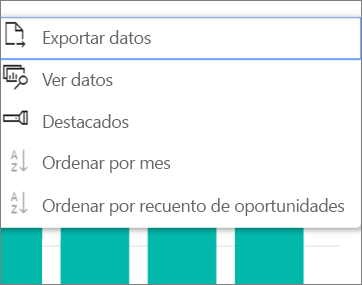

# Instalación y uso de aplicaciones con los paneles e informes de Power BI
Ahora que tiene [conocimientos básicos sobre las aplicaciones](end-user-apps.md), vamos a aprender a abrirlas e interactuar con ellas. 

## Maneras de obtener una nueva aplicación
Recuerde que hay varias maneras de obtener una nueva aplicación. Un compañero diseñador de informes podría instalar la aplicación automáticamente en su cuenta de Power BI o enviarle un vínculo directo a una aplicación. También puede ir a AppSource y buscar aplicaciones disponibles tanto dentro como fuera de la empresa. 

En Power BI desde su dispositivo móvil, solo puede instalar una aplicación desde un vínculo directo y no desde AppSource. Si el autor de la aplicación la instala automáticamente, podrá verla en la lista de aplicaciones.

## Instalar una aplicación desde un vínculo directo
La manera más fácil de instalar usted mismo una aplicación nueva es obtener un vínculo directo de su autor.  

**En el equipo** 

Al seleccionar el vínculo del correo electrónico, el servicio Power BI ([https://powerbi.com](https://powerbi.com)) se abre en un explorador. Confirme que quiere instalar la aplicación y Power BI se abrirá en la página de inicio de la aplicación.

**En su dispositivo móvil de iOS o Android** 

Al seleccionar el vínculo del correo electrónico en el dispositivo móvil, la aplicación se instala automáticamente y se abre su lista de contenido en la aplicación móvil. 

## Obtención de la aplicación desde Microsoft AppSource
También puede buscar e instalar aplicaciones desde Microsoft AppSource. Solo se muestran las aplicaciones a las que puede acceder (es decir, el autor de la aplicación le ha concedido permiso a usted o a todos los usuarios).

1. Seleccione **Aplicaciones**  > **Obtener aplicaciones**. 
   
     
2. En AppSource, en **Mi organización**, puede buscar para limitar los resultados y encontrar la aplicación que está buscando.
   
     
3. Seleccione **Obtenerla ahora** para agregarla a la lista de contenido Aplicaciones. 

## Interacción con los paneles e informes en la aplicación
Ahora podrá explorar los datos de los paneles e informes en la aplicación. Tiene acceso a todas las interacciones estándar de Power BI como el filtrado, el resaltado, la ordenación y la exploración en profundidad. También puede [exportar los datos a Excel ](end-user-export-data.md) desde una tabla o desde otro objeto visual de un informe. Más información sobre la [interacción con informes de Power BI](end-user-reading-view.md). 

## Pasos siguientes
* [Conectarse a los servicios con los paquetes de contenido de Power BI](end-user-connect-to-services.md)
* ¿Tiene alguna pregunta? [Pruebe a preguntar a la comunidad de Power BI](http://community.powerbi.com/)

