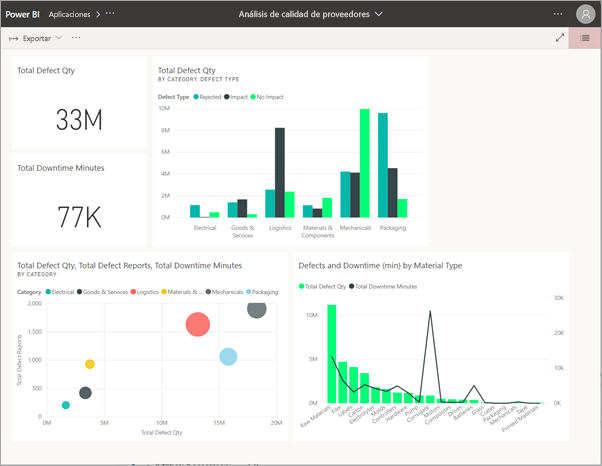
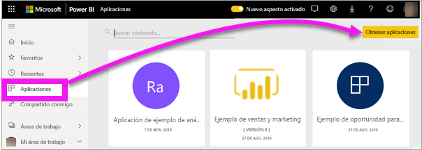
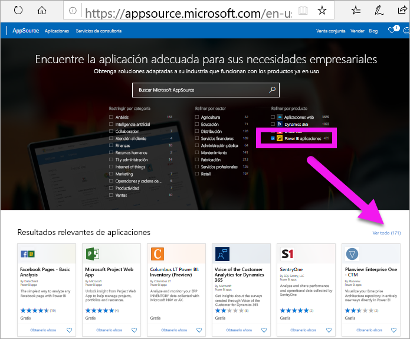
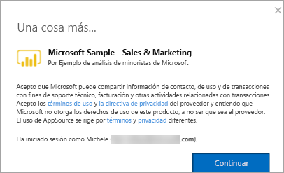
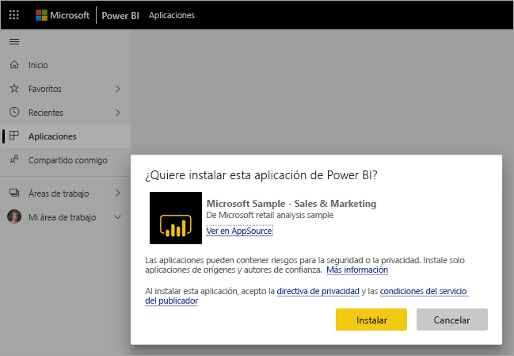
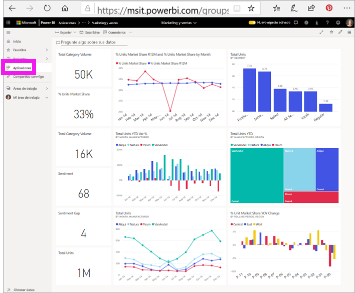

# Instalación y uso de aplicaciones con los paneles e informes de Power BI

[!INCLUDE [power-bi-service-new-look-include](../includes/power-bi-service-new-look-include.md)]

Ahora que tiene [conocimientos básicos sobre las aplicaciones](end-user-apps.md), vamos a aprender a abrirlas e interactuar con ellas. 

## Maneras de obtener una nueva aplicación
Hay varias maneras de obtener una nueva aplicación. Un compañero diseñador de informes podría instalar la aplicación automáticamente en su cuenta de Power BI o enviarle un vínculo directo a una aplicación. También puede ir a AppSource y buscar aplicaciones que los diseñadores de aplicaciones han puesto a su disposición tanto dentro como fuera de la empresa. 

En Power BI desde su dispositivo móvil, solo puede instalar una aplicación desde un vínculo directo y no desde AppSource. Si el diseñador de la aplicación la instala automáticamente, podrá verla en la lista de aplicaciones.

## Instalar una aplicación desde un vínculo directo
La manera más fácil de instalar manualmente una aplicación nueva es obtener un vínculo directo del diseñador de la aplicación por correo electrónico.  

**En el equipo** 

Al hacer clic en el vínculo en el correo, el servicio Power BI ([https://powerbi.com](https://powerbi.com)) abre la aplicación en el explorador. 

**En su dispositivo móvil de iOS o Android** 

Si selecciona el vínculo del correo desde su dispositivo móvil, la aplicación se instala automáticamente y se abre en la aplicación móvil. Es posible que primero tenga que iniciar sesión. 

## Obtención de la aplicación desde Microsoft AppSource
También puede buscar e instalar aplicaciones desde Microsoft AppSource. Solo se muestran las aplicaciones a las que puede acceder (es decir, el autor de la aplicación le ha concedido permiso a usted o a todos los usuarios).

1. Seleccione **Aplicaciones**  > **Obtener aplicaciones**. 
   
        
2. En AppSource, en **Mi organización**, busque para limitar los resultados y encontrar la aplicación que está buscando.
   
    
3. Seleccione **Obtenerla ahora** para agregarla a la lista de contenido Aplicaciones. 

## Obtención de una aplicación desde el sitio web de Microsoft AppSource 

En este ejemplo, abriremos una de las aplicaciones de ejemplo de Microsoft. En AppSource encontrará aplicaciones para muchos de los servicios que usa para llevar su negocio.  Servicios como Salesforce, Microsoft Dynamics, Google Analytics, GitHub, zendesk, Marketo y muchos más. Para saber más, vea [Aplicaciones para los servicios que usa con Power BI](../service-connect-to-services.md). 

1. En un explorador, abra [https://appsource.microsoft.com](https://appsource.microsoft.com) y seleccione las **aplicaciones de Power BI**.

    

2. Seleccione **Ver todo** para ver la lista de todas las aplicaciones Power BI disponibles actualmente en AppSource. Desplácese o busque la aplicación denominada **Microsoft Sample - Sales & Marketing**.

    

3. Seleccione **Obtenerla ahora** y acepte los términos de uso.

    

4. Confirme que quiere instalar la aplicación.

    

5. El servicio Power BI mostrará un mensaje de operación correcta cuando se instale la aplicación. Seleccione **Ir a la aplicación** para abrir la aplicación. En función de cómo el diseñador haya creado la aplicación, se mostrará el panel de la aplicación o el informe de la aplicación.

    

    También puede abrir la aplicación directamente desde la lista de contenido de la aplicación; para ello, seleccione **Aplicaciones** y elija **Sales & Marketing**.

    

6. Decida si quiere explorar o personalizar y compartir la nueva aplicación. Como hemos seleccionado una aplicación de ejemplo de Microsoft, vamos a empezar explorándola. 

    

7.  La nueva aplicación se abre con un panel. Pero el *diseñador* de la aplicación también podría haber configurado la aplicación para que se abra en un informe.  

    

## Interacción con los paneles e informes en la aplicación
Dedique algún tiempo a explorar los datos de los paneles y los informes que componen la aplicación. Puede acceder a todas las interacciones estándar de Power BI, como filtrar, resaltar, ordenar y explorar en profundidad.  ¿Aún no tiene clara la diferencia entre paneles e informes?  Lea el [artículo sobre paneles](end-user-dashboards.md) y el [artículo sobre informes](end-user-reports.md).  

## Actualización de una aplicación 

En ocasiones, los creadores de aplicaciones pueden publicar nuevas versiones de sus aplicaciones. La forma de obtener la nueva versión depende de cómo haya recibido la original. 

* Si ha recibido la aplicación de su organización, la actualización a la versión nueva es completamente transparente; no tiene que hacer nada. 

* Si ha obtenido la aplicación de AppSource, la próxima vez que la abra verá un mensaje emergente a modo de notificación. La notificación le permitirá saber que hay una versión nueva disponible. 

    1. Seleccione **Obtener** para actualizarla.  

        <!-- -->

    2. Cuando se le pida que instale la aplicación actualizada, seleccione **Instalar**. 

         

    3. Como ya tiene una versión de esta aplicación, decida si quiere reemplazar la existente o instalar la aplicación actualizada en una nueva área de trabajo.   

         

    > [!NOTE] 
    > Al instalar una versión nueva, se sobrescriben los cambios que pueda haber realizado en los informes y paneles. Para conservar los informes y paneles actualizados, puede guardarlos con otro nombre o en otra ubicación antes de instalarlos. 

    4. Una vez que haya instalado la versión actualizada, seleccione **Actualizar aplicación** para completar el proceso de actualización. 

    <!-- -->

## Pasos siguientes
* [Volver a la información general de las aplicaciones](end-user-apps.md)
* [Ver un informe de Power BI](end-user-report-open.md)
* [Otras formas de compartir contenido con usted](end-user-shared-with-me.md)
