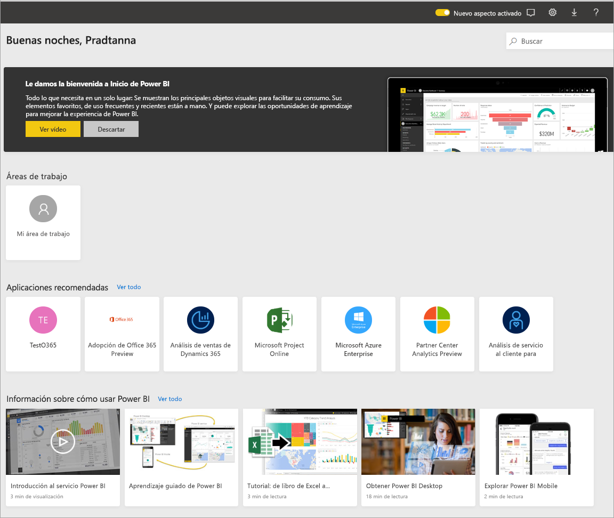
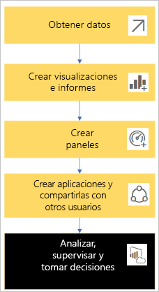
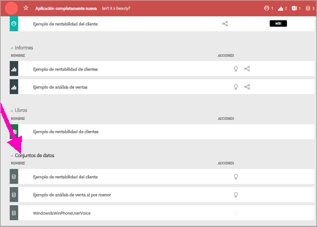
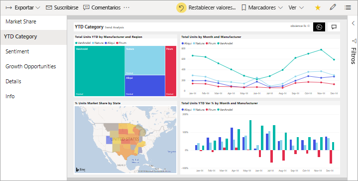
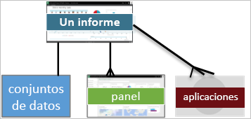
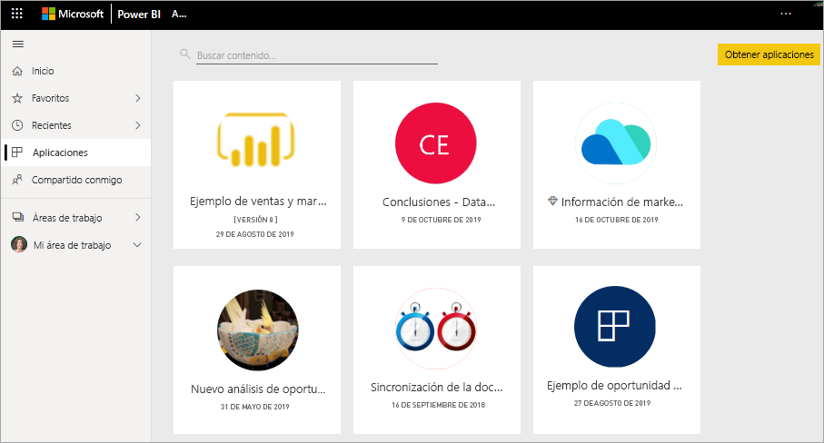
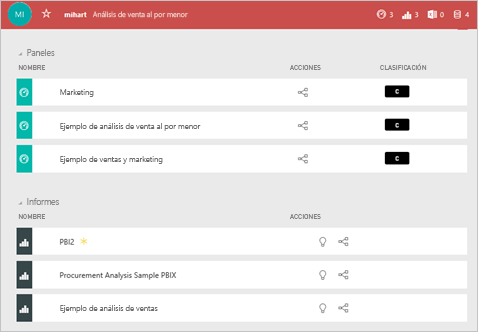

# Conceptos básicos para consumidores de Power BI

[!INCLUDE[consumer-appliesto-ynnm](../includes/consumer-appliesto-ynnm.md)]

[!INCLUDE [power-bi-service-new-look-include](../includes/power-bi-service-new-look-include.md)]

En este artículo se da por hecho que ha leído la [introducción a Power BI](../fundamentals/power-bi-overview.md) y se ha identificado como **_consumidor_** de [Power BI](end-user-consumer.md). Los consumidores reciben el contenido de Power BI, como paneles e informes, de sus compañeros. Los consumidores usan el servicio Power BI, que es la versión basada en el sitio web de Power BI.

Para recibir contenido de otros usuarios, se necesita una licencia de usuario de Power BI Pro o una licencia de capacidad de Power BI Premium. [Busque su tipo de licencia](end-user-license.md)

Seguro que ha oído hablar de "Power BI Desktop" o simplemente de "Desktop". Es la herramienta independiente que usan los *diseñadores* que crean y comparten informes y paneles con usted. Es importante saber que existen otras herramientas de Power BI. Mientras sea consumidor, solo trabajará con el servicio Power BI. Este artículo se aplica solo al servicio Power BI.

## Terminología y conceptos

En este artículo no es un recorrido visual por Power BI, ni un tutorial práctico. Es más bien un artículo de introducción que le ayudará a sentirse cómodo con los conceptos y la terminología de Power BI. Le ayudará a conocer la jerga y familiarizarse con el entorno. Para hacer un recorrido por el servicio Power BI y su navegación, vaya a [Inicio rápido: Moverse por el servicio Power BI](end-user-experience.md).

## Apertura del servicio Power BI por primera vez

La mayor parte de los consumidores de Power BI obtienen el servicio Power BI porque 1) su empresa compra licencias y 2) un administrador asigna las licencias a empleados como usted.

Para empezar, abra un explorador y escriba **app.powerbi.com**. La primera vez que abra el servicio Power BI, verá algo parecido a esto:

Con el uso de Power BI, podrá personalizar lo que vea cada vez que abra el sitio web. Por ejemplo, a algunos usuarios les gusta que Power BI abra la página **principal**, mientras que otros quieren ver en primer lugar su panel preferido. No se preocupe, este artículo le mostrará cómo personalizar su experiencia.

- [Introducing Power BI Home & Global Search](https://powerbi.microsoft.com/blog/introducing-power-bi-home-and-global-search) (Introducción al inicio y la búsqueda global de Power BI)

- [Paneles destacados en el servicio Power BI](end-user-featured.md)

Pero antes de entrar mucho más en materia, vamos a realizar una copia de seguridad y a comentar los bloques de creación que conforman el servicio Power BI.

_______________________________________________________

## Contenido de Power BI

### Introducción a los bloques de creación

Para un consumidor de Power BI, los cinco bloques de creación son los siguientes: **_visualizaciones_** , **_paneles_** , **_informes_** , **_aplicaciones_** y **_conjuntos de datos_** . A veces se hace referencia a ellos como **_contenido_** de *Power BI*, y dicho *contenido* se encuentra en las **_áreas de trabajo_** . Un flujo de trabajo típico implica todos estos bloques de creación: un *diseñador* de Power BI (de color amarillo en el diagrama siguiente) recopila datos de *conjuntos de datos*, los incorpora a Power BI para su análisis, crea *informes* llenos de *visualizaciones* que resaltan hechos y perspectivas interesantes, ancla las visualizaciones de los informes a un panel y comparte los informes y paneles con *consumidores* como usted, (de color negro en el diagrama siguiente). El *diseñador* los comparte en forma de *aplicaciones* u otros tipos de contenido compartido.

En su concepto más básico:

-  una **_visualización_** (u *objeto visual*) es un tipo de gráfico creado por *diseñadores* de Power BI. Los objetos visuales muestran los datos de *informes* y *conjuntos de datos*. Por lo general, los *diseñadores* crean los objetos visuales en Power BI Desktop.

    Para obtener más información, consulte [Interactuar con objetos visuales de informes, paneles y aplicaciones](end-user-visualizations.md).

-  Un *conjunto de datos* es un contenedor de datos. Por ejemplo, podría ser un archivo de Excel de la Organización Mundial de la Salud. También podría ser una base de datos de clientes de la empresa o un archivo de Salesforce.  

-  Un *panel* es una sola pantalla con gráficos, texto y objetos visuales interactivos. Un panel recopila las métricas más importantes, en una pantalla, para contar una historia o responder a una pregunta. El contenido del panel proviene de uno o varios informes y uno o varios conjuntos de datos.

    Para obtener más información, consulte [Panel para los consumidores del servicio Power BI](end-user-dashboards.md).

-  Un *informe* es una o más páginas de gráficos, texto y objetos visuales interactivos que forman un único informe. Power BI basa un informe en un único conjunto de datos. A menudo, el servicio organiza las páginas de un informe para abordar un área central de interés o para responder a una única pregunta.

    Para obtener más información, consulte [Informes en Power BI](end-user-reports.md).

-  Una *aplicación* es un recurso de los *diseñadores* que sirve para agrupar y compartir paneles e informes relacionados entre sí. Los *consumidores* reciben algunas aplicaciones automáticamente, pero pueden ir a buscar otras creadas por sus compañeros o por la comunidad. Por ejemplo, los servicios externos que puede que ya esté usando, como Google Analytics y Microsoft Dynamics CRM, ofrecen aplicaciones de Power BI.

Para ser más específicos, si es un nuevo usuario y ha iniciado sesión en Power BI por primera vez, no verá paneles, informes ni aplicaciones.

_______________________________________________________

## Conjuntos de datos

Un *conjunto de datos* es una colección de datos que los *diseñadores* importan o a la cual se conectan y, a continuación, usan para crear informes y paneles. Como consumidor, no interactuará directamente con los conjuntos de datos, pero sigue siendo interesante entender cómo encajan estos en una perspectiva más amplia.  

Cada conjunto de datos representa un único origen de datos. Por ejemplo, el origen podría ser un libro de Excel en OneDrive, un conjunto de datos tabular local de SQL Server Analysis Services o un conjunto de datos de Salesforce. Power BI admite muchos orígenes de datos diferentes.

Cuando un diseñador comparte una aplicación con usted, puede ver qué conjuntos de datos incluyó el diseñador con la aplicación.

Un conjunto de datos...

- se puede usar una y otra vez por un diseñador de informes para crear paneles e informes.

- se puede usar para crear muchos informes diferentes.

- los objetos visuales de ese conjunto de datos pueden aparecer en muchos paneles diferentes.

  

En el siguiente bloque de creación, visualizaciones.

_______________________________________________________

## Visualizaciones

Las visualizaciones (también conocidas como objetos visuales) muestran la información que Power BI ha descubierto en los datos. Las visualizaciones facilitan la interpretación de la información, ya que su cerebro puede entender una imagen más rápidamente que una hoja de cálculo de cifras.

Algunas de las visualizaciones que encontrará en Power BI son: cascada, cinta de opciones, gráfico de rectángulos, circular, embudo, tarjeta, dispersión y medidor:

   

Consulte la [lista completa de visualizaciones incluidas en Power BI](../power-bi-visualization-types-for-reports-and-q-and-a.md).

Las visualizaciones llamadas *objetos visuales personalizados* también están disponibles desde la comunidad. Si recibe un informe con un objeto visual que no reconoce, probablemente es un objeto visual personalizado. Si necesita ayuda para interpretar el objeto visual personalizado, busque el nombre del *diseñador* del informe o panel y póngase en contacto con él o ella.

Una visualización en un informe...

- puede aparecer varias veces en el mismo informe.

- puede aparecer en muchos paneles diferentes.

_______________________________________________________

## Informes

Un informe de Power BI se compone de una o más páginas de visualizaciones, gráficos y texto. Todas las visualizaciones de un informe proceden de un único conjunto de datos. Los *diseñadores* comparten informes con los *consumidores* que [interactúan con los informes en la *Vista de lectura*](end-user-reading-view.md).

Un informe...

- se puede asociar con varios paneles (los iconos anclados desde ese informe pueden aparecer en varios paneles).

- se puede crear con los datos de un único conjunto de datos.  

- puede formar parte de varias aplicaciones.

  

_______________________________________________________

## Paneles

Un panel representa una vista personalizada de un subconjunto de los conjuntos de datos subyacentes. Los *diseñadores* crean paneles y los comparten con los *consumidores*; ya sea individualmente o como parte de una aplicación. Un panel es un lienzo individual que tiene *iconos*, gráficos y texto.

  

Un icono es una representación de un objeto visual que un *diseñador* *ancla*, por ejemplo, de un informe a un panel. Cada icono anclado muestra una [visualización](end-user-visualizations.md) que un diseñador creó a partir de un conjunto de datos y ancló al panel. Un icono puede contener también una página de informe completa y puede contener datos de streaming en vivo o un vídeo. Los *diseñadores* tienen muchas maneras de agregar iconos a los paneles. Son demasiadas para tratarlas todas en este artículo de información general. Para más información, vea [Iconos del panel en Power BI](end-user-tiles.md).

Los consumidores no pueden modificar los paneles. Sin embargo, en relación con un panel, puede agregar comentarios, ver datos relacionados, establecerlo como favorito, subscribirse, etc.

¿Qué finalidades tienen los paneles?  A continuación se indican algunas:

- Observar de un solo vistazo toda la información necesaria para tomar decisiones

- Supervisar la información más importante sobre su empresa

- Garantizar que todos los compañeros estén en la misma sintonía, es decir, que vean y usen la misma información

- Supervisar el correcto funcionamiento de un negocio, producto, unidad de negocio, campaña de marketing, etc.

- para crear una vista personalizada de un panel más grande (con las métricas importantes para usted)

**UN** panel...

- puede mostrar visualizaciones de muchos conjuntos de datos diferentes

- puede mostrar visualizaciones de muchos informes diferentes

- puede mostrar visualizaciones ancladas desde otras herramientas (por ejemplo, Excel)

  

_______________________________________________________

## Aplicaciones

Estas colecciones de paneles e informes organizan contenido relacionado entre sí en un único paquete. Los *diseñadores* de Power BI los compilan y comparten con usuarios, grupos, toda una organización o el público. Como consumidor, puede estar seguro de que usted y sus compañeros están trabajando con los mismos datos; una única versión de confianza del contenido real.

> [!NOTE]
> Para poder usar aplicaciones, se necesita una licencia de Power BI Pro o Premium. 

Es muy fácil buscar e instalar aplicaciones en el [servicio Power BI](https://powerbi.com) y en el dispositivo móvil. Después de instalar una aplicación, no tiene que recordar los nombres de muchos paneles diferentes. Estarán todos agrupados en una aplicación, en el explorador o en el dispositivo móvil.

Esta aplicación tiene tres paneles relacionados y tres informes relacionados que componen una sola aplicación.

En el caso de las aplicaciones, siempre que el autor de la aplicación publique actualizaciones, verá los cambios automáticamente. El autor controla además la programación de la frecuencia con que Power BI actualiza los datos. No tiene que preocuparse de mantenerlos al día.

Puede obtener aplicaciones de varias maneras diferentes:

- El diseñador de la aplicación puede instalarla automáticamente en su cuenta de Power BI.

- El diseñador de la aplicación puede enviarle un vínculo directo a ella.

- Puede buscarla en [Microsoft AppSource](https://appsource.microsoft.com/marketplace/apps?product=power-bi), donde verá todas las aplicaciones que puede usar.

En Power BI en el dispositivo móvil, solo podrá instalar aplicaciones desde un vínculo directo y no desde AppSource. Si el diseñador de la aplicación la instala automáticamente, podrá verla en la lista de aplicaciones.

Una vez que la aplicación está instalada, simplemente selecciónela en la lista de aplicaciones y seleccione el panel o informe que quiere abrir y explorar en primer lugar.

Espero que este artículo le aporte una perspectiva de los bloques de creación que conforman el servicio Power BI para los consumidores.

## Pasos siguientes

- Revisar y marcar el [glosario](end-user-glossary.md)

- Haga un [recorrido por el servicio Power BI](end-user-experience.md).

- Leer la [Introducción general de Power BI escrita especialmente para consumidores](end-user-consumer.md)

- Vea un vídeo en el cual Will da un repaso a los conceptos básicos y muestra el servicio Power BI.

    <iframe width="560" height="315" src="https://www.youtube.com/embed/B2vd4MQrz4M" frameborder="0" allowfullscreen></iframe>
