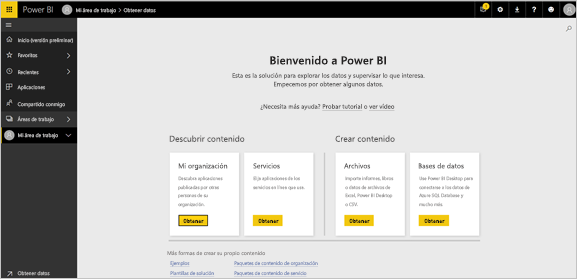
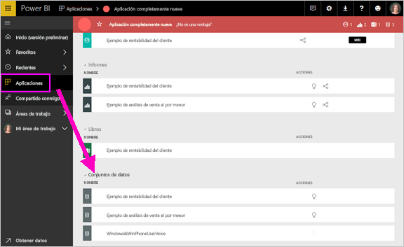
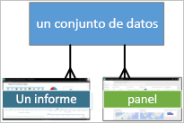
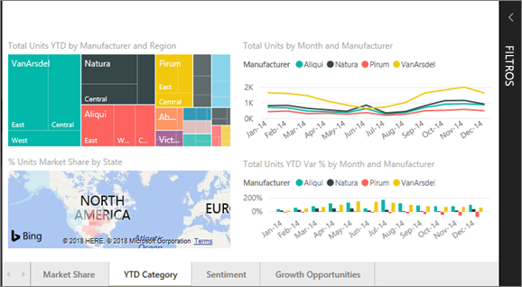
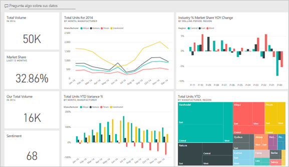
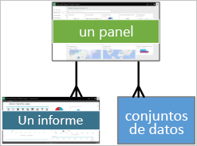
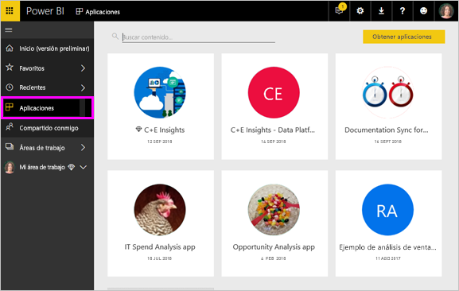

# Conceptos básicos para el ***cliente*** del servicio Power BI

## *Consumidores* y *diseñadores* de Power BI
En este artículo se asume que ha leído la [introducción a Power BI](../power-bi-overview.md) y se ha identificado como ***consumidor*** de Power BI. Los consumidores reciben el contenido de Power BI, como paneles e informes, de sus compañeros. Los consumidores usan el servicio Power BI, que es la versión basada en el sitio web de Power BI.

Sin duda, oirá el término "Power BI Desktop" o simplemente "Desktop", se trata de una herramienta independiente que usan los *diseñadores* que crean y comparten informes y paneles con usted. Es importante saber que existen otras herramientas de Power BI, pero dado que usted es un consumidor, solo trabajará con el servicio Power BI. Y este artículo se aplica solo al servicio Power BI.

## Terminología y conceptos
En este artículo no es un recorrido visual por Power BI, ni un tutorial práctico. Es más bien un artículo de introducción que esperamos que le ayudará a sentirse cómodo con los conceptos y la terminología de Power BI. Es una forma de conocer la jerga y familiarizarse con el entorno. Para realizar un recorrido por el servicio Power BI y su navegación, visite [Realizar un paseo](end-user-experience.md).

## Abrir el servicio Power BI por primera vez
La mayor parte de los consumidores de Power BI obtienen el servicio Power B porque 1) su empresa compra licencias y 2) un administrador asigna las licencias a empleados como usted.

Para empezar, simplemente abra un explorador y escriba **app.powerbi.com**. La primera vez que abra el servicio Power BI, verá algo parecido a esto.

Con el uso de Power BI, podrá personalizar lo que vea cada vez que abra el sitio web.  Por ejemplo, a algunos usuarios les gusta que Power BI abra la página principal, mientras que otros quieren ver en primer lugar su panel preferido. No se preocupe, le enseñaremos cómo hacerlo.
- [Vista previa de la página principal](https://powerbi.microsoft.com/blog/introducing-power-bi-home-and-global-search)    
- [Establecer el contenido como **destacado**](end-user-featured.md)

Pero antes de entrar mucho más en materia, vamos a realizar una copia de seguridad y a comentar los bloques de creación que conforman el servicio Power BI.

## Contenido de ***Power BI***
### Introducción a los bloques de creación
Para un consumidor de Power BI, los cinco bloques de creación son: ***visualizaciones***, ***paneles***, ***informes***, ***aplicaciones*** y ***conjuntos de datos***. A veces se hace referencia a ellos como ***contenido*** de *Power BI*, y dicho *contenido* se encuentra en las ***áreas de trabajo***. Un flujo de trabajo típico implica todos estos bloques de creación:  un *diseñador* de Power BI (de color amarillo en el diagrama siguiente) recopila datos de *conjuntos de datos*, los incorpora a Power BI para su análisis, crea  *informes* llenos de *visualizaciones* que resaltan hechos y perspectivas interesantes, ancla las visualizaciones de los informes a un panel y comparte los informes y paneles con *consumidores* , como usted, (de color negro en el diagrama siguiente) en forma de *aplicaciones* u otros tipos de contenido compartido.

En su concepto más básico.
*  Una ***visualización*** (u *objeto visual*) es un tipo de gráfico generado por *diseñadores* de Power BI mediante los datos de los *informes* y los *conjuntos de datos*. Por lo general, los *diseñadores* crean los objetos visuales en Power BI Desktop.

    Para obtener más información, consulte [Visualizaciones para *consumidores* de Power BI](end-user-visualizations.md)

*  Un *conjunto de datos* es un contenedor de datos. Por ejemplo, puede ser un archivo Excel de la Organización Mundial de la Salud, una base de datos de clientes propiedad de la empresa o un archivo de Salesforce.  

*  Un *panel* es una sola pantalla con gráficos, texto y objetos visuales interactivos. Un panel recopila las métricas más importantes, en una pantalla, para contar una historia o responder a una pregunta. El contenido del panel proviene de uno o varios informes y uno o varios conjuntos de datos.

    Para obtener más información, consulte [Paneles para *consumidores* de Power BI](end-user-dashboards.md)

*  Un *informe* es una o más páginas de gráficos, texto y objetos visuales interactivos que forman un único informe. Un informe se basa en un único conjunto de datos. Las páginas de un informe a menudo se organizan para centrarse en cada área central de interés o para responder a una única pregunta.

    Para obtener más información, consulte [Informes para *consumidores* de Power BI](end-user-reports.md)

*  Una *aplicación* es un recurso de los *diseñadores* que sirve para agrupar y compartir paneles e informes relacionados entre sí. Los *consumidores* reciben algunas aplicaciones automáticamente, pero pueden ir a buscar otras creadas por sus compañeros o por la comunidad. Por ejemplo, los servicios externos que puede que ya esté usando, como Google Analytics y Microsoft Dynamics CRM, ofrecen aplicaciones de Power BI.

Para ser más específicos, si es un nuevo usuario y ha iniciado sesión en Power BI por primera vez, todavía no tiene paneles, informes o aplicaciones.
_______________________________________________________

## Conjuntos de datos
Un *conjunto de datos* es una colección de datos que los *diseñadores* importan o a la cual se conectan y, a continuación, usan para crear informes y paneles. Como consumidor, no interactuará directamente con los conjuntos de datos, pero es interesante entender cómo encajan en una perspectiva más amplia.  

Cada conjunto de datos representa un origen de datos, por ejemplo, un libro de Excel en OneDrive, un conjunto de datos tabulares locales de SSAS o una base de datos de Salesforce. Se admiten muchos orígenes de datos diferentes.

Cuando un diseñador comparte una aplicación con un usuario, este puede ver qué conjuntos de datos se incluyen con la aplicación.

**Un único** conjunto de datos...

* se puede usar una y otra vez
* se puede usar en muchos informes diferentes
* Las visualizaciones de ese conjunto de datos se pueden mostrar en muchos paneles diferentes

  

Además, los conjuntos de datos de otras áreas de trabajo pueden utilizarse para crear contenido (informes, paneles) en el área de trabajo. Estos conjuntos de datos se muestran mediante el icono del conjunto de datos al que se hace referencia:

En el siguiente bloque de creación, visualizaciones.
__________________________________________________________

## Visualizaciones
Las visualizaciones (también conocidas como objetos visuales) muestran información que se ha descubierto en los datos. Las visualizaciones facilitan la interpretación de la información, ya que su cerebro puede entender una imagen más rápidamente que una hoja de cálculo de cifras, por ejemplo.

Algunas de las visualizaciones que encontrará en Power BI son: cascada, cinta de opciones, gráfico de rectángulos, circular, embudo, tarjeta, dispersión y medidor. Consulte la [lista completa de visualizaciones incluidas en Power BI](../power-bi-visualization-types-for-reports-and-q-and-a.md).

   

Las visualizaciones también están disponibles desde la comunidad y se denominan *objetos visuales personalizados*. Si recibe un informe con un objeto visual que no reconoce, probablemente es un objeto visual personalizado. Si necesita ayuda para interpretar el objeto visual personalizado, <!--[look up the name of the report or dashboard *designer*](end-user-owner.md)-->busque el nombre del *diseñador* del informe o panel y póngase en contacto con él o ella.

**UNA** visualización en un informe...

* puede utilizarse una y otra vez en el mismo informe mediante copiar y pegar.
* puede utilizarse en muchos paneles diferentes
__________________________________________________
## Informes
Un informe de Power BI se compone de una o más páginas de visualizaciones, gráficos y texto. Todas las visualizaciones de un informe proceden de un único conjunto de datos. Los *diseñadores* comparten informes con los *consumidores* que [interactúan con los informes en la *Vista de lectura*](end-user-reading-view.md).

**UN** informe...

* se puede asociar con varios paneles (los iconos anclados desde ese informe pueden aparecer en varios paneles).
* se crea con los datos de un único conjunto de datos.  
* puede formar parte de varias aplicaciones

  

________________________________________________

## Paneles
Un panel representa una vista personalizada de un subconjunto de los conjuntos de datos subyacentes. Los *diseñadores* crean paneles y los comparten con los *consumidores*; ya sea individualmente o como parte de una aplicación. Un panel es un lienzo individual que contiene *iconos*, gráficos y texto.

  

Un icono es una representación de un objeto visual que un *diseñador* *ancla*, por ejemplo, de un informe a un panel.  Cada icono anclado muestra una [visualización](end-user-visualizations.md) creada a partir de un conjunto de datos y anclada al panel. Un icono puede contener también una página de informe completa y puede contener datos de streaming en vivo o un vídeo. El *diseñador* puede agregar iconos al panel de muchas maneras; demasiadas para tratarlas en este tema de información general. Para más información, vea [Iconos del panel en Power BI](end-user-tiles.md).

Desde la perspectiva de un consumidor, no se pueden editar los paneles. Sin embargo, en relación con un panel, puede agregar comentarios, ver datos relacionados, establecerlo como favorito, subscribirse, etc.

¿Qué finalidades tienen los paneles?  A continuación se indican algunas:

* para observar de un solo vistazo toda la información necesaria para tomar decisiones
* para supervisar la información más importante sobre su empresa
* para garantizar que todos los compañeros estén en la misma sintonía, es decir, que vean y usen la misma información
* para supervisar el correcto funcionamiento de un negocio, producto, unidad de negocio, campaña de marketing, etc.
* para crear una vista personalizada de un panel más grande (con las métricas importantes para usted)

**UN** panel...

* puede mostrar visualizaciones de muchos conjuntos de datos diferentes
* puede mostrar visualizaciones de muchos informes diferentes
* puede mostrar visualizaciones ancladas desde otras herramientas (por ejemplo, Excel)

  

________________________________________________

## Aplicaciones
Estas colecciones de paneles e informes organizan contenido relacionado entre sí en un único paquete. Los *diseñadores* de Power BI los compilan y comparten con usuarios, grupos, toda una organización o el público. Como consumidor, puede estar seguro de que usted y sus compañeros están trabajando con los mismos datos; una única versión de confianza del contenido real.

Es muy fácil buscar e instalar aplicaciones en el servicio Power BI (https://powerbi.com)) y en el dispositivo móvil. Después de instalar una aplicación, no tendrá que recordar los nombres de muchos paneles diferentes ya que se encontrarán todos juntos en una aplicación, en el explorador o en su dispositivo móvil.

Esta aplicación tiene tres paneles relacionados y tres informes relacionados que componen una sola aplicación.

En el caso de las aplicaciones, siempre que el autor de la aplicación publique actualizaciones, verá los cambios automáticamente. El autor controla la frecuencia de actualización de los datos, por lo que no tiene que preocuparse de mantenerlos actualizados.

Puede obtener aplicaciones de varias maneras diferentes. El diseñador de una aplicación puede instalarla automáticamente en su cuenta de Power BI, enviarle un vínculo directo a una aplicación. También puede buscarla usted en Microsoft AppSource, donde verá todas las aplicaciones a las que puede acceder. En Power BI en el dispositivo móvil, solo podrá instalar aplicaciones desde un vínculo directo y no desde AppSource. Si el diseñador de la aplicación la instala automáticamente, podrá verla en la lista de aplicaciones.

Una vez que la aplicación está instalada, simplemente selecciónela en la lista de aplicaciones y seleccione el panel o informe que quiere abrir y explorar en primer lugar.   

Espero que este artículo le aporte una perspectiva de los bloques de creación que conforman el servicio Power BI para los consumidores.

## Pasos siguientes
- Revisar y marcar el [glosario](end-user-glossary.md)    
- Dar un [paseo por el servicio Power BI](end-user-experience.md)
- Leer la [Introducción general de Power BI escrita especialmente para consumidores](end-user-consumer.md)    
- Vea un vídeo en el cual Will da un repaso a los conceptos básicos y muestra el servicio Power BI. <iframe width="560" height="315" src="https://www.youtube.com/embed/B2vd4MQrz4M" frameborder="0" allowfullscreen></iframe>
