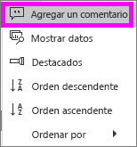
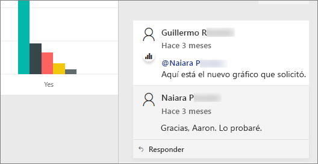

# Agregar comentarios a un panel o informe
Agregar un comentario personal o iniciar una conversación sobre un panel o informe con sus compañeros. La característica **Comentarios** es solo una de las formas que tiene un *consumidor* de colaborar con otros. 

## Cómo usar la característica Comentarios
Los comentarios se pueden agregar a todo un panel, los objetos visuales individuales en un panel, una página del informe y objetos visuales individuales en una página del informe. Agregar un comentario general o un comentario dirigido a los compañeros de trabajo específicos.  

Cuando se agrega un comentario a un informe, Power BI captura los valores de filtro y segmentación de datos actuales. Esto significa que cuando se selecciona o responder a un comentario, en la página del informe o visual de informe puede cambiar para mostrar el filtro y selecciones de segmentación de datos que estaban activas cuando fue el primero el comentario agregan.  

¿Por qué es importante? Supongamos que un compañero de trabajo aplicó un filtro que revele información interesante que desea compartir con el equipo. Sin filtro seleccionado, el comentario no tienen sentido. 

### Agregar un comentario general a un panel o informe
Los procesos para agregar comentarios a un panel o informe son similares. En este ejemplo, estamos usando un panel. 

1. Abrir un panel de Power BI o el informe y seleccione el **comentarios** icono. Se abre el cuadro de diálogo Comentarios.

    

    Aquí vemos que el creador del panel ya agregó un comentario general.  Cualquier persona con acceso a este panel puede ver este comentario.

    

2. Para responder, seleccione **Responder**, escriba la respuesta y seleccione **Publicar**.  

    

    De forma predeterminada, Power BI dirige la respuesta al compañero que inició el hilo de comentarios, en este caso, Aaron F. 

    

 3. Si desea agregar un comentario que no forma parte de un subproceso existente, escriba el comentario en el campo de texto superior.

    

    Los comentarios sobre este panel ahora tendrán este aspecto.

    

### Agregar un comentario a un panel específico o un informe visual
Además de agregar comentarios a todo un panel o a una página de informe completa, puede agregar comentarios a los iconos de panel individual y objetos visuales de informes individuales. Los procesos son similares, y en este ejemplo, usamos un informe.

1. Mantenga el mouse encima del objeto visual y seleccione los tres puntos (...).    
2. En la lista desplegable, seleccione **Agregar un comentario**.

      

3.  El **comentarios** abre el cuadro de diálogo y los demás objetos visuales en la página están atenuados. El objeto visual aún no tiene comentarios. 

      

4. Escriba un comentario y seleccione **Publicar**.

      

    - En un informe de página, seleccione un comentario que se realizó en un objeto visual, resalta ese objeto visual (véase más arriba).

    - En un panel, el icono de gráfico  nos permite saber que un comentario está asociado a un objeto visual específico. Los comentarios que se aplican a todo el panel no tienen un icono especial. Seleccione el icono de gráfico resalta el objeto visual relacionado en el panel.

        

5. Seleccione **Cerrar** para volver al panel o al informe.

### Llamar la atención de sus compañeros mediante el signo @
Si está creando un panel, icono, informe o comentario visual, agarre atención de sus compañeros de trabajo mediante el uso de la "\@" símbolos.  Cuando escriba el "\@" símbolos, Power BI abre una lista desplegable donde puede buscar y seleccionar personas de su organización. Cualquier nombre comprobado precedido por el símbolo "\@" se muestra en una fuente de color azul. 

Esta es una conversación que estoy manteniendo con el *diseñador* de la visualización. Usa el símbolo @ para asegurarse de que veo el comentario. Así sé que este comentario es para mí. Al abrir este panel de la aplicación en Power BI, selecciono **Comentarios** en el encabezado. El panel **Comentarios** se muestra en nuestra conversación.

  

## Pasos siguientes
Volver a [Visualizaciones para consumidores](end-user-visualizations.md)    
<!--[Select a visualization to open a report](end-user-open-report.md)-->
