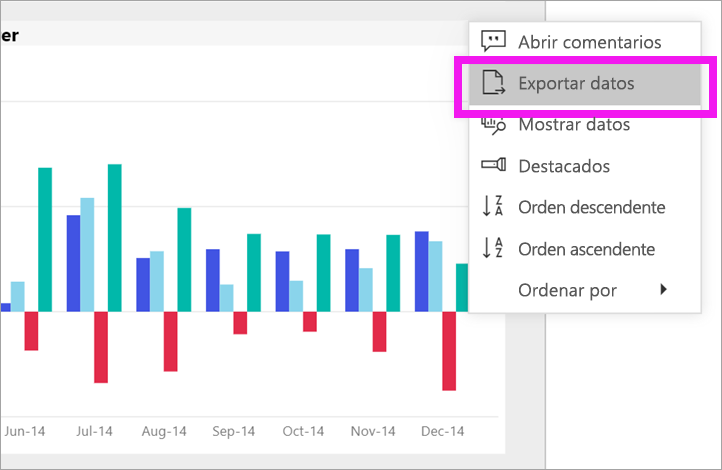
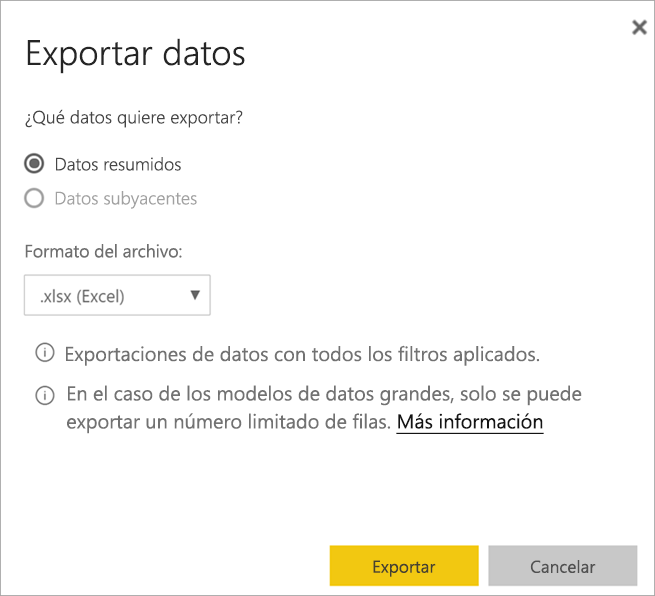
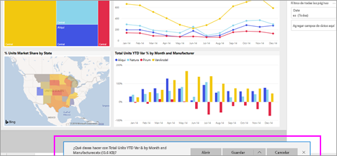

# Exportación de datos de un objeto visual

[!INCLUDE [power-bi-service-new-look-include](../includes/power-bi-service-new-look-include.md)]

Si quiere ver los datos que se usan para crear un objeto visual, [puede mostrar dichos datos en Power BI](end-user-show-data.md) o exportarlos a Excel. La opción para exportar datos requiere un determinado tipo o licencia y permisos de edición para el contenido. Si no puede hacer la operación, consulte con el administrador de Power BI. 

## Desde un objeto visual en un panel de Power BI

1. Comience en un panel de Power BI. Aquí vamos a usar el panel de la aplicación ***Ejemplo de marketing y ventas***. Puede [descargar esta aplicación desde AppSource.com](https://appsource.microsoft.com/en-us/product/power-bi/microsoft-retail-analysis-sample.salesandmarketingsample-preview?flightCodes=e2b06c7a-a438-4d99-9eb6-4324ce87f282).

    

2. Mantenga el mouse sobre un objeto visual para mostrar los puntos suspensivos (...) y haga clic para que aparezca el menú de acción.

    

3. Seleccione **Exportar a Excel**.

4. Lo que sucede después depende del explorador que use. Puede que se le pida que guarde el archivo o que vea un vínculo al archivo exportado en la parte inferior del explorador. 

    

5. Abra el archivo en Excel.  

    

## Desde un objeto visual de un informe
Puede exportar datos desde un objeto visual de un informe en formato .csv o .xlsx (Excel). 

1. En un panel, seleccione un icono para abrir el informe subyacente.  En este ejemplo, vamos a seleccionar el mismo objeto visual que antes *Total Units YTD Var %* (% de desviación de unidades totales hasta la fecha). 

    

    Como este icono se creó en el informe *Ejemplo de ventas y marketing*, es el informe que se abre. Y lo hace en la página que contiene el objeto visual del icono seleccionado. 

2. Seleccione el icono en el informe. Observe el panel **Filtros** de la derecha. Este objeto visual tiene filtros aplicados. Para más información sobre los filtros, consulte [Uso de filtros en un informe](end-user-report-filter.md).

    

3. Seleccione los puntos suspensivos en la esquina superior derecha de la visualización. Elija **Exportar datos**.

    

4. Verá opciones para exportar datos resumidos o datos subyacentes. Si usa la aplicación *Ejemplo de ventas y marketing*, se deshabilitará la opción **Datos subyacentes**. Sin embargo, puede encontrar informes donde estén habilitadas ambas opciones. A continuación se muestra una explicación de la diferencia.

    **Datos resumidos**: seleccione esta opción si quiere exportar datos de lo que se ve en ese objeto visual.  Este tipo de exportación solo muestra los datos que se usaron para crear el objeto visual. Si el objeto visual tiene filtros aplicados, los datos que exporte también se filtrarán. Por ejemplo, en el caso de este objeto visual, la exportación incluirá únicamente los datos de 2014 y la región central, y solo los datos de cuatro de los fabricantes: VanArsdel, Natura, Aliqui y Pirum.
  

    **Datos subyacentes**: seleccione esta opción si quiere exportar datos de lo que ve en el objeto visual **junto con** datos adicionales del conjunto de datos subyacente.  Esto puede incluir los datos contenidos en el conjunto de datos pero que no se usan en el objeto visual. 

    

5. Lo que sucede después depende del explorador que use. Puede que se le pida que guarde el archivo o que vea un vínculo al archivo exportado en la parte inferior del explorador. 

    

6. Abra el archivo en Excel. Compare la cantidad de datos exportados con los datos que se exportaron desde el mismo objeto visual en el panel. La diferencia es que esta exportación incluye **datos subyacentes**. 

    

## Pasos siguientes

[Mostrar los datos usados para crear un objeto visual](end-user-show-data.md)