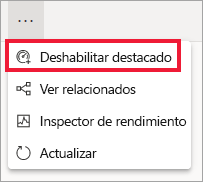

# Paneles destacados en el servicio Power BI
## Creación de un panel destacado
Muchos de los usuarios tienen un panel que visitan con más frecuencia que otros.  Puede ser el panel que usa para administrar el negocio o quizás uno que contenga una agregación de iconos de muchos paneles e informes distintos.

Cuando selecciona un panel para que sea *destacado*, cada vez que abra el servicio Power BI, se abrirá mostrando ese panel.  

También puede seleccionar algunos paneles para establecerlos como *favoritos*. Consulte [Paneles favoritos](end-user-favorite.md).

> [!NOTE] 
>Este tema se aplica al servicio Power BI no a Power BI Desktop.

Si aún no ha configurado un panel destacado, Power BI se abrirá en el último panel que haya usado.  

### Para establecer un panel como **destacado**
Observe cómo Amanda crea un panel destacado y, luego, siga las instrucciones que aparecen debajo del vídeo para intentarlo.

<iframe width="560" height="315" src="https://www.youtube.com/embed/G26dr2PsEpk" frameborder="0" allowfullscreen></iframe>

1. Abra el panel que desee establecer como *destacado*. 
2. En la barra de menús superior, verá **Establecer como destacado** o simplemente el icono de destacado . Seleccione uno de ellos.
   
    
3. Confirme la selección.
   
    

## Cambio del panel destacado
Por supuesto, si cambia de opinión más adelante, puede establecer un nuevo panel como panel destacado.

1. Siga los pasos 1 y 2 anteriores.
   
    
2. Seleccione **Establecer como destacado**. Dejar de destacar un panel no lo quita del área de trabajo.  
   
    

## Quitar el panel destacado
Si decide que no desea que haya ningún panel designado como destacado, esta es la forma de hacer que un panel deje de serlo.

1. Abra el panel destacado actualmente.
2. En la barra de menús superior, seleccione **Deshabilitar destacado**.
   
    

Ahora Power BI se abrirá en el último panel que haya usado.  

## Pasos siguientes
[Paneles favoritos](end-user-favorite.md)

¿Tiene más preguntas? [Pruebe la comunidad de Power BI](http://community.powerbi.com/)

