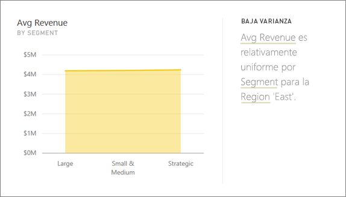

# Tipos de información compatibles con Power BI
## ¿Cómo funciona la búsqueda de información?
Power BI busca rápidamente en distintos subconjuntos del conjunto de datos al tiempo que aplica un conjunto de algoritmos sofisticados para detectar información de posible interés. Power BI examina tanto como puede un conjunto de datos en el tiempo asignado.

Puede ejecutar la información en un conjunto de datos o en un icono de panel.   

## ¿Qué tipos de información se puede buscar?
Estos son algunos de los algoritmos que se usan:

## Valores atípicos de categoría (superior o inferior)
Resalta los casos en los que, en relación con una medida del modelo, uno o dos miembros de una dimensión tienen valores mucho más altos que otros miembros de la dimensión.  

## Cambiar los puntos de una serie temporal
Resalta cuando hay cambios significativos en las tendencias de datos de una serie temporal.

## Correlación
Detecta los casos en los que varias medidas muestran una correlación entre sí al trazarse en una dimensión del conjunto de datos.

## Baja varianza
Detecta aquellos casos en los que los puntos de datos no están lejos de la media.

## Mayoría (factores principales)
Busca los casos en los que una mayoría de un valor total puede atribuirse a un único factor cuando se desglosa con otra dimensión.  

## Tendencias generales de la serie temporal
Detecta las tendencias hacia arriba o hacia abajo de los datos de la serie temporal.

## Estacionalidad de la serie temporal
Busca patrones periódicos en los datos de series temporales, por ejemplo, semanales, mensuales o de estacionalidad anual.

## Recurso compartido constante
Resalta los casos en los que hay una correlación de elementos primarios y secundarios entre el recurso compartido de un valor de secundario en relación con el valor global del elemento primario a través de una variable continua.

## Valores atípicos de la serie temporal
En el caso de los datos de una serie temporal, detecta si hay determinadas fechas u horas con valores significativamente diferentes de los demás valores de fecha y hora.

## Pasos siguientes
[Información de Power BI](end-user-insights.md)

Si es propietario de un conjunto de datos, [optimícelo para información](../service-insights-optimize.md)

¿Tiene más preguntas? [Pruebe la comunidad de Power BI](http://community.powerbi.com/)

