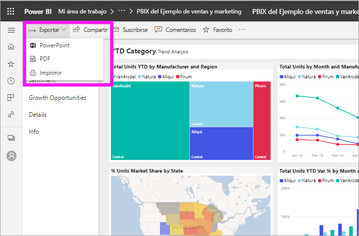
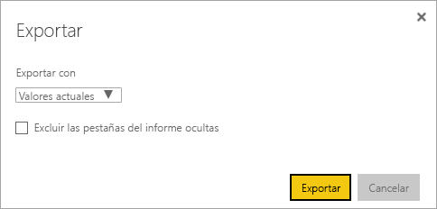
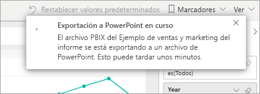

# Exportar informes de Power BI a PowerPoint

[!INCLUDE [power-bi-service-new-look-include](../includes/power-bi-service-new-look-include.md)]

Con Power BI, puede publicar el informe en Microsoft PowerPoint y crear fácilmente una presentación de diapositivas basada en el informe de Power BI. Cuando se exporta a PowerPoint, ocurre lo siguiente:

* Cada página del informe de Power BI se convierte en una diapositiva de PowerPoint.
* Cada página del informe de Power BI se exporta como una única imagen de alta resolución en PowerPoint.
* Se conserva la configuración de los filtros y las segmentaciones que se ha agregado al informe.
* Se crea un vínculo en PowerPoint que dirige al informe de Power BI.

Exportar su **informe de Power BI** a **PowerPoint** es muy fácil. Siga los pasos descritos en la sección siguiente.

## Exportación del informe de Power BI a PowerPoint
En el servicio Power BI, seleccione un informe para mostrarlo en el lienzo. También puede seleccionar un informe en la página **Inicio**, **Aplicaciones** o en cualquier otro contenedor del panel de navegación.

Cuando el informe que quiere exportar a PowerPoint aparezca en el lienzo, seleccione **Exportar** > **PowerPoint** en la barra de menús.

Aparece una ventana emergente en la que tiene la opción de seleccionar los **Valores actuales** o los **Valores predeterminados**. Los **valores actuales** exportan el informe en el estado actual, lo que incluye los cambios activos que haya realizado en los valores de filtro o segmentación. La mayoría de los usuarios seleccionan esta opción. Como alternativa, al seleccionar **Valores predeterminados** se exporta el informe en el estado original, como lo haya compartido el *autor*, y no se reflejan los cambios que haya realizado al estado original.

 
Además, hay una casilla para seleccionar si se quieren exportar o no las pestañas ocultas de un informe. Seleccione esta casilla si solo quiere exportar las pestañas del informe que son visibles para usted en el explorador. Si prefiere incluir todas las pestañas ocultas como parte de la exportación, deje desactivada esta casilla. Si la casilla aparece atenuada, significa que no hay ninguna pestaña oculta en el informe. Seleccione **Exportar** para continuar cuando haya realizado las selecciones.

Verá un banner de notificación en la esquina superior derecha de la ventana del explorador del servicio Power BI que indica que el informe se está exportando a PowerPoint. La exportación puede tardar unos minutos. Puede continuar trabajando en Power BI mientras se exporta el informe.

Cuando el servicio Power BI haya terminado el proceso de exportación, el banner de notificación cambiará para informarle. El archivo está disponible donde el explorador muestra los archivos descargados. En la siguiente imagen, se muestra como un banner de descarga en la parte inferior de la ventana del explorador.

Y eso es todo. Puede descargar el archivo, abrirlo con PowerPoint y, después, modificarlo o mejorarlo, tal como lo haría con cualquier otra presentación de PowerPoint.

## Desprotección del archivo exportado de PowerPoint
Al abrir el archivo de PowerPoint que exportó Power BI, encontrará unos cuantos elementos útiles e interesantes. Eche un vistazo a la siguiente imagen y desproteja los elementos numerados que describen algunas de esas características interesantes.

1. La primera página de la presentación de diapositivas incluye el nombre del informe y un vínculo para que pueda **Ver en Power BI** el informe en el que se basa la presentación de diapositivas.
2. También obtendrá información útil sobre el informe. **Última actualización de datos** muestra la fecha y la hora en las que se basa el informe exportado. **Descargado en** muestra la fecha y la hora en las que se ha exportado el informe de Power BI a un archivo de PowerPoint.
3. Cada página del informe es una diapositiva independiente, tal como se muestra en el panel de navegación. 
4. El informe publicado se representa en el idioma configurado en Power BI, o de acuerdo con el valor de configuración regional del explorador. Para ver o configurar las preferencias de idioma, seleccione el icono de engranaje  > **Configuración** > **General** > **Idioma**. Para obtener información sobre la configuración regional, consulte [Idiomas y países o regiones compatibles con Power BI](../supported-languages-countries-regions.md).
5. La presentación de PowerPoint incluye una diapositiva de portada con la hora exportada en la zona horaria correcta.

Cuando vaya a una diapositiva individual, observará que cada página del informe es una imagen independiente.

>[!NOTE]
> Tener un objeto visual por cada página del informe es el nuevo comportamiento. El comportamiento anterior, que proporcionaba una imagen independiente para cada objeto visual, ya no se implementa. 
 

Lo que haga con la presentación de PowerPoint a partir de este punto, o con cualquiera de las imágenes de alta resolución, ya es su decisión.

## Limitaciones
Hay algunas consideraciones y limitaciones a tener en cuenta al trabajar con la característica **Exportar a PowerPoint**.

* En la actualidad, no se admiten objetos visuales de R. Los objetos visuales se exportan como una imagen en blanco a PowerPoint con un mensaje de error que indica que el objeto visual no se admite.
* Los objetos visuales personalizados que se han certificado son compatibles. Para obtener más información acerca de los objetos visuales personalizados certificados, incluido cómo obtener un objeto visual personalizado, consulte [Obtener un objeto visual personalizado certificado](../developer/power-bi-custom-visuals-certified.md). No se admiten los objetos visuales personalizados que no se hayan certificado. Estos se exportan como una imagen en blanco a PowerPoint con un mensaje de error que indica que el objeto visual no se admite.
* Actualmente no se pueden exportar informes de más de 30 páginas.
* Tenga paciencia, ya que el proceso de exportación del informe a PowerPoint puede tardar unos minutos en completarse. Entre los factores que pueden afectar al tiempo requerido está la estructura del informe y la carga actual del servicio Power BI.
* Si el elemento de menú **Exportar a PowerPoint** no está disponible en el servicio Power BI, probablemente sea porque el administrador de inquilinos ha deshabilitado la característica. Póngase en contacto con el administrador de inquilinos para obtener más información.
* Las imágenes de fondo se recortan con el área de límite del gráfico. Se recomienda quitar las imágenes de fondo antes de realizar la exportación a PowerPoint.
* Las páginas de PowerPoint siempre se crean en el tamaño estándar 16:9, sin tener en cuenta los tamaños de página ni las dimensiones originales del informe de Power BI.
* Los informes que pertenecen a un usuario situado fuera del dominio de su inquilino de Power BI como, por ejemplo, un informe que alguien de fuera de su organización ha compartido con usted, no pueden publicarse en PowerPoint.
* Si se comparte un panel con alguien de fuera de su organización y, por lo tanto, con un usuario que no está en su inquilino de Power BI, ese usuario no podrá exportar a PowerPoint los informes asociados del panel compartido. Por ejemplo, si es aaron@contoso.com, puede compartir con david@cohowinery.com. Pero david@cohowinery.com no puede exportar los informes asociados a PowerPoint.
* La exportación podría no funcionar con versiones anteriores de PowerPoint.
* Como se mencionó anteriormente, cada página del informe se exporta como una única imagen en el archivo de PowerPoint.
* El servicio Power BI utiliza su propia configuración de idioma como idioma para la exportación de PowerPoint. Para ver o configurar las preferencias de idioma, seleccione el icono de engranaje  > **Configuración** > **General** > **Idioma**.
* La opción de hora de **descarga** en la diapositiva de portada para el archivo PowerPoint exportado se establece en la zona horaria de su equipo en el momento de la exportación.
* Actualmente no se respetan los filtros de las direcciones URL al elegir **Valores actuales** para la exportación.

## Pasos siguientes
[Imprimir un informe](end-user-print.md)
