<!-- once the sample apps are live, change this so consumers can follow along -->
# Inicio rápido: más información sobre las capacidades de Power BI para ***consumidores***
En esta guía de inicio rápido obtendrá información sobre cómo interactuar con Power BI para detectar información empresarial basada en datos. La información del artículo no pretende ser exhaustiva, sino un resumen rápido de muchas de las acciones disponibles para los **consumidores** de Power BI.

Si no está registrado en Power BI, [regístrese para obtener una evaluación gratuita](https://app.powerbi.com/signupredirect?pbi_source=web) antes de empezar.

## Requisitos previos
- Servicio Power BI (app.powerbi.com)
<!-- app from AppSource -->

## Vista de lectura
La vista de lectura está disponible en el servicio Power BI para *consumidores* de informes. Cuando algún compañero comparta un informe con usted, podrá explorar el informe e interactuar con él en la Vista de lectura. 

El otro modo de informes del servicio Power BI es la [Vista de edición](../service-interact-with-a-report-in-editing-view.md), que está disponible para *diseñadores* de informes.  

La Vista de lectura es una manera eficaz y segura de explorar los paneles e informes. Al segmentar y desglosar los paneles e informes compartidos con usted, los conjuntos de datos subyacentes permanecen intactos y sin cambios. 

En la Vista de lectura puede realizar un resaltado cruzado y un filtrado cruzado de los objetos visuales de una página.  Simplemente resalte o seleccione un valor en un objeto visual y verá de forma instantánea su impacto en los demás objetos visuales. Use el panel Filtro para agregar y modificar los filtros en una página de informe, y cambie la manera en que los valores se ordenan en una visualización. Estas son solo algunas de las capacidades para los *consumidores* en Power BI.  Siga leyendo para obtener más información sobre ellas y muchos más aspectos.

 
### Visualización de una aplicación
En Power BI, las *aplicaciones* reúnen paneles e informes relacionados en un solo lugar.

1. Seleccione **Aplicaciones**  > **Obtener aplicaciones**. 
   
     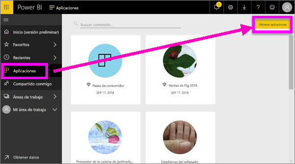
2. En AppSource, en **Mi organización**, busque para limitar los resultados y encontrar la aplicación que está buscando.
   
     
3. Seleccione **Obtenerla ahora** para agregarla al contenedor Aplicaciones. 

### Visualización de un panel
Esta aplicación se abre en un panel. Un ***panel*** de Power BI tiene una sola página, a menudo denominada lienzo, que usa visualizaciones para contar una historia. Dado que se limita a una sola página, un panel bien diseñado contiene únicamente los elementos más importantes de esa historia.

Las visualizaciones que se ven en el panel se denominan *iconos* y están *ancladas* al panel de informes.

### Suscribirse a un panel (o un informe)
No es necesario abrir Power BI para supervisar un panel.  En su lugar, puede suscribirse a él y Power BI le enviará una instantánea de dicho panel en un período establecido. 

.

1. En la barra de menús superior, seleccione **Suscribirse** o el icono de sobre .
   
   

3. Use el control deslizante amarillo para activar y desactivar la suscripción.  Opcionalmente, agregue los detalles del mensaje de correo electrónico. 

    En las capturas de pantalla siguiente, tenga en cuenta que, cuando se suscribe a un informe, realmente se está suscribiendo a una de sus *páginas*.  Para suscribirse a más de una página de un informe, seleccione **Agregar otra suscripción** y seleccione una página diferente. 
      
   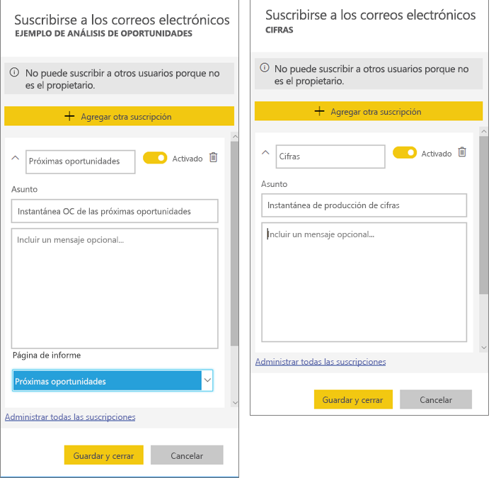
   
    La actualización de la página del informe no actualiza el conjunto de datos. El propietario del conjunto de datos es el único que puede actualizar manualmente un conjunto de datos. Para buscar el nombre de los conjuntos de datos subyacentes, seleccione **Ver relacionados** en la barra de menús superior.

### Ver contenido relacionado
El panel **Contenido relacionado** muestra cómo está interconectado el contenido del servicio Power BI: paneles, informes y conjuntos de datos. No solo el panel muestra el contenido relacionado, también permite realizar acciones en el contenido y navegar fácilmente entre el contenido relacionado.

En un panel o informe, seleccione **Ver relacionados** en la barra de menús superior.

### Use Preguntas y respuestas para realizar preguntas con lenguaje natural
A veces, la manera más rápida de obtener una respuesta de sus datos es formular una pregunta con un lenguaje natural. El cuadro de pregunta de Preguntas y respuestas disponible en la parte superior del panel. Por ejemplo, "Mostrarme el recuento de las grandes oportunidades por fase de ventas como un embudo". 

### Agregar un panel a Favoritos
Al marcar contenido como *favorito*, puede acceder a él desde la barra de navegación izquierda. La barra de navegación izquierda es visible desde casi todas las áreas de Power BI. Los favoritos suelen ser los paneles, las páginas de informe y las aplicaciones que consulta con más frecuencia.

1. Salga de Preguntas y respuestas para volver a un panel.    
2. En la esquina superior derecha del servicio Power BI, seleccione **Agregar a Favoritos** o el icono de estrella .
   
   

### Apertura y visualización de un informe y las páginas del informe
Un informe consta de una o varias páginas de objetos visuales. Los informes se crean por *diseñadores de informes* de Power BI y [se comparten con los *consumidores* directamente](end-user-shared-with-me.md) o como parte de una [aplicación](end-user-apps.md). 

Los informes se pueden abrir desde un panel. La mayoría de los iconos de panel están *anclados* y remiten a los informes. Al seleccionar un icono se abre el informe que se usó para crear el icono. 

1. En un panel, seleccione un icono. En este ejemplo hemos seleccionado el icono del gráfico de columna "Ingresos".

    

2.  Se abre el informe asociado. Tenga en cuenta que estamos en la página "Información general de ingresos". Se trata de la página del informe que contiene el gráfico de columnas que hemos seleccionado desde el panel.

    

### Ajustar las dimensiones de pantalla
Los informes se ven en muchos dispositivos diferentes, con diferentes tamaños de pantalla y relaciones de aspecto.  La representación predeterminada quizá no sea la que quiere ver en el dispositivo.  

1. Para ajustar la visualización, seleccione **Vista** en la barra de menús superior.

    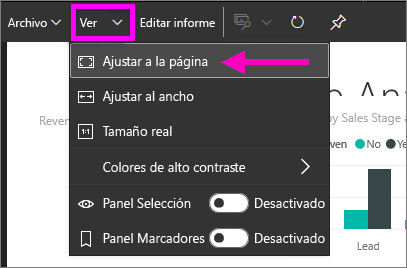

2.  Elija una de las opciones para mostrar. En este ejemplo hemos elegido **Ajustar a la página**.

    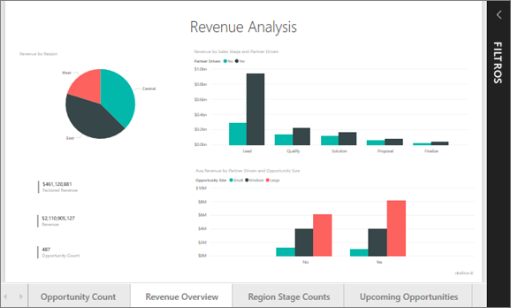    

### Utilizar el panel Filtros del informe
Si el autor del informe agrega filtros a una página del informe, puede interactuar con ellos y guardar sus cambios en el informe.

1. Seleccione el icono **Filtros** en la esquina superior derecha.
   
     

2. Seleccione un objeto visual para activarlo. Verá todos los filtros que se han aplicado al objeto visual (filtros de nivel visual), en toda la página del informe (filtros de nivel de página) y en todo el informe (filtros de nivel de informe).
   
   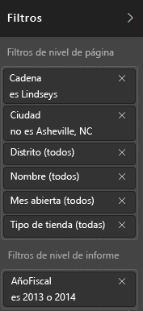

3. Mueva el puntero sobre un filtro y expándalo seleccionando la flecha abajo.
   
   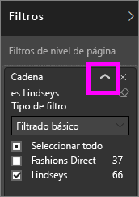

4. Realice cambios en los filtros y vea cómo afectan a los objetos visuales.  
   
     
     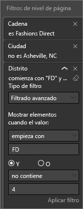

### Visualización de la interconexión de los objetos visuales de una página
Realice un resaltado cruzado y un filtrado cruzado de las visualizaciones relacionadas en una página. Las visualizaciones en una única página del informe están todas "conectadas" entre sí.  Esto significa que si selecciona uno o varios valores en una visualización, otras visualizaciones que usan el mismo valor cambiarán en función de esa selección.

> 
### Consulta de los detalles de una visualización
Mover el puntero sobre los objetos visuales para ver los detalles

### Ordenar una visualización
Los objetos visuales en una página de informe pueden organizarse y guardarse con los cambios aplicados. 

1. Pase sobre un objeto visual para activarlo.    
2. Seleccione el botón de puntos suspensivos (...) para abrir las opciones de ordenación.

     

###  Abrir el panel **Selección**
Navegue fácilmente entre las visualizaciones en la página de informe. 

1. Seleccione **Vista > panel Selección** para abrir el panel Selección. Cambie el **panel Selección** a activado.

    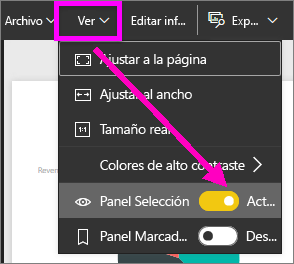

2. El panel Selección se abre en el lienzo del informe. Seleccione un objeto visual de la lista para activarlo.

    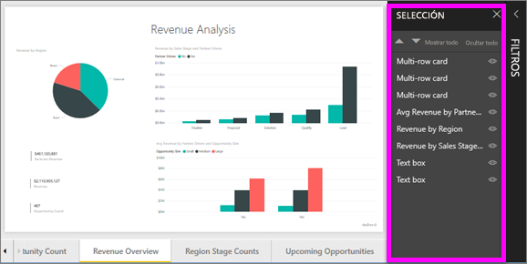

### Acercar la imagen en objetos visuales individuales
Mantenga el puntero sobre un objeto visual y seleccione el icono **Modo Enfoque** . Cuando se ve una visualización en el modo de enfoque, se expande para ocupar todo el lienzo de informes como se puede ver aquí abajo.

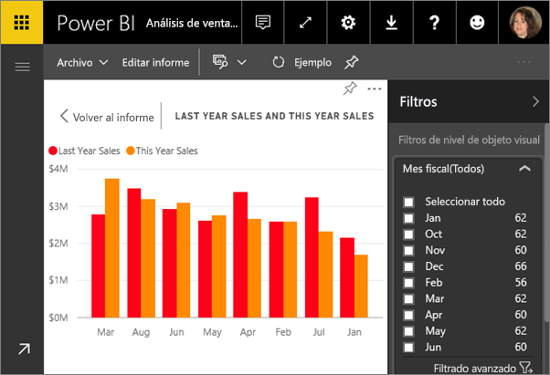

Para mostrar esa misma visualización sin la distracción de las barras de menús, del panel de filtros y otros adornos, seleccione el icono de **pantalla completa** de la barra de menús de la parte superior .

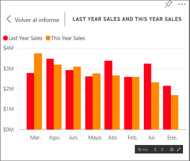

### Mostrar los datos utilizados para crear una visualización
Una visualización de Power BI se construye con datos provenientes de los conjuntos de datos subyacentes. Si quiere ver lo que sucede en segundo plano, Power BI le permite *mostrar* los datos que se usan para crear el objeto visual. Cuando se selecciona **Mostrar datos**, Power BI muestra los datos que están situados debajo (o cerca) de la visualización.

1. En el servicio Power BI, abra un informe y seleccione un objeto visual.  
2. Para que se muestren los datos que hay detrás del objeto visual, seleccione los puntos suspensivos (...) y elija **Mostrar datos**.
   
   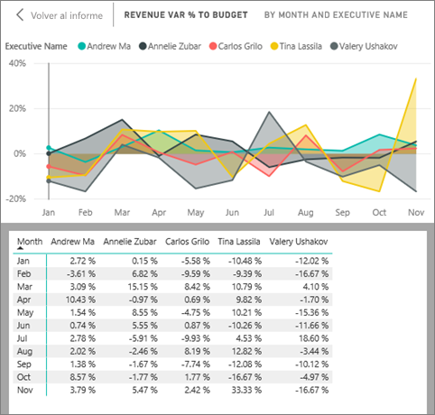

Aquí finaliza esta introducción rápida a algunas de las acciones que pueden realizar los **consumidores** con el servicio Power BI.  

## Limpieza de recursos
- Si se conecta a una aplicación, en la barra de navegación izquierda, seleccione **Aplicaciones** para abrir la lista de contenido de las aplicaciones. Mantenga el puntero sobre la aplicación que desea eliminar y seleccione el icono de Papelera.

- Si ha importado un informe de ejemplo de Power BI, o se ha conectado a uno, abra **Mi área de trabajo** en la barra de navegación izquierda. Busque el panel, informe y conjunto de datos mediante las pestañas de la parte superior, y seleccione el icono de Papelera de cada uno.

## Pasos siguientes

