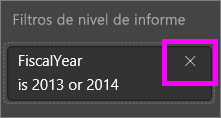
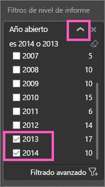
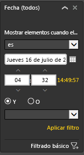

# Ver el panel Filtros del informe
En este artículo se analiza en profundidad el panel Filtros del informe. Verá el panel en la [vista de edición y la vista de lectura del servicio Power BI](end-user-reading-view.md) y en la [vista de informe de Power BI Desktop](../desktop-report-view.md).

Hay muchas maneras diferentes de filtrar los datos en Power BI, por eso es recomendable leer primero el artículo [Filtros y resaltado](../power-bi-reports-filters-and-highlighting.md).

## Trabajar con el panel Filtros de informes
En Power BI Desktop, los informes se abren en la vista de informe. En el servicio Power BI, los informes se pueden abrir en la [vista de edición o la vista de lectura](end-user-reading-view.md). En la vista de edición y en la vista de informe de Desktop, los propietarios de informes pueden [agregar filtros a un informe](../power-bi-report-add-filter.md), de modo que dichos filtros se guarden con el informe. Las personas que ven el informe en la vista Lectura pueden interactuar con los filtros y guardar sus cambios, pero no pueden agregar nuevos filtros al informe.

En el servicio Power BI, los informes conservan cualquier cambio que haya realizado en el panel Filtros y dichos cambios se aplican en la versión móvil del informe. Para restablecer los valores predeterminados del creador en el panel Filtro, seleccione **Restablecer valores predeterminados** en la barra de menús superior.     

## Abrir el panel Filtros
Cuando se abre un informe, el panel Filtros se muestra en la parte derecha del lienzo del informe. Si no ve el panel, seleccione la flecha que encontrará en la esquina superior derecha para expandirlo. Si está en la vista de lectura de servicio Power BI, el único panel disponible en el lado derecho es el panel Filtros.

En este ejemplo, hemos seleccionado un objeto visual que cuenta con seis filtros. La página de informe también tiene filtros, que se muestran en el encabezado **Filtros de nivel de página**. Hay un [Filtro de obtención de detalles](../power-bi-report-add-filter.md) y todo el informe tiene también un filtro: **FiscalYear** es 2013 o 2014.

Algunos de los filtros tienen la palabra **Todo** junto a ellos, lo que indica que se incluyen como filtro todos los valores.  Por ejemplo, **Cadena(Todo)**, como se puede ver en la captura de pantalla siguiente, indica que esta página del informe incluye datos sobre todas las cadenas.  Por otro lado, el filtro de nivel de informe **AñoFiscal es 2013 o 2014** nos indica que el informe solo incluye los datos de los años fiscales de 2013 y 2014.

Cualquier persona que vea este informe puede interactuar con estos filtros.

* Para ver los detalles del filtro, mueva el puntero por encima de él y seleccione la flecha situada junto al filtro.
  
   
* Puede cambiar el filtro; por ejemplo, puede cambiar **Lindseys** por **Fashions Direct**.
  
     

* Para restablecer los filtros a su estado original, seleccione **Restablecer valores predeterminados** en la barra de menús superior.    
    
    
* Para eliminar el filtro, seleccione el icono **x** que aparece junto al nombre del filtro.
  
  Si elimina un filtro, se quitará de la lista, pero los datos no se eliminarán del informe.  Por ejemplo, si elimina el filtro **AñoFiscal es 2013 o 2014**, los datos del año fiscal seguirán en el informe, pero ya no se aplicará ningún filtro para mostrar solo los años 2013 y 2014, sino que se mostrarán todos los años fiscales que contengan los datos.  Sin embargo, una vez elimine el filtro, no podrá modificarlo de nuevo, ya que no estará en la lista. La opción más adecuada es borrar el filtro con el icono de borrador .
  
  

## Filtros en la Vista de edición
Al abrir un informe en la vista de edición del servicio Power BI o en Desktop, el panel Filtros se muestra en la parte derecha del lienzo del informe, en la mitad inferior del **Panel de visualización**. Si no ve el panel, seleccione la flecha que encontrará en la esquina superior derecha para expandirlo.

.  

Si no está seleccionado ningún objeto visual en el lienzo, el panel de filtros muestra solo los filtros que se aplican a la página del informe completa o al informe completo y cualquier filtro de obtención de detalles (si se estableció alguno). En el ejemplo siguiente, no se seleccionó ningún objeto visual y no hay ningún filtro en el nivel de página ni filtros de obtención de detalles, pero hay un filtro en el nivel de informe.  

  

Si se selecciona un objeto visual en el lienzo, también verá los filtros que se aplican únicamente a ese objeto visual:   

Para mostrar las opciones de un filtro determinado, seleccione la flecha hacia abajo que figura junto al nombre del filtro.  En el ejemplo siguiente, el filtro de nivel de informe se establece en 2013 y 2014. Y este es un ejemplo de **filtrado básico**.  Para mostrar las opciones avanzadas, seleccione **Filtrado avanzado**.

## Borrado de un filtro
 Tanto en el modo de filtrado básico como en el avanzado, seleccione el icono de borrador  para borrar el filtro. 

## Agregar un filtro
* En la vista de edición de Desktop y del servicio Power BI, agregue un filtro a un objeto visual, página, obtención de detalles o informe seleccionando un campo desde el panel Campos y arrastrándolo al área del filtro apropiado, donde verá las palabras **Arrastre los campos aquí**. Cuando haya agregado un campo como filtro, modifíquelo con los controles Filtrado básico y Filtrado avanzado, descritos a continuación.

* **El hecho de arrastrar un nuevo campo en el área del filtro de nivel objeto visual no agrega el campo al objeto visual**, pero le permite filtrar el objeto visual por este nuevo campo. En el ejemplo siguiente se agrega **Cadena** como nuevo filtro al objeto visual. Tenga en cuenta que, aunque agregue **Cadena** como filtro, el objeto visual no se alterará hasta que use los controles Filtrado básico o Filtrado avanzado.

    

* Todos los campos que se utilizan para crear una visualización también están disponibles como filtros. Primero, seleccione un objeto visual para activarlo. Los campos en uso del objeto visual se muestran en los paneles Visualizaciones y Filtros, en el encabezado **Filtros de nivel visual**.
  
     
  
   Modifique cualquiera de estos campos con los controles Filtrado básico y Filtrado avanzado, descritos a continuación.

## Tipos de filtros: filtros de campo de texto
### Modo de lista
Al marca una casilla, se activa o desactiva el valor. La casilla **Todos** se puede usar para activar o desactivar todas las casillas . Las casillas representan todos los valores disponibles para ese campo.  Al ajustar el filtro, la redefinición se actualiza para reflejar las opciones elegidas. 

Observe cómo la redefinición ahora indica "es Amarilla o Carretera"

### Modo avanzado
Seleccione **Filtrado avanzado** para cambiar al modo avanzado. Use los controles de lista desplegable y cuadros de texto para identificar los campos que se van a incluir. Con la selección de **And** y **Or**puede crear expresiones de filtro complejas. Seleccione el botón **Aplicar filtro** cuando haya establecido los valores que desee.  

## Tipos de filtros: filtros de campo de numérico
### Modo de lista
Si los valores son finitos, al seleccionar el nombre del campo se muestra una lista.  Consulte **Filtros de campo de texto** &gt; **Modo de lista** que aparece más arriba para obtener ayuda con las casillas.   

### Modo avanzado
Si los valores son infinitos o representan un intervalo, la selección del nombre del campo abre el modo de filtro avanzado. Use los cuadros de texto y los desplegables para especificar el intervalo de valores que desea ver. 

Con la selección de **And** y **Or**puede crear expresiones de filtro complejas. Seleccione el botón **Aplicar filtro** cuando haya establecido los valores que desee.

## Tipos de filtros: fecha y hora
### Modo de lista
Si los valores son finitos, al seleccionar el nombre del campo se muestra una lista.  Consulte **Filtros de campo de texto** &gt; **Modo de lista** que aparece más arriba para obtener ayuda con las casillas.   

### Modo avanzado
Si los valores de campo representan una fecha o una hora, puede especificar una hora de inicio y de fin al usar los filtros de fecha y hora.  

## Pasos siguientes
[Filtrado y resaltado en informes](../power-bi-reports-filters-and-highlighting.md)  
[Interacción con filtros y resaltado en la Vista de lectura del informe](end-user-reading-view.md)  
[Creación de filtros en la Vista de edición de los informes](../power-bi-report-add-filter.md)  
[Cambiar el filtro cruzado y el resaltado cruzado entre los objetos visuales de los informes](end-user-interactions.md)

Más información sobre [informes de Power BI](end-user-reports.md)  
[Power BI: Conceptos básicos](end-user-basic-concepts.md)

¿Tiene más preguntas? [Pruebe la comunidad de Power BI](http://community.powerbi.com/)

