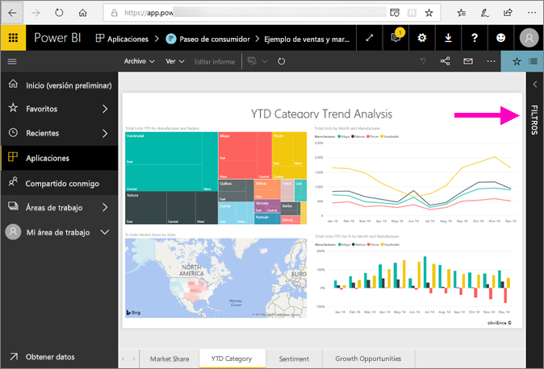
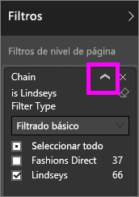
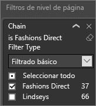
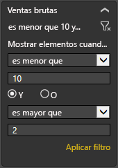

# Ver el panel Filtros del informe
En este artículo se analiza el panel Filtros del informe en el servicio Power BI.

Hay muchas maneras diferentes de filtrar los datos en Power BI, por eso es recomendable leer primero el artículo [Filtros y resaltado](../power-bi-reports-filters-and-highlighting.md).

## Trabajar con el panel Filtros de informes
Cuando algún compañero comparta un informe con usted, asegúrese de buscar el panel **Filtros**. A veces se contrae en el borde derecho del informe. Selecciónelo para expandirlo.   

El panel Filtros contiene filtros que el *diseñador* de informes ha agregado al informe. Los *consumidores*, como usted, pueden interactuar con los filtros y guardar sus cambios, pero no pueden agregar nuevos filtros al informe.

En el servicio Power BI, los informes conservan cualquier cambio que haya realizado en el panel Filtros y dichos cambios se aplican en la versión móvil del informe. Para restablecer los valores predeterminados del diseñador en el panel Filtro, seleccione **Restablecer valores predeterminados** en la barra de menús superior.     

## Abrir el panel Filtros
Cuando se abre un informe, el panel Filtros se muestra en la parte derecha del lienzo del informe. Si no ve el panel, seleccione la flecha que encontrará en la esquina superior derecha para expandirlo.  

En este ejemplo, hemos seleccionado un objeto visual que cuenta con seis filtros. La página de informe también tiene filtros, que se muestran en el encabezado **Filtros de nivel de página**. Hay un [Filtro de obtención de detalles](../power-bi-report-add-filter.md) y todo el informe tiene también un filtro: **FiscalYear** es 2013 o 2014.

Algunos de los filtros tienen la palabra **Todo** junto a ellos, lo que indica que se incluyen como filtro todos los valores.  Por ejemplo, **Cadena(Todo)**, como se puede ver en la captura de pantalla siguiente, indica que esta página del informe incluye datos sobre todas las cadenas.  Por otro lado, el filtro de nivel de informe **AñoFiscal es 2013 o 2014** nos indica que el informe solo incluye los datos de los años fiscales de 2013 y 2014.

Cualquier persona que vea este informe puede interactuar con estos filtros.

* Para ver los detalles del filtro, mueva el puntero por encima de él y seleccione la flecha situada junto al filtro.
  
   
* Puede cambiar el filtro; por ejemplo, puede cambiar **Lindseys** por **Fashions Direct**.
  
     

* Para restablecer los filtros a su estado original, seleccione **Restablecer valores predeterminados** en la barra de menús superior.    
    
    
* Para eliminar el filtro, seleccione el icono **x** que aparece junto al nombre del filtro.
  
  Si elimina un filtro, se quitará de la lista, pero los datos no se eliminarán del informe.  Por ejemplo, si elimina el filtro **AñoFiscal es 2013 o 2014**, los datos del año fiscal seguirán en el informe, pero ya no se aplicará ningún filtro para mostrar solo los años 2013 y 2014, sino que se mostrarán todos los años fiscales que contengan los datos.  Sin embargo, una vez elimine el filtro, no podrá modificarlo de nuevo, ya que no estará en la lista. La opción más adecuada es borrar el filtro seleccionando el icono de borrador .
  
  

## Borrado de un filtro
 En el modo de filtrado básico o avanzado, seleccione el icono de borrador   para borrar el filtro. 

## Tipos de filtros: filtros de campo de texto
### Modo de lista
Al marca una casilla, se activa o desactiva el valor. La casilla **Todos** se puede usar para activar o desactivar todas las casillas . Las casillas representan todos los valores disponibles para ese campo.  Al ajustar el filtro, la redefinición se actualiza para reflejar las opciones elegidas. 

Observe cómo la redefinición ahora indica "es Amarilla o Carretera"

### Modo avanzado
Seleccione **Filtrado avanzado** para cambiar al modo avanzado. Use los controles de lista desplegable y cuadros de texto para identificar los campos que se van a incluir. Con la selección de **And** y **Or**puede crear expresiones de filtro complejas. Seleccione el botón **Aplicar filtro** cuando haya establecido los valores que desee.  

## Tipos de filtros: filtros de campo de numérico
### Modo de lista
Si los valores son finitos, al seleccionar el nombre del campo se muestra una lista.  Consulte **Filtros de campo de texto** &gt; **Modo de lista** que aparece más arriba para obtener ayuda con las casillas.   

### Modo avanzado
Si los valores son infinitos o representan un intervalo, la selección del nombre del campo abre el modo de filtro avanzado. Use los cuadros de texto y los desplegables para especificar el intervalo de valores que desea ver. 

Con la selección de **And** y **Or**puede crear expresiones de filtro complejas. Seleccione el botón **Aplicar filtro** cuando haya establecido los valores que desee.

## Tipos de filtros: fecha y hora
### Modo de lista
Si los valores son finitos, al seleccionar el nombre del campo se muestra una lista.  Consulte **Filtros de campo de texto** &gt; **Modo de lista** que aparece más arriba para obtener ayuda con las casillas.   

### Modo avanzado
Si los valores de campo representan una fecha o una hora, puede especificar una hora de inicio y de fin al usar los filtros de fecha y hora.  

## Pasos siguientes
[Obtener información sobre cómo y por qué cambiar el filtro cruzado y el resaltado cruzado entre los objetos visuales en una página de informe](end-user-interactions.md)