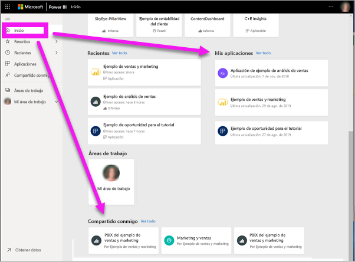
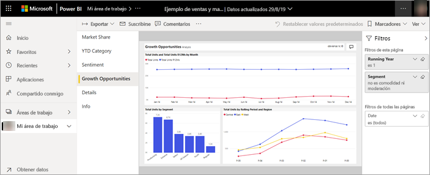
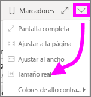
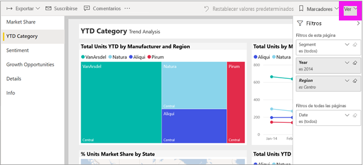

# Visualización de un informe en el servicio Power BI para *consumidores*
Un informe consta de una o varias páginas de objetos visuales. Los *diseñadores* de Power BI crean los informes y [los comparten con los *consumidores* directamente](end-user-shared-with-me.md) o como parte de una [aplicación](end-user-apps.md). 

Hay muchas maneras diferentes de abrir un informe; aquí le mostraremos dos de ellas: desde la Página principal y desde un panel. 

<!-- add art-->

## Abrir un informe desde Página principal de Power BI
Vamos a abrir un informe que se ha compartido con usted directamente y, a continuación, vamos a abrir un informe que se ha compartido como parte de una aplicación.

   

### Apertura de un informe que se ha compartido con usted
Los *diseñadores* de Power BI pueden compartir un informe individual directamente con usted mediante un vínculo en el correo electrónico o si lo agregan a su inicio de Power BI. El contenido que se comparte de este modo se muestra en el contenedor **Compartido conmigo** de la barra de navegación y en la sección **Compartido conmigo** del lienzo Página principal.

1. Abra el servicio Power BI (app.powerbi.com).

2. En la barra de navegación, seleccione **Página principal** para mostrar el lienzo Página principal.  

   
   
3. Desplácese hacia abajo hasta que vea **Compartido conmigo**. Busque el icono de informe . En esta captura de pantalla tenemos un panel y un informe llamado *Sales and marketing sample* (Ejemplo de ventas y marketing). 
   
   

4. Simplemente seleccione la *tarjeta* del informe para abrirlo.

   

5. Observe las pestañas de la parte izquierda.  Cada pestaña representa una *página* del informe. Ahora está abierta la página *Growth Opportunity* (Oportunidades de crecimiento). Seleccione la pestaña *YTD Category* (Categoría del año actual) para abrir la página del informe. 

   

6. Ahora se ve la página de informe completa. Para cambiar la presentación (zoom) de la página, seleccione la lista desplegable Vista en la esquina superior derecha y elija **Tamaño real**.

   

   

### Apertura de un informe que forma parte de una aplicación
Si ha recibido aplicaciones de compañeros de trabajo o de AppSource, esas aplicaciones están disponibles en la Página principal y el contenedor **Aplicaciones** de la barra de navegación. Una [aplicación](end-user-apps.md) es un conjunto de paneles e informes.

1. Seleccione **Página principal** en la barra de navegación para volver a la Página principal.

7. Desplácese hacia abajo hasta que vea **Mis aplicaciones**.

   

8. Seleccione una de las aplicaciones para abrirla. Dependiendo de las opciones establecidas por el *diseñador* de la aplicación, esta abrirá un panel o un informe. Si al seleccionar la aplicación:
    - se abre el informe, ya ha terminado.
    - se abre un panel, vea ***Apertura de un informe desde un panel***, a continuación.

## Apertura de un informe desde un panel
Los informes se pueden abrir desde un panel. La mayoría de los [iconos](end-user-tiles.md) de panel están *anclados* desde los informes. Al seleccionar un icono se abre el informe que se usó para crear el icono. 

1. En un panel, seleccione un icono. En este ejemplo hemos seleccionado el icono del gráfico de columnas "Total unidades hasta la fecha...".

    

2.  Se abre el informe asociado. Tenga en cuenta que estamos en la página "Categoría hasta la fecha". Se trata de la página del informe que contiene el gráfico de columnas que hemos seleccionado desde el panel.

    

> [!NOTE]
> No todos los iconos conducen a un informe. Si selecciona un icono que ha sido [creado con Preguntas y respuestas](end-user-q-and-a.md), se abrirá la pantalla de Preguntas y respuestas. Si selecciona un icono que ha sido [creado mediante el widget **Agregar icono** del panel](../service-dashboard-add-widget.md), pueden pasar varias cosas: puede que se reproduzca un vídeo, un sitio web o algo distinto.  

##  Más maneras aún de abrir un informe
Conforme se vaya familiarizando con la navegación por el servicio Power BI, descubrirá qué flujos de trabajo funcionan mejor en su caso. Algunas otras maneras de acceder a los informes:
- Desde la barra de navegación usando **Favoritos** y **Recientes**    
- Mediante [Ver relacionados](end-user-related.md)    
- En un correo electrónico cuando alguien [comparte con usted](../service-share-reports.md) o [establece una alerta](end-user-alerts.md).    
- Desde el [Centro de notificaciones](end-user-notification-center.md)    
- Y más

## Pasos siguientes
[Abrir y ver un panel](end-user-dashboard-open.md)

