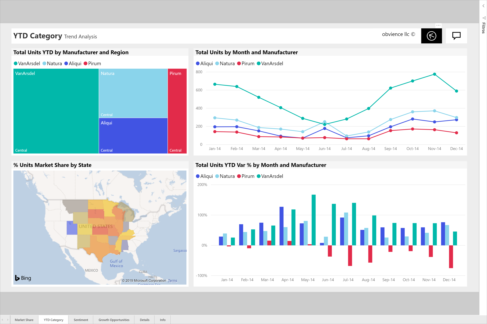

# Cambiar la presentación de una página de informe
Los informes se ven en muchos dispositivos diferentes con diferentes tamaños de pantalla y relaciones de aspecto.  Cambiar la forma en que se muestra una página de informe para satisfacer sus necesidades.    

## Explore el menú Ver
Las opciones en el menú Vista ofrecen flexibilidad para mostrar las páginas del informe en el tamaño y el ancho que elija.

- Supongamos que está viendo un informe en un dispositivo pequeño y resulta difícil ver los títulos y leyendas.  Seleccione **vista** > **tamaño real** para aumentar el tamaño de página del informe. Use las barras de desplazamiento para moverse por el informe. 

    

- Otra opción consiste en ajustar el informe para el ancho de pantalla seleccionando **ajustar al ancho**. Esto puede requerir todavía el uso de una barra de desplazamiento vertical.

  

- Si no desea que las barras de desplazamiento, pero desea hacer el mejor uso de su tamaño de la pantalla.  Seleccione **ajustar a la página**.

   

   
- La última opción, **pantalla completa**, muestra la página del informe sin barras de menús y los encabezados. Pantalla completa puede ser una buena elección para pantallas pequeñas, donde son difíciles de ver los detalles.  Pantalla completa también puede ser una buena opción al proyectar las páginas del informe en las pantallas grandes que las personas a ver pero no interactuar.  

    

Cuando se cierra el informe, la configuración de vista no se guarda, pero revertir al valor predeterminado. Si es importante guardar esta configuración, utilice [marcadores](end-user-bookmarks.md). 

## Pasos siguientes
[Crear informes para Cortana](../service-cortana-answer-cards.md)
