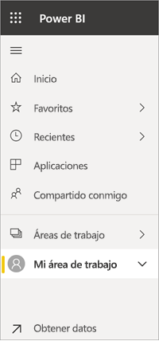
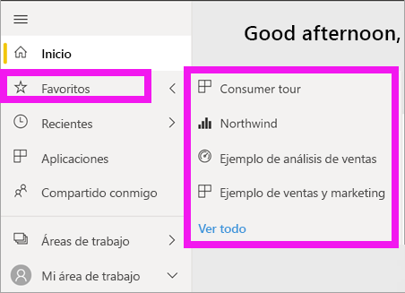

# Navegación: búsqueda, detección y ordenación de contenido en el servicio Power BI
Hay muchas maneras de navegar por el contenido en el servicio Power BI. El contenido de su área de trabajo está organizado por tipos: paneles e informes.  Y también se organiza el contenido por usos: favoritos, reciente, aplicaciones, compartido conmigo y destacado. Para que no haya que moverse de un lado a otro, el *inicio* de Power BI organiza todo el contenido en una página. Estos diferentes métodos de acceso al contenido le permiten encontrar rápidamente lo que necesita en el servicio Power BI.  

## Navegación en áreas de trabajo

Los *consumidores* de Power BI suelen tener solo un área de trabajo: **Mi área de trabajo**. En **Mi área de trabajo** se incluirá contenido si ha descargado los ejemplos de Microsoft o creado o descargado sus propios paneles, informes o aplicaciones.  

En **Mi área de trabajo**, el servicio Power BI separa el contenido por tipo: paneles, informes, libros y conjuntos de datos. Verá esta organización cuando seleccione un área de trabajo. En este ejemplo, **Mi área de trabajo** contiene un panel, un informe, ningún libro y un conjunto de datos.

________________________________________
## Navegación mediante el campo de búsqueda
Use la vista de contenido **Mi área de trabajo** para buscar, filtrar y ordenar el contenido. En el campo de búsqueda, escriba el nombre completo de un panel, un informe, un libro o un propietario, o bien una parte de él.  

Si solo tiene algunos elementos de contenido, la búsqueda y la ordenación no son necesarias.  En cambio, si tiene listas largas de paneles e informes, podrá comprobar que la búsqueda y la ordenación son muy útiles. Por ejemplo, la lista de informes siguiente tiene 83 elementos. 

También puede ordenar el contenido por nombre o propietario. Tenga en cuenta la flecha hacia arriba a la derecha del **Nombre**. Actualmente estamos ordenando 83 elementos alfabéticamente por nombre, de modo ascendente. Para cambiar el criterio de ordenación a descendente, seleccione **Nombre**. La flecha hacia arriba cambia a una flecha hacia abajo.

No todas las columnas se pueden ordenar. Mantenga el puntero sobre los encabezados de columna para detectar los que pueden ordenarse.

___________________________________________________________________
## Navegación mediante la barra de navegación izquierda
La barra de navegación izquierda clasifica el contenido de forma que le ayuda a encontrar lo que necesita rápidamente.  

- El contenido que se comparte con usted está disponible en **Compartido conmigo**.
- El contenido visto por última vez está disponible en **Recientes**. 
- Las aplicaciones se pueden encontrar al seleccionar **Aplicaciones**.
- **Inicio** es una vista de página única que presenta el contenido más importante y los orígenes de aprendizaje y contenido sugeridos.

Además, puede etiquetar el contenido como [favorito](end-user-favorite.md) y [destacado](end-user-featured.md). Seleccione el panel o el informe que espera ver más a menudo y establézcalo como contenido *destacado*. Cada vez que abra el servicio Power BI, el panel destacado será el que vea primero. ¿Tiene un número de paneles y aplicaciones que visita con frecuencia? Si los establece como favoritos, siempre estarán disponibles en la barra de navegación izquierda.

.

## Consideraciones y solución de problemas
* En los conjuntos de datos, **Ordenar por** no está disponible por propietario.

## Pasos siguientes
[Ordenación de objetos visuales en informes](end-user-change-sort.md)

¿Tiene más preguntas? [Pruebe la comunidad de Power BI](http://community.powerbi.com/)
