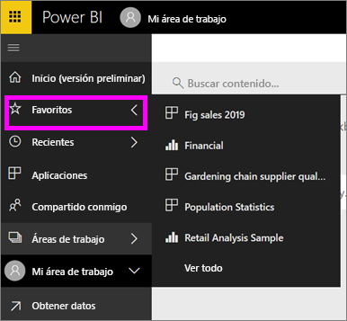

# Navegación: búsqueda, detección y ordenación de contenido en el servicio Power BI
Hay muchas maneras de navegar por el contenido en el servicio Power BI. El contenido de las áreas de trabajo está organizado por tipos: paneles, informes, libros y conjuntos de datos.  Y también se organiza el contenido por usos: favoritos, reciente, aplicaciones, compartido conmigo y destacado. Para que no haya que moverse de un lado a otro, la página Inicio organiza todo contenido en un mismo lugar. Estos diferentes métodos de acceso al contenido le permiten encontrar rápidamente lo que necesita en el servicio Power BI.  

## Navegación en áreas de trabajo

Los *consumidores* de Power BI suelen tener solo un área de trabajo: **Mi área de trabajo**. **Mi área de trabajo** solo tendrá contenido si ha descargado los ejemplos de Microsoft o creado o descargado su propio contenido.  

En **Mi área de trabajo**, el servicio Power BI separa el contenido por tipo: paneles, informes, libros y conjuntos de datos. Verá esta organización cuando seleccione un área de trabajo. En este ejemplo, **Mi área de trabajo** contiene un panel, dos informes, ningún libro y dos conjuntos de datos.

________________________________________

## Navegación mediante la barra de navegación izquierda
La barra de navegación de la izquierda clasifica el contenido de tal forma que es aún más fácil encontrar lo que necesita, rápidamente.  

- El contenido que se comparte con usted está disponible en **Compartido conmigo**.
- El contenido visto por última vez está disponible en **Recientes**. 
- Las aplicaciones se pueden encontrar al seleccionar **Aplicaciones**.
- **Inicio** es una vista de página única que presenta el contenido más importante y los orígenes de aprendizaje y contenido sugeridos.

Además, puede etiquetar el contenido como [favorito](end-user-favorite.md) y [destacado](end-user-featured.md). Seleccione el panel que espera ver más a menudo y establézcalo como su panel *destacado*. Cada vez que abra el servicio Power BI, el panel destacado será el que vea primero. ¿Tiene un número de paneles y aplicaciones que visita con frecuencia? Si los establece como favoritos, siempre estarán disponibles en la barra de navegación izquierda.

.

## Consideraciones y solución de problemas
* En los conjuntos de datos, **Ordenar por** no está disponible por propietario.

## Pasos siguientes
[Power BI: Conceptos básicos](end-user-basic-concepts.md)

¿Tiene más preguntas? [Pruebe la comunidad de Power BI](http://community.powerbi.com/)