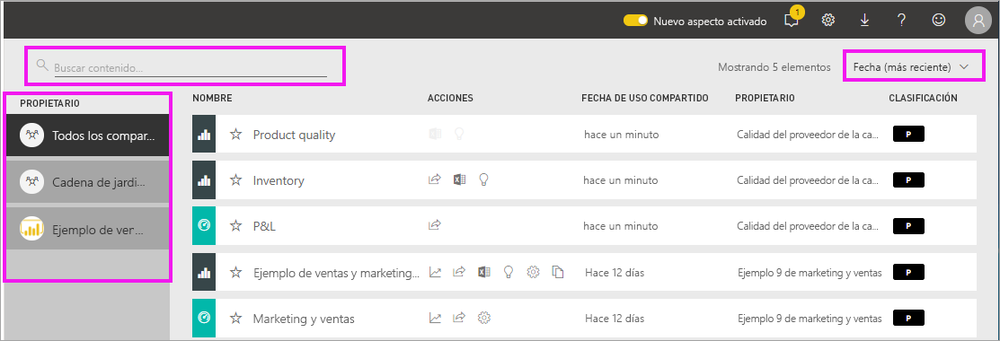

# Mostrar los paneles y los informes que se han compartido conmigo

[!INCLUDE[consumer-appliesto-ynny](../includes/consumer-appliesto-ynny.md)]

[!INCLUDE [power-bi-service-new-look-include](../includes/power-bi-service-new-look-include.md)]

Cuando algún compañero comparta contenido con usted con el botón **Compartir**, aparecerá en su contenedor **Compartido conmigo**. El panel o informe solo está disponible en **Compartido conmigo** y no en las **Aplicaciones**.

Amanda explica la lista de contenido **Compartido conmigo** y muestra cómo navegar y filtrar la lista. Luego, siga las instrucciones paso a paso que aparecen debajo del vídeo para intentarlo. Para poder ver paneles que hayan compartido con usted, debe tener una licencia de Power BI Pro. Lea [Tipos de licencias de Power BI](end-user-license.md) para obtener más información.
    

> [!NOTE]
> En este vídeo se usa una versión anterior del servicio Power BI.
    

<iframe width="560" height="315" src="https://www.youtube.com/embed/G26dr2PsEpk" frameborder="0" allowfullscreen></iframe>

## Interacción con el contenido compartido

Tendrá opciones para interactuar con los paneles y los informes compartidos, en función de los permisos que le otorgue el *diseñador*. como poder realizar copias del panel, abrir el informe [en la vista de lectura](end-user-reading-view.md) y volver a compartir con otros compañeros.

### Acciones disponibles en el contenedor **Compartido conmigo**
Las acciones disponibles dependerán de la configuración que asigna el *diseñador* de contenido. Algunas de las opciones pueden incluir lo siguiente:
* Seleccionar el icono de estrella para [marcar como favorito un panel o informe](end-user-favorite.md) .
* Retirada de un panel o informe  .
* Algunos paneles e informes se pueden volver a compartir  .
* [Abrir el informe en Excel](end-user-export.md)  
* [Ver información](end-user-insights.md) que Power BI encuentra en el  de datos.
  
  > [!NOTE]
  > Para obtener información sobre las clasificaciones de EGRC, seleccione el botón de **Clasificación** o [visite la Clasificación de datos del panel](../service-data-classification.md).
  > 

## Búsqueda y ordenación de paneles compartidos
Si la lista de contenido es larga, tiene varias opciones para encontrar lo que necesita. Puede usar el campo de búsqueda, ordenar por fecha o seleccionar en la columna **Propietario**.    

