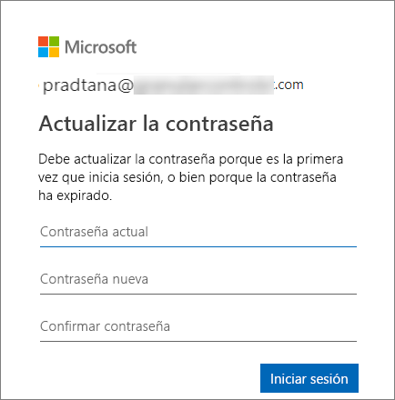
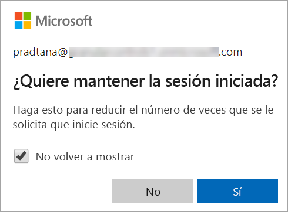
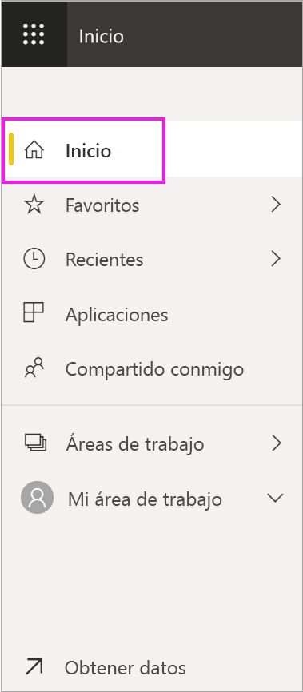
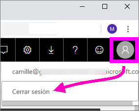

# Inicio de sesión en el servicio Power BI

## Cuentas de Power BI
Antes de poder iniciar sesión en Power BI, necesitará una cuenta. Hay dos maneras de obtener una cuenta de Power BI. La primera es cuando la empresa compra licencias de Power BI para sus empleados. Y la segunda es cuando los individuos se registran para obtener evaluaciones gratuitas o licencias personales. En este artículo se describe el primer escenario.

## Iniciar sesión por primera vez

### Paso 1: abrir un explorador
El servicio Power BI se ejecuta en un explorador.  Por tanto, el primer paso consiste en abrir su explorador favorito y escribir **app.powerbi.com**.

### Paso 2: escribir su dirección de correo electrónico
La primera vez que inicie sesión, se le pedirá la dirección de correo electrónico.  Se trata de la cuenta profesional o educativa que usó para registrarse en Power BI.  

Busque en la Bandeja de entrada un correo electrónico del Administrador de Power BI. La mayoría de los administradores le enviarán un correo electrónico de bienvenida que contiene la contraseña temporal. Use esta cuenta de correo electrónico para iniciar sesión. 

 
### Paso 3: crear una contraseña
Si el Administrador de Power BI le ha enviado una contraseña temporal, escríbala en el campo **Contraseña actual**. Si no ha recibido ninguna contraseña por correo electrónico, póngase en contacto con el administrador de Power BI.

Si quiere que Power BI recuerde sus credenciales, seleccione **Sí**. 

### Paso 4: revisar la página de aterrizaje Inicio
En la primera visita, Power BI abre la página de aterrizaje **Inicio**. Si **Inicio** no se abre, selecciónela en el panel de navegación. 

En la página Inicio, verá todo el contenido que puede usar. Inicialmente, es posible que no haya mucho contenido, pero no se preocupe, ya que cambiará a medida que empiece a usar Power BI con sus compañeros de trabajo. 

Si no quiere que Power BI abra la página Inicio, puede [establecer un panel o informe **Destacado**](end-user-featured.md) para que se abra en su lugar. 

## Interacción segura con el contenido
Como ***consumidor***, otros usuarios compartirán contenido con usted y podrá interactuar con ese contenido para explorar los datos y tomar decisiones empresariales.  Cuando filtre, segmente, se subscriba, exporte y cambie de tamaño, no se preocupe: el trabajo no afecta al conjunto de datos subyacente ni al contenido compartido original (informes y paneles). Power BI es un espacio seguro para explorar y experimentar. Eso no significa que los cambios no se puedan guardar: sí se puede. Pero estos cambios solo afectan a **su** vista del contenido. Y revertir a la vista predeterminada original es tan fácil como hacer clic en un botón.

## Cierre de sesión en el servicio Power BI
Cuando se cierra Power BI o la sesión de Power BI, los cambios se guardan para que pueda retomar desde donde lo haya dejado.

Para cerrar Power BI, cierre la pestaña del explorador en la que esté trabajando. 

 

Si comparte un equipo, se recomienda cerrar la sesión cada vez que cierre Power BI.  Para cerrar la sesión, haga clic en la imagen del perfil en la esquina superior derecha y elija **Cerrar sesión**. En caso contrario, cuando haya terminado, cierre la pestaña del explorador.

 

## Solución de problemas y consideraciones
- Si se ha registrado en Power BI como usuario individual, inicie sesión con la dirección de correo electrónico que haya usado para suscribirse.

- Algunas personas usan Power BI con más de una cuenta. Si es así, al iniciar sesión se le pedirá que seleccione una cuenta de una lista. 

## Pasos siguientes
[Visualización de una aplicación de Power BI](end-user-app-view.md)
