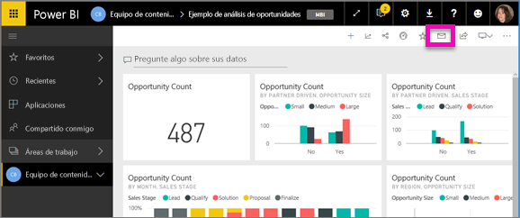
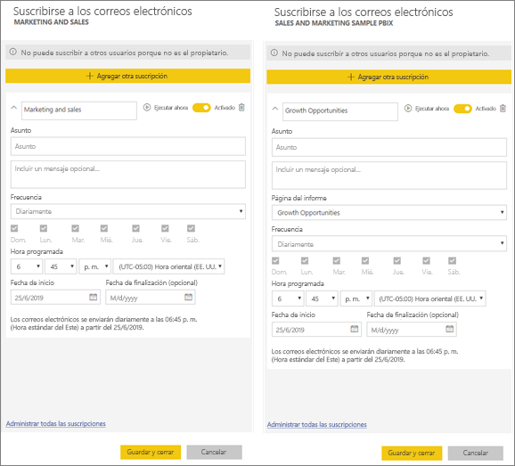
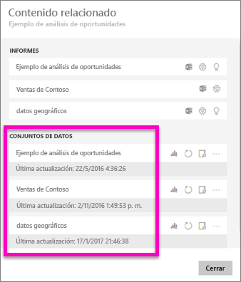

# Suscripción a un informe o panel en el servicio Power BI 

[!INCLUDE [power-bi-service-new-look-include](../includes/power-bi-service-new-look-include.md)]

Nunca antes ha sido tan fácil mantenerse al día de los paneles e informes más importantes. Suscríbase a las páginas de informes y paneles que más le interesen y Power BI le enviará por correo electrónico una instantánea a la Bandeja de entrada. Puede indicarle a Power BI la frecuencia con la que quiere recibir los mensajes de correo electrónico: una vez al día, una vez por semana o cuando se actualicen los datos. Incluso puede establecer una hora concreta a la que Power BI envíe los mensajes de correo electrónico o hacer que se ejecute al instante.  En resumen, puede configurar hasta 24 suscripciones distintas por informe o panel.  

El correo electrónico y la instantánea usarán el idioma establecido en la configuración de Power BI (consulte [Idiomas y países o regiones admitidos para Power BI](../supported-languages-countries-regions.md)). Si no se ha definido ningún idioma, Power BI usa el idioma de acuerdo con la configuración regional del explorador actual. Para ver o establecer las preferencias de idioma, seleccione el icono de engranaje  > **Configuración > General > Idioma**. 

Cuando reciba el correo electrónico, incluye un vínculo para "ir al informe o panel". En los dispositivos móviles con aplicaciones de Power BI instaladas, al seleccionar este vínculo, se inicia la aplicación (en lugar de la acción predeterminada de abrir el informe o el panel en el sitio web de Power BI).

## Requisitos
**Crear** una suscripción para usted mismo requiere una licencia de Power BI Pro. Los usuarios que ven contenido en un área de trabajo o aplicación Premium también pueden suscribirse al contenido que se encuentra allí, incluso sin una licencia Power BI Pro. **Suscribir a otros usuarios** solo está disponible para el propietario del panel. 

## Suscribirse a un panel o una página de informe
El proceso de suscripción a un panel o un informe es similar. El mismo botón permite suscribirse a los paneles e informes del servicio Power BI.
 
.

1. Abra el panel o el informe.
2. En la barra de menús superior, haga clic en **Suscribirse** o en el icono de sobre .
   
   

   
    
    La pantalla de la izquierda aparece cuando esté en un panel y haga clic en **Suscribirse**. La pantalla de la derecha aparece cuando esté en una página de informe y haga clic en **Suscribirse**. Para suscribirse a más de una página de un informe, seleccione **Agregar otra suscripción** y seleccione una página diferente. 

4. Use el control deslizante amarillo para activar y desactivar la suscripción.  Aunque el control deslizante se establezca en desactivado, la suscripción no se elimina. Para eliminarla, seleccione el icono de papelera.

5. Opcionalmente, agregue un asunto y los detalles del mensaje de correo electrónico. 

5. Seleccione una **Frecuencia** para la suscripción.  Puede elegir Diaria, Semanal o Tras la actualización de los datos (una vez al día).  Para recibir el correo electrónico de suscripción solo en días concretos, seleccione **Semanal** y elija los días en los que quiera recibirlo.  Por ejemplo, si le gustaría recibir el correo electrónico de suscripción solo los días laborables, seleccione **Semanal** para la frecuencia y desactive las casillas para Sáb. y Dom.   

6. Para programar la hora a la que se envía el correo electrónico, seleccione Diaria o Semanal para la frecuencia, y escriba una **Hora** **programada** para la suscripción.  Esta hora es cuando se inicia el trabajo de la suscripción. En determinados escenarios, puede tardar unos minutos antes de que se entregue el correo electrónico a la Bandeja de entrada.    

7. Para programar la fecha de inicio y la fecha de finalización, escríbalas en los campos de fecha. De forma predeterminada, la hora de inicio para la suscripción será la fecha en la que la haya creado y la fecha de finalización será un año más tarde. Cuando una suscripción alcanza una fecha de finalización, se detiene hasta que vuelva a habilitarla.  Recibirá notificaciones antes de la fecha de finalización programada para preguntarle si quiere ampliarla.     

8. Para revisar la suscripción y probarla, haga clic en **Ejecutar ahora**.  Esto envía el correo electrónico de inmediato. 

8. Si todo es correcto, haga clic en **Guardar y cerrar** para guardar la suscripción. Recibirá un correo electrónico y la instantánea del panel o informe en la programación que haya establecido. Todas las suscripciones en las que la frecuencia se ha establecido en **Tras la actualización de los datos** solo enviarán un correo electrónico después de la primera actualización programada de ese día.
   
   
   
    La actualización de la página del informe no actualiza el conjunto de datos. El propietario del conjunto de datos es el único que puede actualizar manualmente un conjunto de datos. Para buscar el nombre del propietario de los conjuntos de datos subyacentes, seleccione **Ver relacionados** en la barra de menús superior o busque en el correo electrónico de la suscripción original.
   
    

## Administrar sus suscripciones
Solo puede administrar las suscripciones que cree. Vuelva a hacer clic en **Suscribirse** y haga clic en **Administrar todas las suscripciones** en la esquina inferior izquierda (vea las capturas de pantalla anteriores). 

Una suscripción finalizará si expira la licencia de Pro, el propietario elimina el panel o el informe o se elimina la cuenta de usuario utilizada para crear la suscripción.

## Consideraciones y solución de problemas
* Es posible que los paneles con más de 25 iconos anclados, o bien con 4 páginas de informes activos ancladas, no se representen totalmente en los correos electrónicos de la suscripción enviados a los usuarios. Se recomienda contactar con el diseñador del panel y pedirle que reduzca los iconos anclados a menos de 25 y los informes activos anclados a menos de 4 para asegurarse de que el correo electrónico se representa de forma correcta.  
* En las suscripciones de correo electrónico de panel, si se ha aplicado la seguridad de nivel de fila (RLS) a algún icono, dicho icono no se mostrará.  En cuanto a las suscripciones de correo electrónico de informe, si el conjunto de datos usa RLS, no podrá crear una suscripción.
* Si los vínculos del correo electrónico (al contenido) dejan de funcionar, es posible que el contenido se haya eliminado. En el correo electrónico, debajo de la captura de pantalla, puede ver si se ha suscrito personalmente o si alguien lo ha hecho por usted. Si lo ha hecho otra persona, pídale que cancele los mensajes de correo electrónico o que vuelva a suscribirle.
* Las suscripciones a una página del informe están asociadas con el nombre de la página del informe. Si se suscribe a una página del informe y cambia de nombre, tendrá que volver a crear la suscripción.
* Si no puede usar la característica de suscripción, póngase en contacto con el administrador del sistema. Es posible que su organización haya deshabilitado esta característica.  
* Las suscripciones de correo electrónico no admiten la mayoría de los [objetos visuales personalizados](../developer/power-bi-custom-visuals.md).  La excepción son los objetos visuales personalizados que se han [certificado](../developer/power-bi-custom-visuals-certified.md).  
* En estos momentos, las suscripciones de correo electrónico no admiten los objetos visuales personalizados con la tecnología de R.  
* Para las suscripciones de unos paneles en concreto, no se admiten aún ciertos tipos de iconos.  Entre estos se incluyen: transmisión en secuencias de mosaicos, iconos de vídeo, iconos de contenido web personalizado.     
* Las suscripciones pueden provocar errores en paneles o informes con imágenes muy grandes debido a las limitaciones de tamaño del correo electrónico.    
* Power BI detiene de forma automática la actualización en los conjuntos de datos asociados con los paneles e informes que no se han visitado en más de dos meses.  Pero si agrega una suscripción a un panel o informe, no se detendrá aunque no reciba visitas.
* En raras ocasiones, las suscripciones de correo electrónico pueden tardar más de 15 minutos en entregarse a los destinatarios.  Si esto ocurre, se recomienda ejecutar la actualización de datos y la suscripción de correo electrónico a otras horas para garantizar la entrega puntual.  Si la incidencia persiste, póngase en contacto con el soporte técnico de Power BI.

## Pasos siguientes

[Búsqueda y ordenación de contenido](end-user-search-sort.md)
