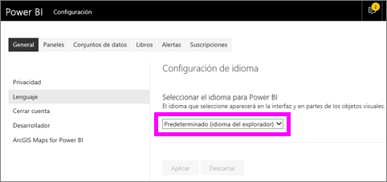
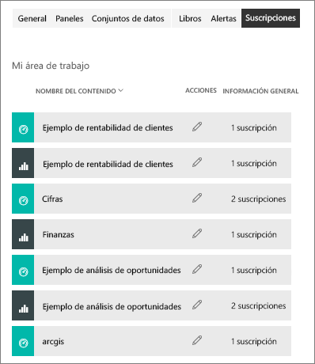

# Suscripción a un informe o panel en el servicio Power BI 
Nunca antes ha sido tan fácil mantenerse al día de los paneles e informes más importantes. Suscríbase a las páginas de informes y paneles que más le interesen y Power BI le enviará por correo electrónico una instantánea a la bandeja de entrada. Puede indicarle a Power BI la frecuencia con la que quiere recibir los mensajes de correo electrónico: una vez al día, una vez por semana o cuando se actualicen los datos. Incluso puede establecer una hora concreta a la que Power BI envíe los mensajes de correo electrónico.  

El correo electrónico y la instantánea usarán el idioma establecido en la configuración de Power BI (consulte [Idiomas y países o regiones admitidos para Power BI](../supported-languages-countries-regions.md)). Si no se ha definido ningún idioma, Power BI usa el idioma de acuerdo con la configuración regional del explorador actual. Para ver o establecer las preferencias de idioma, seleccione el icono de engranaje  > **Configuración > General > Idioma**. 

Cuando reciba el correo electrónico, incluye un vínculo para "ir al informe o panel". En los dispositivos móviles con aplicaciones de Power BI instaladas, al seleccionar este vínculo, se inicia la aplicación (en lugar de la acción predeterminada de abrir el informe o el panel en el sitio web de Power BI).

## Requisitos
**Crear** una suscripción es una característica de Power BI Pro.   

## Suscribirse a un panel o una página de informe
El proceso de suscripción a un panel o un informe es similar. El mismo botón permite suscribirse a los paneles e informes del servicio Power BI.
 
.

1. Abra el panel o el informe.
2. En la barra de menús superior, haga clic en **Suscribirse** o en el icono de sobre .
   
   

   
    
    La pantalla de la izquierda aparece cuando esté en un panel y haga clic en **Suscribirse**. La pantalla de la derecha aparece cuando esté en una página de informe y haga clic en **Suscribirse**. Para suscribirse a más de una página de un informe, seleccione **Agregar otra suscripción** y seleccione una página diferente. 

3. Use el control deslizante amarillo para activar y desactivar la suscripción.  Aunque el control deslizante se establezca en desactivado, la suscripción no se elimina. Para eliminarla, seleccione el icono de papelera.

4. Opcionalmente, agregue los detalles del mensaje de correo electrónico. 

5. Seleccione una **Frecuencia** para la suscripción.  Puede elegir Diaria, Semanal o Tras la actualización de los datos (una vez al día).  Para recibir el correo electrónico de suscripción solo en días concretos, seleccione **Semanal** y elija los días en los que quiera recibirlo.  Por ejemplo, si le gustaría recibir el correo electrónico de suscripción solo los días laborables, seleccione **Semanal** para la frecuencia y desactive las casillas para Sáb. y Dom.   

6. Para programar la hora a la que se envía el correo electrónico, seleccione Diaria o Semanal para la frecuencia, y escriba una **Hora** **programada** para la suscripción.   

7. Para programar la fecha de inicio y la fecha de finalización, escríbalas en los campos de fecha. De forma predeterminada, la hora de inicio para la suscripción será la fecha en la que la haya creado y la fecha de finalización será un año más tarde. Cuando una suscripción alcanza una fecha de finalización, se detiene hasta que vuelva a habilitarla.  Recibirá notificaciones antes de la fecha de finalización programada para preguntarle si quiere ampliarla.     

5. Seleccione **Guardar y cerrar** para guardar la suscripción. Recibirá un correo electrónico y la instantánea del panel o informe en la programación que haya establecido. Todas las suscripciones en las que la frecuencia se ha establecido en **Tras la actualización de los datos** solo enviarán un correo electrónico después de la primera actualización programada de ese día.
   
   
   
    La actualización de la página del informe no actualiza el conjunto de datos. El propietario del conjunto de datos es el único que puede actualizar manualmente un conjunto de datos. Para buscar el nombre de los conjuntos de datos subyacentes, seleccione **Ver relacionados** en la barra de menús superior.
   
    

## Administrar sus suscripciones
Solo usted puede administrar sus suscripciones. Vuelva a hacer clic en **Suscribirse** y haga clic en **Administrar todas las suscripciones** en la esquina inferior izquierda (vea las capturas de pantalla anteriores). 

Una suscripción finalizará si expira la licencia de Pro, el propietario elimina el panel o el informe o se elimina la cuenta de usuario utilizada para crear la suscripción.

## Consideraciones y solución de problemas
* En las suscripciones de correo electrónico de panel, si se ha aplicado la seguridad de nivel de fila (RLS) a algún icono, dicho icono no se mostrará.  En cuanto a las suscripciones de correo electrónico de informe, si el conjunto de datos usa RLS, no podrá crear una suscripción.
* Las suscripciones a una página del informe están asociadas con el nombre de la página del informe. Si se suscribe a una página del informe y cambia su nombre, tendrá que volver a crear la suscripción.
* Si no puede usar la característica de suscripción, póngase en contacto con el administrador del sistema. Es posible que la organización haya desactivado esta característica por razones de autenticación o de otro tipo.  
* Las suscripciones de correo electrónico no admiten la mayoría de los [objetos visuales personalizados](../power-bi-custom-visuals.md).  La excepción son los objetos visuales personalizados que se han [certificado](../power-bi-custom-visuals-certified.md).  
* En estos momentos, las suscripciones de correo electrónico no admiten los objetos visuales personalizados con la tecnología de R.  
* Para las suscripciones de unos paneles en concreto, no se admiten aún ciertos tipos de iconos.  Entre estos se incluyen: transmisión en secuencias de mosaicos, iconos de vídeo, iconos de contenido web personalizado.     
* Las suscripciones pueden provocar errores en paneles o informes con imágenes muy grandes debido a las limitaciones de tamaño del correo electrónico.    
* Power BI detiene automáticamente la actualización en los conjuntos de datos asociados con los paneles e informes que no se han visitado en más de dos meses.  Sin embargo, si agrega una suscripción a un panel o informe, no se detendrá incluso si no recibe visitas.    

## Pasos siguientes
* ¿Tiene más preguntas? [Pruebe a preguntar a la comunidad de Power BI](http://community.powerbi.com/)    
* [Leer la entrada del blog](https://powerbi.microsoft.com/blog/introducing-dashboard-email-subscriptions-a-360-degree-view-of-your-business-in-your-inbox-every-day/)

