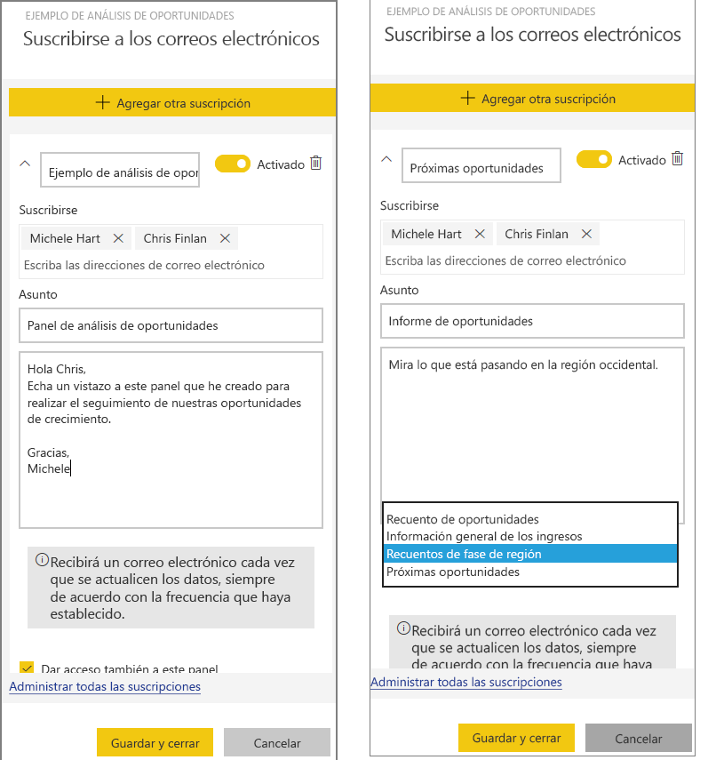
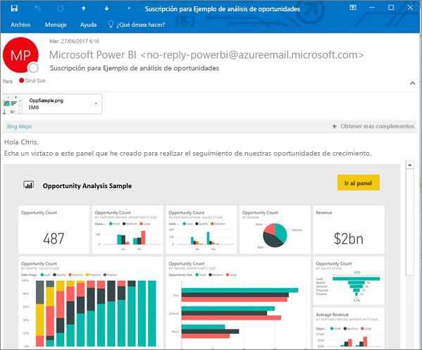

# Suscripción a un informe o panel en el servicio Power BI (app.powerbi.com)
Nunca antes ha sido tan fácil mantenerse al día de los paneles e informes más importantes. Suscriba tanto a su usuario como a sus compañeros de trabajo a las páginas de informes y paneles que más le interesen y Power BI le enviará por correo electrónico una instantánea a la bandeja de entrada. Puede indicarle a Power BI la frecuencia con la que quiere recibir los mensajes de correo electrónico: desde una vez al día hasta una vez por semana. 

El correo electrónico y la instantánea usarán el idioma establecido en la configuración de Power BI (consulte [Idiomas y países o regiones admitidos para Power BI](../supported-languages-countries-regions.md)). Si no se ha definido ningún idioma, Power BI usa el idioma de acuerdo con la configuración regional del explorador actual. Para ver o establecer las preferencias de idioma, seleccione el icono de engranaje  > **Configuración > General > Idioma**. 

Solo se pueden crear suscripciones en el servicio Power BI. Cuando reciba el correo electrónico, incluirá un vínculo para "ir al informe o panel". En los dispositivos móviles con aplicaciones de Power BI instaladas, al seleccionar este vínculo, se inicia la aplicación (en lugar de la acción predeterminada de abrir el informe o el panel en el sitio web de Power BI).

## Requisitos
- **Crear** una suscripción es una característica de Power BI Pro, y debe tener permisos para editar el contenido (panel o informe) si quiere hacerlo. 
- Puesto que solo se envían mensajes de correo electrónico de suscripción cuando un conjunto de datos se actualiza o se vuelve a cargar, las suscripciones no funcionan en conjuntos de datos que no se actualicen.

## Suscribirse a un panel o una página de informe
El proceso de suscripción a un panel es muy similar al de un informe. El mismo botón permite suscribirse y suscribir a otros usuarios a los paneles e informes del servicio Power BI.
 
.

1. Abra el panel o el informe.
2. En la barra de menús superior, seleccione **Suscribirse** o el icono de sobre .
   
   

3. Use el control deslizante amarillo para activar y desactivar la suscripción.  Aunque el control deslizante se establezca en desactivado, no se eliminará la suscripción. Para eliminarla, seleccione el icono de papelera.

4. Rellene los detalles del mensaje de correo electrónico. El correo electrónico se rellena previamente, pero puede agregar otros usuarios a la suscripción. Solo se pueden agregar direcciones de correo electrónico de un mismo dominio (vea **Consideraciones y solución de problemas** a continuación para obtener más detalles). Si el informe o el panel está hospedado en la [capacidad Premium](../service-premium.md), podrá suscribir a otros usuarios que usen direcciones de correo electrónico y alias de grupo. Si el informe o el panel no está hospedado en la capacidad de Premium, podrá suscribir a otros usuarios que usen sus direcciones de correo electrónico, pero también deberán tener licencias de Power BI Pro.

    En las capturas de pantalla siguiente, tenga en cuenta que, cuando se suscribe a un informe, realmente se está suscribiendo a una de sus *páginas*.  Para suscribirse a más de una página de un informe, seleccione **Agregar otra suscripción** y seleccione una página diferente. 
      
   

5. Seleccione **Guardar y cerrar** para guardar la suscripción. Los usuarios suscritos recibirán un correo electrónico y una instantánea del panel o de la página de informe siempre que se modifique uno de sus conjuntos de datos. Si el panel o el informe se actualiza más de una vez al día, el correo electrónico solo se enviará tras la primera actualización.  
   
   
   
   > [!TIP]
   > ¿Quiere ver el correo electrónico de inmediato? Puede desencadenar un correo electrónico actualizando una de las bases de datos asociadas al panel o el conjunto de datos asociado al informe. (Si no tiene permisos de edición del conjunto de datos, tendrá que solicitar que lo haga alguien que los tenga). Para averiguar qué conjuntos de datos se emplean, seleccione el icono de **Ver relacionados**  para abrir **Contenido relacionado** y luego seleccione el icono de actualización . 
   > 
   > 
   
   

## Cómo se determina la programación de correos electrónicos
En la tabla siguiente se describe la frecuencia con recibirá un correo electrónico. Todo depende del método de conexión del conjunto de datos en el que se basa el panel o el informe (DirectQuery, conexión dinámica, importación a Power BI o archivo de Excel en OneDrive o SharePoint Online) y de las opciones de suscripción disponibles y seleccionadas (diaria, semanal o ninguna).

|  | **DirectQuery** | **Live Connect** | **Actualización programada (importación)** | **Archivo de Excel en OneDrive o SharePoint Online** |
| --- | --- | --- | --- | --- |
| **¿Con qué frecuencia se actualiza el informe o panel?** |Cada 15 minutos |Power BI realiza una comprobación cada 15 minutos y, si el conjunto de datos ha cambiado, el informe se actualiza. |El usuario selecciona la frecuencia: ninguna, diaria o semanal. La frecuencia diaria puede ser de hasta 8 veces al día. La frecuencia semanal es en realidad una programación semanal que crea el usuario y que establece la actualización como mínimo una vez por semana y como máximo cada día. |Una vez cada hora |
| **¿Cuánto control tiene el usuario sobre la programación de correos electrónicos de la suscripción?** |Opciones: diaria o semanal. |Sin opciones: los usuarios reciben un correo electrónico si se actualiza el informe, pero no más de una vez al día. |Si la programación de actualización es diaria, las opciones son diaria y semanal.  Si la programación de actualización es semanal, la única opción es semanal. |Sin opciones: el usuario recibe un correo electrónico cada vez que se actualiza el conjunto de datos, pero no más de una vez al día. |

## Administrar sus suscripciones
Solo la persona que haya creado la suscripción podrá administrarla.  Hay 2 rutas de acceso a la pantalla en la que se administran sus suscripciones.  El primer paso es seleccionar **Administrar todas las suscripciones** en el cuadro de diálogo **Subscribirse a correos electrónicos** (vea el paso 4 anterior). La segunda es seleccionar el icono de engranaje de Power BI  en la barra de menús superior y elegir **Configuración**.

Las suscripciones concretas que se muestran dependen del área de trabajo que está activa en ese momento.  Para ver a la vez todas las suscripciones de todas las áreas de trabajo, asegúrese de que **Mi área de trabajo** está activa. Para entender las áreas de trabajo, consulte [Áreas de trabajo de Power BI](end-user-create-apps.md).

Una suscripción finalizará si expira la licencia de Pro, el propietario elimina el panel o el informe o se elimina la cuenta de usuario utilizada para crear la suscripción.

## Consideraciones y solución de problemas
* En las suscripciones de correo electrónico de panel, si se ha aplicado la seguridad de nivel de fila (RLS) a algún icono, dicho icono no se mostrará.  En cuanto a las suscripciones de correo electrónico de informe, si el conjunto de datos usa RLS, no podrá crear una suscripción.
* Las suscripciones a una página del informe están asociadas con el nombre de la página del informe. Si se suscribe a una página del informe y cambia su nombre, tendrá que volver a crear la suscripción
* En estos momentos, al suscribir a otros usuarios, no se admiten las suscripciones de correo electrónico relativas a informes o paneles que usen conjuntos de datos con conexión dinámica.
* Para las suscripciones de correo electrónico en conjuntos de datos de conexiones dinámicas, solo recibirá correos electrónicos cuando los datos cambien. Por lo tanto, si se produce una actualización pero los datos no cambian, Power BI no le enviará un correo electrónico.
* Las suscripciones de correo electrónico no admiten la mayoría de los [objetos visuales personalizados](../power-bi-custom-visuals.md).  La única excepción son esos objetos visuales personalizados que se han [certificado](../power-bi-custom-visuals-certified.md).  
* En estos momentos, las suscripciones de correo electrónico no admiten los objetos visuales personalizados con la tecnología de R.  
* Si se ha aplicado la seguridad de nivel de fila (RLS) a algún icono de panel, este no se mostrará.
* No puede suscribir a otros usuarios a un informe que tenga aplicada la seguridad de nivel de fila (RLS).
* Las suscripciones de correo electrónico se envían con los estados de segmentación y filtros predeterminados del informe. En el correo electrónico no se mostrarán los cambios en los valores predeterminados que realice tras suscribirse.    
* Las suscripciones de correo electrónico todavía no se admiten en las páginas de informes creadas con la característica Live Connect del servicio Power BI Desktop.    
* Para las suscripciones de unos paneles en concreto, no se admiten aún ciertos tipos de iconos.  Entre estos se incluyen: transmisión en secuencias de mosaicos, iconos de vídeo, iconos de contenido web personalizado.     
* Si comparte un panel con un compañero de trabajo fuera de su inquilino, no podrá crear una suscripción para él. Por tanto, si usted es aaron@xyz.com, podrá compartir con anyone@ABC.com, pero no podrá suscribir a anyone@ABC.com, y ese usuario no podrá suscribirse al contenido compartido.      
* Las suscripciones pueden provocar errores en paneles o informes con imágenes muy grandes debido a las limitaciones de tamaño del correo electrónico.    
* Power BI detiene automáticamente la actualización en los conjuntos de datos asociados con los paneles e informes que no se han visitado en más de 2 meses.  Sin embargo, si agrega una suscripción a un panel o informe, no se detendrá incluso si no recibe visitas.    
* Si no recibe los mensajes de correo electrónico de suscripción, asegúrese de que el nombre principal de usuario (UPN) puede recibir mensajes de correo electrónico. [El equipo de Power BI está trabajando para reducir este requisito](https://community.powerbi.com/t5/Issues/No-Mail-from-Cloud-Service/idc-p/205918#M10163). Esté atento a las novedades. 
* Si el panel o el informe está en la capacidad Premium, podrá usar el alias de correo electrónico del grupo para las suscripciones en lugar de suscribir las direcciones de correo electrónico de sus compañeros de trabajo de una en una. Los alias se basan en el directorio actual de Active Directory. 

## Pasos siguientes
* ¿Tiene más preguntas? [Pruebe a preguntar a la comunidad de Power BI](http://community.powerbi.com/)    
* [Leer la entrada del blog](https://powerbi.microsoft.com/blog/introducing-dashboard-email-subscriptions-a-360-degree-view-of-your-business-in-your-inbox-every-day/)

