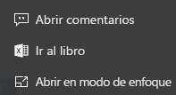

# Iconos de paneles en Power BI

[!INCLUDE[consumer-appliesto-yyny](../includes/consumer-appliesto-ynny.md)]

[!INCLUDE [power-bi-service-new-look-include](../includes/power-bi-service-new-look-include.md)]

Un icono es una instantánea de sus datos, que un *diseñador* ha anclado en el panel. Los *diseñadores* pueden crear iconos desde un informe, un conjunto de datos, un panel, el cuadro de pregunta de Preguntas y respuestas, Excel, SQL Server Reporting Services (SSRS), etc.  Esta captura de pantalla muestra muchos iconos diferentes anclados a un panel.

Además de los iconos anclados de los informes, los *diseñadores* puede agregar iconos independientes directamente en el panel mediante **Agregar icono**. Los iconos independientes incluyen: cuadros de texto, imágenes, vídeos, datos de transmisión y contenido web.

¿Necesita ayuda para comprender los bloques de creación que conforman Power BI?  Consulte [Power BI: conceptos básicos](end-user-basic-concepts.md).

## Interactuar con los iconos en un panel

1. Mantenga el puntero sobre el icono para que se muestren los puntos suspensivos.
   
    
2. Seleccione los puntos suspensivos (...) para abrir el menú de acciones del icono. Las opciones disponibles varían según el tipo de objeto visual y el método utilizado para crear el icono. Estos son algunos ejemplos de lo que puede ver.

    - Icono creado con Preguntas y respuestas
   
        

    - Icono creado a partir de un libro
   
        

    - Icono creado a partir de un informe
   
        
   
    Desde aquí, puede:
   
   * [Abrir el informe que se ha usado para crear este icono ](end-user-reports.md)   
   
   * [Abrir la pregunta de Preguntas y respuestas que se ha usado para crear el icono ](end-user-reports.md)   
   

   * [Abrir el libro que se ha usado para crear este icono ](end-user-reports.md)   
   * [Ver el icono en modo de enfoque ](end-user-focus.md)   
   * [Ver conclusiones ](end-user-insights.md) 
   * [Agregar un comentario e iniciar una discusión](end-user-comment.md) 
   * [Administrar las alertas establecidas en un icono del panel](end-user-alerts.md) 
   * [Abrir los datos en Excel](end-user-export.md) 

3. Para cerrar el menú Acción, seleccione un área en blanco en el lienzo.

### Seleccionar (hacer clic en) un icono
Al seleccionar un icono, lo que sucede después depende de cómo se creó el icono y de si tiene un [vínculo personalizado](../service-dashboard-edit-tile.md). Si tiene un vínculo personalizado, al seleccionar el icono se le lleva a ese vínculo. En caso contrario, al seleccionar el icono se le dirigirá al informe, al libro de Excel Online, al informe de SSRS local o a la pregunta de Preguntas y respuestas que se usó para crear el icono.

> [!NOTE]
> La excepción son los iconos de vídeo creados directamente en el panel con **Agregar icono**. Al seleccionar un icono de vídeo (que se creó de este modo), el vídeo se reproduce directamente en el panel.   
> 
> 

## Consideraciones y solución de problemas
* Si el informe usado para crear la visualización no se guardó, al seleccionar el icono no se realizará ninguna acción.
* Si el icono se creó desde un libro de Excel Online y no tiene como mínimo permisos de lectura para ese libro, al seleccionar el icono no se abrirá el libro en Excel Online.
* En el caso de los iconos creados directamente en el panel con **Agregar icono**, si se estableció un hipervínculo personalizado, al seleccionar el título, el subtítulo o el icono se abrirá esa dirección URL.  De lo contrario, y de manera predeterminada, seleccionar uno de estos iconos creados directamente en el panel para una imagen, un código web o un cuadro de texto no generará ninguna acción.
* Si no tiene permiso para el informe de SSRS y selecciona un icono creado desde SSRS, aparecerá una página indicándole que no tiene acceso (rsAccessDenied).
* Si no tiene acceso a la red donde se encuentra el servidor de SSRS y selecciona un icono creado a partir de SSRS, aparecerá una página indicándole que no se puede encontrar el servidor (HTTP 404). El dispositivo debe tener acceso de red al servidor de informes para ver el informe.
* Si la visualización original usada para crear el icono cambia, no se produce ningún cambio en el icono.  Por ejemplo, si el *diseñador* ha anclado un gráfico de líneas desde un informe y posteriormente ha cambiado el gráfico de líneas a un gráfico de barras, el icono del panel seguirá mostrando un gráfico de líneas. Los datos se actualizan, pero no el tipo de visualización.

## Pasos siguientes
[Actualización de datos](../refresh-data.md)

[Power BI: Conceptos básicos](end-user-basic-concepts.md)
