# Visualización de informes y KPI locales del servidor de informes en la aplicaciones móviles de Power BI

Las aplicaciones móviles de Power BI proporcionan acceso móvil directo y táctil a la información local más importante de su empresa en el servidor de informes de Power BI y SQL Server 2016 Reporting Services (SSRS).

Se aplica a:

|  |  |  |  |
|:--- |:--- |:--- |:--- |
| iPhones |iPad |Teléfonos Android |Tabletas Android |

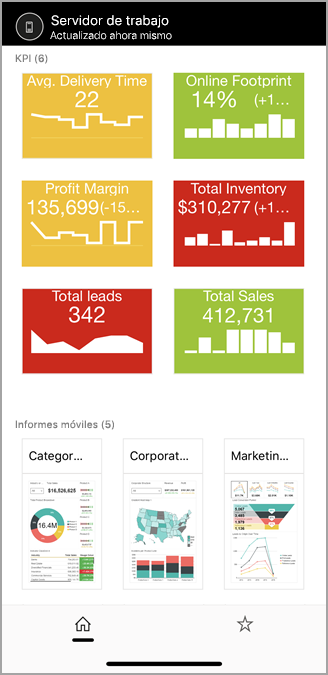

## Lo primero es lo primero
**Las aplicaciones móviles se encuentran donde visualiza el contenido de Power BI, donde no lo haya creado.**

* Usted y otros creadores de informes de su organización podrán [crear informes de Power BI con Power BI Desktop y publicarlos en el portal web del servidor de informes de Power BI](../../report-server/quickstart-create-powerbi-report.md). 
* Puede crear [KPI desde el mismo portal web](https://docs.microsoft.com/sql/reporting-services/working-with-kpis-in-reporting-services), organizarlos en carpetas y marcar sus favoritos para encontrarlos fácilmente. 
* [Cree informes móviles de Reporting Services](https://docs.microsoft.com/sql/reporting-services/mobile-reports/create-mobile-reports-with-sql-server-mobile-report-publisher) con el Publicador de informes móviles de SQL Server 2016 Enterprise Edition y publíquelos en el [portal web de Reporting Services](https://docs.microsoft.com/sql/reporting-services/web-portal-ssrs-native-mode).  

Luego, en las aplicaciones móviles de Power BI, podrá conectarse a cinco servidores de informes como máximo para ver los informes y los KPI de Power BI, organizados en carpetas o recopilados como favoritos. 

## Explorar ejemplos de las aplicaciones móviles sin conexión con el servidor
Aunque no tenga acceso a un portal web de Reporting Services, puede explorar las características de los informes móviles y los KPI de Reporting Services. 

1. Pulse la imagen del perfil en la esquina superior izquierda y, después, pulse **Configuración** en el panel de cuentas que aparece.

2. En la página de configuración que se abre, pulse **Ejemplos de Reporting Services** y examine los ejemplos para interactuar con los informes móviles y los KPI.
   
   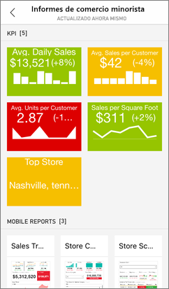

## Conectarse a un servidor de informes local
En las aplicaciones móviles de Power BI podrá ver los informes locales de Power BI, y los informes móviles y los KPI de Reporting Services. 

1. En su dispositivo móvil, abra la aplicación de Power BI.
2. Si todavía no ha iniciado sesión en Power BI, pulse **Servidor de informes**.
   
   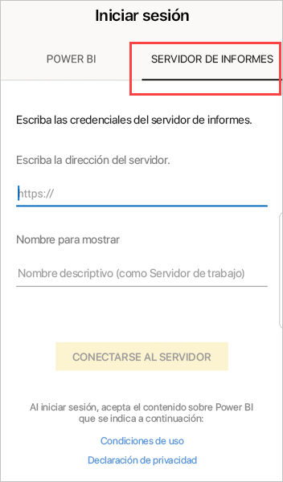
   
   Si ya ha iniciado sesión en la aplicación Power BI, pulse la imagen del perfil en la esquina superior izquierda y, después, pulse **Configuración** en el panel de cuentas que aparece.
3. En la página configuración que se abre, pulse **Conectarse al servidor**.
   
    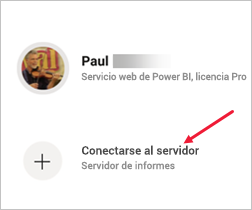

    La aplicación móvil debe tener acceso al servidor de alguna manera. Hay varias maneras de hacerlo:
     * Estar en la misma red o mediante VPN es la manera más fácil.
     * Es posible usar un proxy de aplicación web para conectarse desde fuera de la organización. Consulte [Uso de OAuth para conectarse a Reporting Services](mobile-oauth-ssrs.md) para más información.
     * Abra una conexión (puerto) en el firewall.

4. Rellene la dirección del servidor y asígnele un nombre descriptivo, si quiere. Use este formato para la dirección del servidor:
   
     `https://<servername>/reports`
   
     O
   
     `https://<servername>/reports`
   
   Incluya **http** o **https** delante de la cadena de conexión.
   
    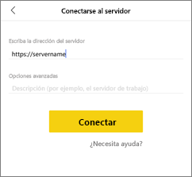
5. Una vez que haya escrito la dirección del servidor y un nombre descriptivo opcional, pulse **Conectar** y, después, rellene el nombre de usuario y la contraseña cuando se le solicite.
6. Ahora verá el servidor en el panel Cuentas, en este ejemplo con el nombre "Servidor profesional".
   
   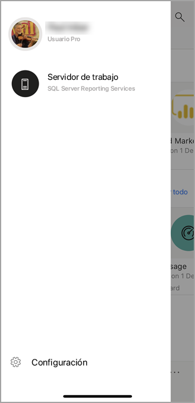

## Conexión a un servidor de informes local en iOS o Android

Si ve Power BI en la aplicación móvil de iOS o Android, es posible que el administrador de TI haya definido una directiva de configuración de aplicación. Si es así, se habrá simplificado la experiencia de conexión al servidor de informes y no tendrá que proporcionar tanta información cuando se conecte a un servidor de informes. 

1. Verá un mensaje que indica que su aplicación móvil está configurada con un servidor de informes. Pulse en **Iniciar sesión**.

    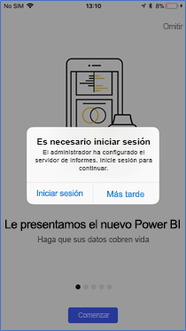

2.  En la página **Conectar al servidor**, los detalles del servidor de informes ya están rellenados. Pulse **Conectar**.

    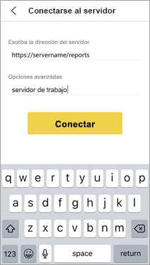

3. Escriba una contraseña para autenticar y luego pulse en **Iniciar sesión**. 

    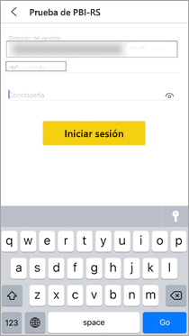

Ahora puede ver e interactuar con los KPI y los informes de Power BI almacenados en el servidor de informes.

## Ver los informes y los KPI de Power BI en la aplicación de Power BI
Los informes de Power BI, y los informes móviles y KPI de Reporting Services se muestran en las mismas carpetas en las que están en el portal web de Reporting Services. 

* Pulse un informe de Power BI . Se abre en modo horizontal y puede interactuar con él en la aplicación de Power BI.

    > [!NOTE]
  > El rastreo agrupando y desagrupando datos actualmente no está habilitado en los informes de Power BI de Power BI Report Server.
  
    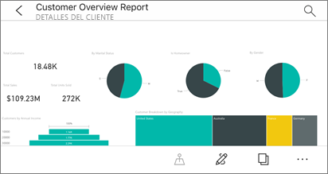
* En Power BI Desktop, los propietarios de informes pueden [optimizar un informe](../../desktop-create-phone-report.md) para las aplicaciones móviles de Power BI. En el teléfono móvil, los informes optimizados tienen un icono, , y un diseño especiales.
  
    
* Puntee un KPI para verlo en el modo de enfoque.
  
    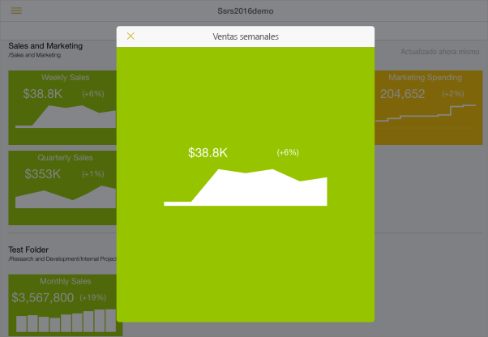

## Ver los informes y KPI favoritos
Puede marcar KPI e informes como favoritos en el portal web y verlos después en una práctica carpeta en su dispositivo móvil, junto con sus paneles favoritos de Power BI.

* Pulse **Favoritos** en la barra de navegación.
  
   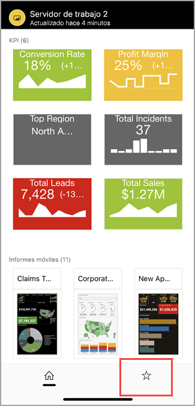
  
   Los KPI e informes favoritos del portal web se encuentran en esta página, junto con los paneles de Power BI del servicio Power BI:
  
   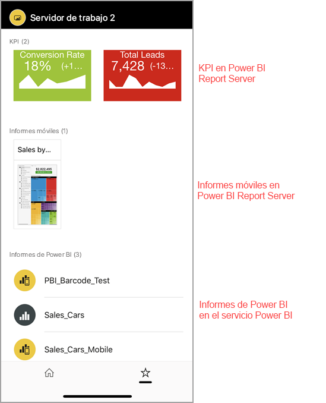

## Quitar una conexión a un servidor de informes
1. Abra el panel Cuentas, pulse **Configuración**.
2. Pulse el nombre del servidor al que no quiera estar conectado.
3. Pulse **Quitar servidor**.

## Pasos siguientes
* [¿Qué es Power BI?](../../fundamentals/power-bi-overview.md)  
* ¿Preguntas? [Pruebe a preguntar a la comunidad de Power BI](https://community.powerbi.com/)

