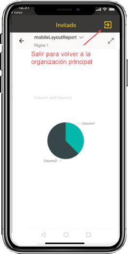
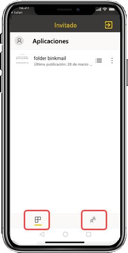

# Visualización del contenido de Power BI compartido con usted desde una organización externa

Power BI se integra con Azure Active Directory business-to-business (Azure AD B2B) para permitir una distribución segura del contenido de Power BI a los usuarios invitados de fuera de la organización. Los usuarios invitados externos pueden usar la aplicación móvil de Power BI para acceder a ese contenido de Power BI compartido con ellos. 

Se aplica a:

|  |  |  |  |
|:--- |:--- |:--- |:--- |
| iPhones |iPad |Teléfonos Android |Tabletas Android |

## Acceder al contenido compartido

**En primer lugar, necesita que un usuario de una organización externa comparta un elemento con usted.** Cuando alguien [comparte un elemento con usted](../../collaborate-share/service-share-dashboards.md), ya sea desde la misma organización o desde una organización externa, recibe un correo electrónico con un vínculo a ese elemento compartido. Al seguir ese vínculo en el dispositivo móvil, se abre la aplicación móvil de Power BI. Si la aplicación reconoce que el elemento se ha compartido desde una organización externa, la aplicación se vuelve a conectar a esa organización con su identidad. Luego la aplicación carga todos los elementos que se han compartido con usted desde esa organización.

> [!NOTE]
> Si este es el primer elemento que se comparte con usted como usuario invitado externo, debe reclamar la invitación en un explorador. No se puede reclamar la invitación en la aplicación de Power BI.

Siempre que esté conectado a una organización externa, aparece un encabezado negro en la aplicación. Este encabezado indica que no está conectado a la organización principal. Para volver a conectarse a la organización principal, salga del modo invitado.

Aunque necesite tener un vínculo de artefacto de Power BI para conectarse a una organización externa, una vez que la aplicación cambie, puede acceder a todos los elementos compartidos con usted (no solo el elemento abierto desde el correo electrónico). Para ver todos los elementos a los que puede acceder en la organización externa, vaya al menú de la aplicación y seleccione **Compartido conmigo**. En **Aplicaciones**, también se encuentran las aplicaciones que puede usar.

## Limitaciones

- Los usuarios deben tener una cuenta de Power BI activa y un inquilino principal.
- Los usuarios deben iniciar sesión en su inquilino principal de Power BI para poder acceder al contenido compartido con ellos desde un inquilino externo.
- En Azure AD B2B y Power BI Mobile no se admiten las directivas de acceso condicional ni otras de Intune. Esto significa que la aplicación solo aplica las directivas de la organización principal, si las hubiera.
- Las notificaciones de inserción solo se reciben desde el sitio de la organización principal (aunque el usuario esté conectado como invitado a una organización externa). Al abrir la notificación se vuelve a conectar la aplicación al sitio de la organización principal del usuario.
- Si el usuario cierra la aplicación, cuando se vuelve a abrir, se conecta automáticamente a la organización principal del usuario.
- Al conectarse a una organización externa, algunas acciones están deshabilitadas: elementos favoritos, alertas de datos, comentarios y uso compartido.
- Los datos sin conexión no están disponibles mientras se está conectado a una organización externa.
- Si tiene la aplicación Portal de empresa instalada en el dispositivo, el dispositivo debe estar inscrito.
