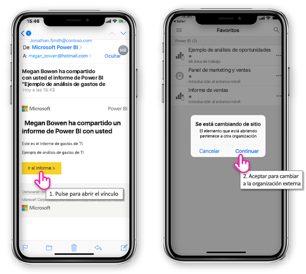
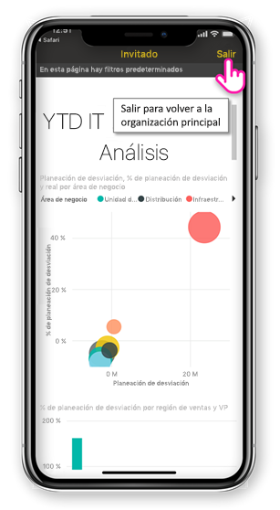
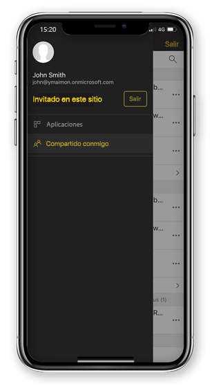

# Ver el contenido de Power BI compartido con usted desde una organización externa

Power BI se integra con Azure Active Directory business-to-business (B2B de Azure AD) para permitir una distribución segura de contenido de Power BI a usuarios invitados ajenos a su organización. Y los usuarios externos invitados pueden usar la aplicación móvil de Power BI para tener acceso a ese contenido de Power BI compartido con ellos. 

Se aplica a:

|  |  |  |  |
|:--- |:--- |:--- |:--- |
| iPhone |iPad |Teléfonos Android |Tabletas Android |

## Tener acceso al contenido compartido

**En primer lugar, se necesita a alguien de una organización externa para compartir un elemento con usted.** Cuando alguien [comparte un elemento con usted](../../service-share-dashboards.md), desde la misma organización o de una organización externa, recibirá un correo electrónico con un vínculo al elemento compartido. Siga este vínculo en el dispositivo móvil, abre la aplicación móvil de Power BI. Si la aplicación reconoce que se ha compartido el elemento de una organización externa, la aplicación vuelve a conectarse a dicha organización con su identidad. La aplicación, a continuación, carga todos los elementos que se han compartido con usted de dicha organización.

> [!NOTE]
> Si se trata del primer elemento compartido con usted como usuario externo invitado, debe reclamar la invitación de un explorador. Puede no puede reclamar la invitación de la aplicación Power BI.

Mientras está conectado a una organización externa, aparece un encabezado de color negro en la aplicación. Este encabezado indica que no están conectados a su organización principal. Para conectarse a su organización principal, salga del modo de invitado.

Aunque debe tener un vínculo de artefacto de Power BI para conectarse a una organización externa, una vez que se activa la aplicación, puede tener acceso a todos los elementos que se hayan compartido contigo (no solo el elemento que abrió desde el correo electrónico). Para ver todos los elementos son accesibles en la organización externa, vaya al menú de aplicación y seleccione **compartido conmigo**. En **aplicaciones** buscar aplicaciones que pueden usar también.

## Limitaciones

- Acceso condicional y otras directivas de Intune no se admiten en Azure AD B2B y en Power BI mobile. Esto significa que la aplicación aplica solo las directivas de la organización principal, si existen.
- Se reciben notificaciones de inserción desde el sitio de la organización principal solo (incluso cuando está conectado el usuario como invitado a una organización externa). Apertura de la notificación de volver a conecta la aplicación al sitio de la organización principal del usuario.
- Si el usuario cierra la aplicación, al volver a abrir la aplicación se conecta automáticamente a la organización principal del usuario.
- Cuando se conecta a una organización externa, algunas acciones están deshabilitadas: favorito elementos, las alertas de datos, comentarios y el uso compartido.
- Datos sin conexión no están disponibles mientras está conectado a una organización externa.
- Si tiene la aplicación de Portal de empresa instalada en el dispositivo, se debe inscribir su dispositivo.
