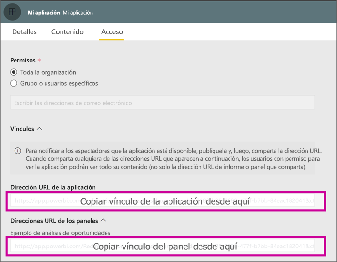

# <a name="create-a-link-to-a-specific-location-in-the-power-bi-mobile-apps"></a>Creación de un vínculo a una ubicación específica en las aplicaciones móviles de Power BI
Puede usar vínculos para tener acceso directamente a elementos específicos en Power BI: Informe, el panel y el icono.

Existen principalmente dos escenarios de uso de vínculos en Power BI Mobile: 

* Para abrir Power BI desde **fuera de la aplicación**y terrestre en contenido específico (panel/informes/aplicación). Esto suele ser un escenario de integración, cuando desee abrir Power BI Mobile desde otra aplicación. 
* Para **vaya** dentro de Power BI. Se trata normalmente cuando desea crear una navegación personalizada en Power BI.


## <a name="use-links-from-outside-of-power-bi"></a>Usar vínculos desde fuera de Power BI
Cuando se usa un vínculo desde fuera de la aplicación de Power BI, desea asegurarse de que se abrirá la aplicación, y si la aplicación no está instalada en el dispositivo y, después, para ofrecer al usuario para instalarlo. Hemos creado un formato de vínculo especial para admitir exactamente eso. Este formato de vínculo, se asegurará de que el dispositivo está utilizando la aplicación para abrir el vínculo y, si la aplicación no está instalada en el dispositivo, ofrecerá al usuario que vaya a la tienda para obtenerlo.

El vínculo debe comenzar con el siguiente  
```html
https://app.powerbi.com/Redirect?[**QUERYPARAMS**]
```

> [!IMPORTANT]
> Si el contenido está hospedado en un centro de datos especial, como China, gobierno, etcetera. El vínculo debe comenzar con la dirección correcta de Power BI, como `app.powerbigov.us` o `app.powerbi.cn`.   
>


El **consulta PARAMS** son:
* **acción** (obligatorio) = OpenApp / OpenDashboard / OpenTile / OpenReport
* **appId** = si desea abrir un informe o panel que forman parte de una aplicación 
* **groupObjectId** = si desea abrir un informe o panel que forman parte del área de trabajo (pero no en Mi área de trabajo)
* **dashboardObjectId** = Id. de objeto de panel (si la acción es OpenDashboard o OpenTile)
* **reportObjectId** = Id. de objeto de informe (si la acción es OpenReport)
* **tileObjectId** = Id. de objeto de icono (si la acción es OpenTile)
* **reportPage** = si desea abrir la sección de informe específico (si la acción es OpenReport)
* **ctid** = elemento Id. de organización (relevante para el escenario de B2B. Esto se puede omitir si el elemento pertenece a la organización del usuario).

**Ejemplos:**

* Vínculo de abrir una aplicación 
  ```html
  https://app.powerbi.com/Redirect?action=OpenApp&appId=appidguid&ctid=organizationid
  ```

* Abrir el panel que forma parte de una aplicación 
  ```html
  https://app.powerbi.com/Redirect?action=OpenDashboard&appId=**appidguid**&dashboardObjectId=**dashboardidguid**&ctid=**organizationid**
  ```

* Abra el informe que forma parte de un área de trabajo
  ```html
  https://app.powerbi.com/Redirect?Action=OpenReport&reportObjectId=**reportidguid**&groupObjectId=**groupidguid**&reportPage=**ReportSectionName**
  ```

### <a name="how-to-get-the-right-link-format"></a>Cómo obtener el formato de vínculo derecho

#### <a name="links-of-apps-and-items-in-app"></a>Vínculos de las aplicaciones y elementos de la aplicación

Para **aplicaciones e informes y paneles que forman parte de una aplicación**, es la manera más fácil de obtener el vínculo Ir al área de trabajo de aplicación y elija "Actualizar aplicación". Se abrirá la experiencia de "Aplicación de publicación" y, en la ficha acceso, encontrará un **vínculos** sección. Expansión que sección y verá una lista de la aplicación y todo su contenido vínculos puede utilizarse para tener acceso a ellos directamente.



#### <a name="links-of-items-not-in-app"></a>Vínculos de elementos no en la aplicación 

Para los informes y paneles que no forman parte de una aplicación, deberá extraer el Id. de la dirección URL del elemento.

Por ejemplo, para buscar el carácter de 36 **panel** Id. de objeto, vaya al panel específico en el servicio Power BI 

```html
https://app.powerbi.com/groups/me/dashboards/**dashboard guid comes here**?ctid=**organization id comes here**`
```

Para buscar el carácter de 36 **informe** Id. de objeto, navegue hasta el informe específico en el servicio Power BI.
Este es un ejemplo de informe desde "Mi área de trabajo"

```html
https://app.powerbi.com/groups/me/reports/**report guid comes here**/ReportSection3?ctid=**organization id comes here**`
```
La dirección URL anterior también contiene página específica del informe **"ReportSection3"** .

Este es un ejemplo de un informe desde un área de trabajo (no mi área de trabajo)

```html
https://app.powerbi.com/groups/**groupid comes here**/reports/**reportid comes here**/ReportSection1?ctid=**organizationid comes here**
```

## <a name="use-links-inside-power-bi"></a>Use los vínculos dentro de Power BI

Vínculos dentro de Power BI están trabajando en las aplicaciones móviles exactamente como en servicio Power BI.

Si desea agregar el vínculo a un informe que apunta a otro elemento de Power BI, simplemente copie esa dirección URL del elemento de la barra de direcciones del explorador. Obtenga más información sobre [cómo agregar un hipervínculo a un cuadro de texto en un informe](https://docs.microsoft.com/power-bi/service-add-hyperlink-to-text-box).

## <a name="use-report-url-with-filter"></a>Use la dirección URL del informe con filtro
Igual que el servicio Power BI, Power BI Mobile apps también admiten dirección URL de informe que contiene un parámetro de consulta de filtro. Puede abrir un informe en la aplicación móvil de Power BI y filtrarlos a estado específico. Por ejemplo, esta dirección URL se abre el informe de ventas y filtrarlos por territorio

```html
https://app.powerbi.com/groups/me/reports/**report guid comes here**/ReportSection3?ctid=**organization id comes here**&filter=Store/Territory eq 'NC'
```

Obtenga más información sobre [crear parámetros de consulta para filtrar informes](https://docs.microsoft.com/power-bi/service-url-filters).

## <a name="next-steps"></a>Pasos siguientes
Sus comentarios nos ayudan a decidir qué implementaremos en el futuro; no olvide votar por otras características que le gustaría ver en aplicaciones móviles de Power BI. 

* [Aplicaciones de Power BI para dispositivos móviles](mobile-apps-for-mobile-devices.md)
* Siga @MSPowerBI en Twitter
* Únase a la conversación en la [comunidad de Power BI](http://community.powerbi.com/)
* [¿Qué es Power BI?](../../power-bi-overview.md)

