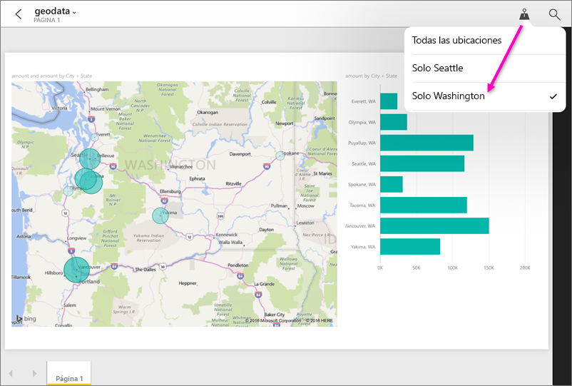

# Filtrar un informe por ubicación geográfica en las aplicaciones móviles de Power BI
Se aplica a:

|  |  |  |  |  |
|:--- |:--- |:--- |:--- |:--- |
| iPhone |iPad |Teléfonos Android |Tabletas Android |Teléfonos con Windows 10 |

Al examinar un informe de Power BI en su dispositivo móvil, ¿ve un pequeño icono de chincheta en la esquina superior derecha? Si es así, puede filtrar ese informe según su ubicación geográfica.

> [!NOTE]
> Solo puede filtrar por ubicación si los nombres geográficos en el informe están en inglés; por ejemplo, "New York City" o "Germany". Las tabletas y los equipos Windows 10 no admiten el filtrado geográfico, pero los teléfonos Windows 10 sí.
> 
> 

## Filtrar un informe por ubicación geográfica
1. Abra un informe en la aplicación móvil Power BI de su dispositivo móvil.
2. Si el informe contiene datos geográficos, podrá ver un mensaje preguntándole si desea permitir que Power BI acceda a su ubicación. Haga clic en **Permitir** y, después, pulse en **Permitir** otra vez.
3. Pulse el icono de chincheta . Puede filtrar por ciudad, estado o provincia, o país o región, dependiendo de los datos del informe. El filtro solo muestra las opciones que coincidan con la ubicación actual.
   
    

## ¿Por qué no veo etiquetas de ubicación en un informe?
Se deben cumplir estas tres condiciones para ver las etiquetas de ubicación. 

* La persona que creó el informe en Power BI Desktop [clasificó los datos geográficos](../../desktop-mobile-geofiltering.md) para al menos una columna, como Ciudad, Estado o País o región.
* Se encuentra en una de las ubicaciones que tiene datos en esa columna.
* Usa uno de estos dispositivos móviles:
  * iOS (iPad, iPhone, iPod).
  * Tableta o teléfono Android.
  * Teléfono Windows 10 (otros dispositivos Windows 10, como tabletas y equipos, no admiten el filtrado geográfico).

Obtenga más información sobre cómo [configurar el filtrado geográfico](../../desktop-mobile-geofiltering.md) en Power BI Desktop.

### Pasos siguientes
* [Get Power BI data from the real world with the mobile apps](mobile-apps-data-in-real-world-context.md) (Obtener datos de Power BI del mundo real con las aplicaciones móviles)
* [Categorización de datos en Power BI Desktop](../../desktop-data-categorization.md) 
* ¿Tiene alguna pregunta? [Pruebe a preguntar a la comunidad de Power BI](http://community.powerbi.com/)

