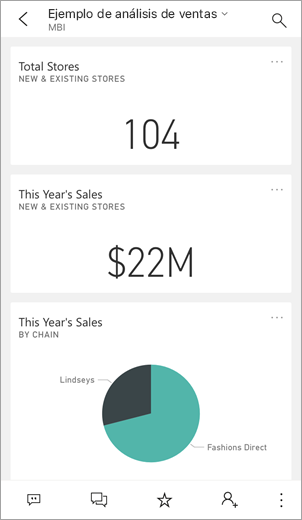
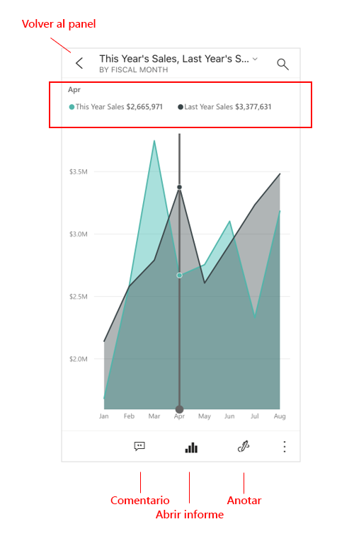
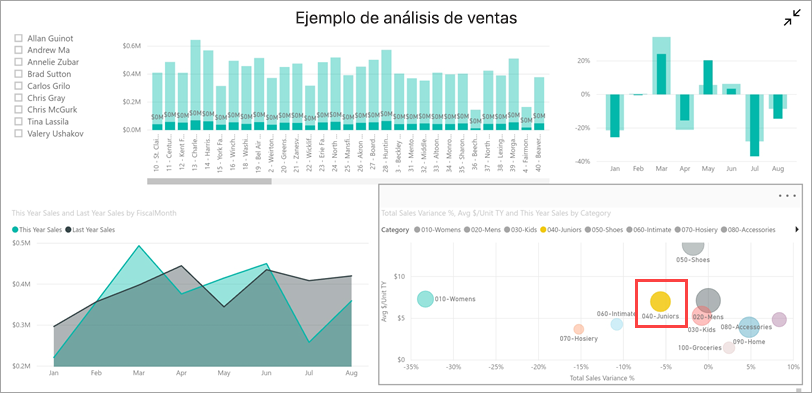
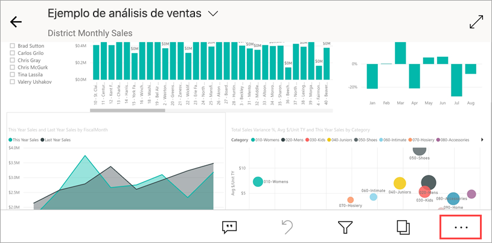
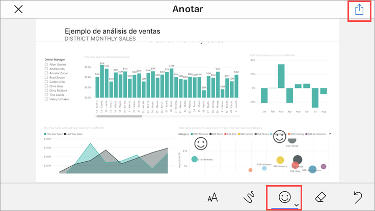
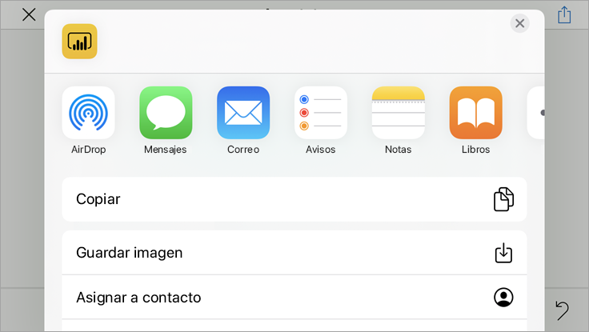
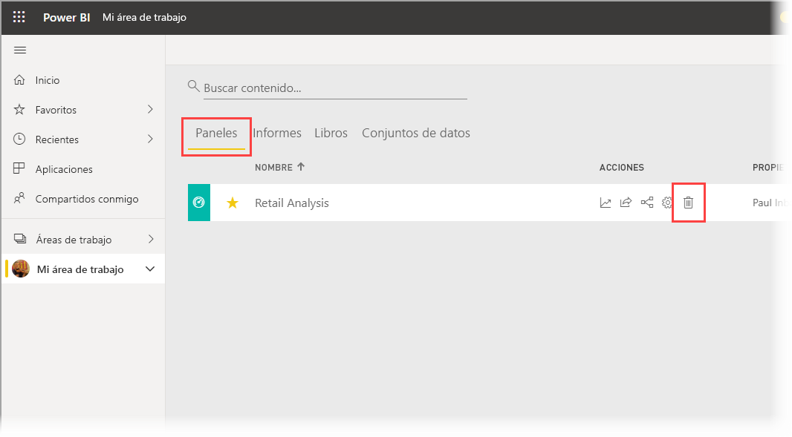
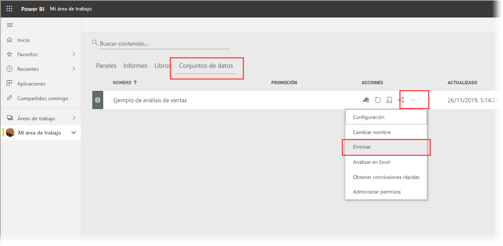

# Inicio rápido: exploración de paneles e informes en la aplicación móvil de Power BI
En este inicio rápido, realizará un recorrido rápido por la aplicación Power BI Mobile y explorará un informe y un panel de ejemplo. Se muestra la aplicación Power BI para iOS, pero puede seguir los pasos en otros dispositivos.

Se aplica a:

|  |  |  |  |
|:--- |:--- |:--- |:--- |
| iPhone | iPad | Android | Windows 10 |

>[!NOTE]
>El soporte técnico de la aplicación móvil de Power BI con **teléfonos con Windows 10 Mobile** finalizará el 16 de marzo de 2021. [Más información](https://go.microsoft.com/fwlink/?linkid=2121400)

Un panel es un portal para ver los procesos y el ciclo de vida de la empresa. Es información general, un lugar único para supervisar el estado actual de la empresa. Los informes son vistas interactivas de los datos, con objetos visuales que representan distintas conclusiones e información a partir de esos datos. 

## Requisitos previos

* **Suscribirse en Power BI**: Si no está registrado en Power BI, [regístrese para obtener una evaluación gratuita](https://app.powerbi.com/signupredirect?pbi_source=web) antes de empezar.
* **Instale la aplicación Power BI para el dispositivo**: descargue la aplicación móvil de Power BI** en el [App Store](https://apps.apple.com/app/microsoft-power-bi/id929738808) (iOS) o en [Google Play](https://play.google.com/store/apps/details?id=com.microsoft.powerbim&amp;amp;clcid=0x409) (Android).
* **Descargue el ejemplo de análisis de minoristas**: el primer paso de este inicio rápido consiste en descargar el ejemplo de análisis de minoristas en el servicio Power BI. [Obtenga información sobre cómo descargar un ejemplo](./mobile-apps-download-samples.md) en la cuenta de Power BI para comenzar. Asegúrese de seleccionar el ejemplo de análisis de minoristas.

Una vez que haya completado los requisitos previos y descargado el ejemplo de análisis de minoristas en la cuenta de Power BI, estará listo para comenzar este paseo rápido.

## Visualización de un panel en el dispositivo móvil
1. En el dispositivo, abra la aplicación de Power BI e inicie sesión con las credenciales de la cuenta de Power BI, las mismas que ha usado en el servicio Power BI en el explorador.
 
1. Ahora, pulse el icono **Áreas de trabajo** , elija **Mis áreas de trabajo** y, después, pulse el ejemplo de análisis de minoristas para abrirlo.

    
   
    Los paneles de Power BI tienen un aspecto ligeramente distinto en el dispositivo móvil que en el servicio Power BI. Todos los iconos aparecen de la misma anchura y están ordenados uno tras otro de arriba hacia abajo.

5. Pulse el icono de estrella  en la barra de herramientas inferior para convertirlo en un panel favorito. Cuando se crea un favorito en la aplicación móvil, se convierte en favorito en el servicio Power BI, y viceversa.

6. Desplácese hacia abajo y pulse el gráfico de líneas rellenas "This Year's Sales, Last Year's Sales".

    

    Se abre en modo de enfoque.

7. En el modo de enfoque, pulse **Apr** (abril) en el gráfico. Los valores de abril aparecen en la parte superior del gráfico.

    

8. Pulse el icono de informe  en la parte inferior de la pantalla (en dispositivos Android, es posible que se encuentre en la parte superior). El informe relacionado con este icono se abre en modo horizontal.

    

9. Pulse la burbuja amarilla "040 - Juniors" en el gráfico de burbujas. Observe cómo resalta los valores relacionados en los otros gráficos. 

    

10. Deslice el dedo hacia arriba para ver una barra de herramientas en la parte inferior y pulse **Más opciones (...)** .

    

11. Desplácese hacia abajo por la lista y seleccione **Anotar**.

    

12. En la barra de herramientas Anotar, pulse el icono de la cara sonriente y después la página del informe donde quiera agregar algunas caras sonrientes.
 
    

13. Ahora, pulse **Compartir** en la esquina superior derecha.

14. Elija el modo en el que quiera compartir el informe.  

    

    Puede compartir esta instantánea con cualquier usuario, dentro o fuera de su organización. Si se encuentran en la organización y tienen su propia cuenta de Power BI, también podrán abrir el informe de ejemplo de análisis de minoristas.

## Limpieza de recursos

Una vez que finalice este inicio rápido, si quiere puede eliminar el panel del ejemplo de análisis de minoristas, el informe y el conjunto de datos.

1. Abra el servicio Power BI ([servicio Power BI](https://app.powerbi.com)) e inicie sesión.

2. En el panel de navegación, seleccione **Mi área de trabajo**.

3. Seleccione la pestaña de paneles y, después, haga clic en la papelera.

    

    Ahora, haga clic en la pestaña Informes y repita la operación.

4. Luego, seleccione la pestaña Conjuntos de datos, haga clic en **Más opciones** (...) y elija **Eliminar**. 

    

## Pasos siguientes

En este inicio rápido, ha explorado un ejemplo de panel e informe en el dispositivo móvil. Obtenga más información sobre cómo trabajar en el servicio Power BI. 

> [!div class="nextstepaction"]
> [Inicio rápido: Moverse por el servicio Power BI](../end-user-experience.md)

