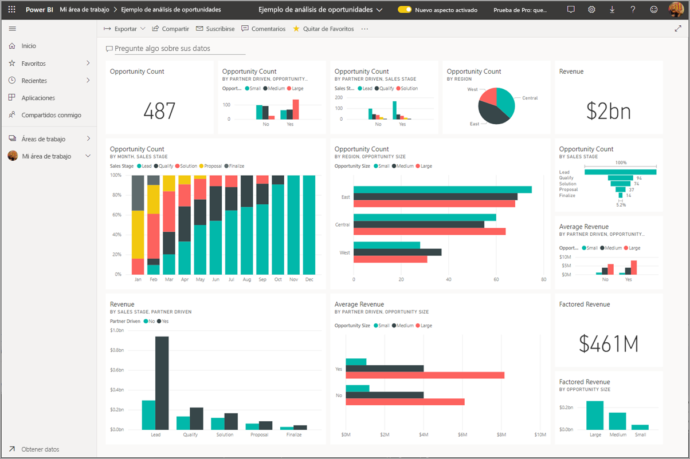
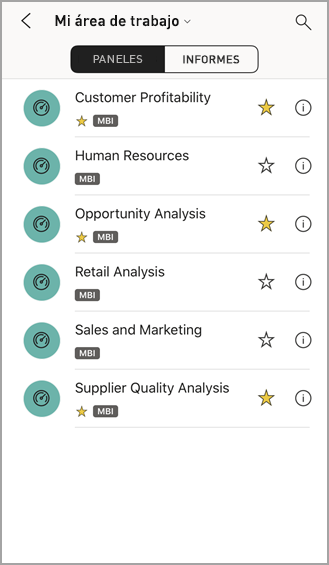
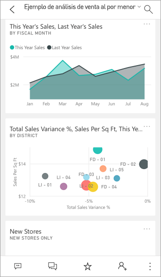
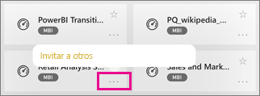
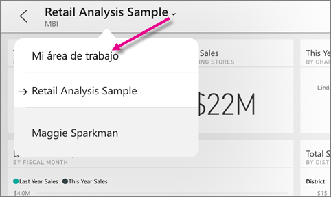
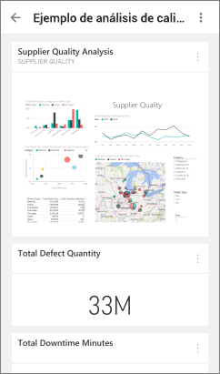
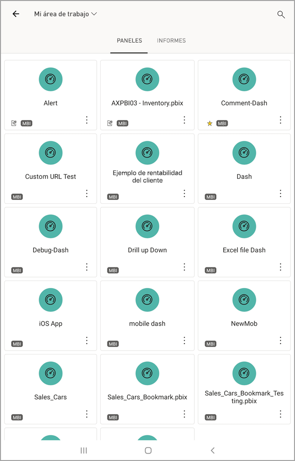
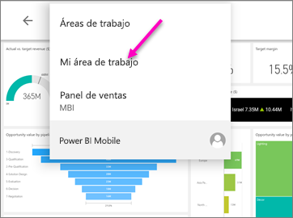
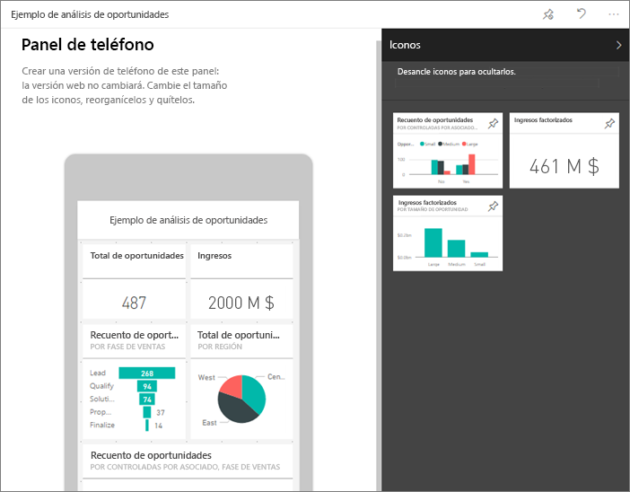

# Visualización de paneles e informes en la aplicación móvil de Power BI
Se aplica a:

|  |  |  |  | 
|:--- |:--- |:--- |:--- |:--- |
| [iPhones](mobile-apps-view-dashboard.md#view-dashboards-on-your-iphone) |[iPads](mobile-apps-view-dashboard.md#view-dashboards-on-your-ipad) |[Teléfonos Android](mobile-apps-view-dashboard.md#view-dashboards-on-your-android-phone) |[Tabletas Android](mobile-apps-view-dashboard.md#view-dashboards-on-your-android-tablet) |

Los paneles sirven como portal para ver los procesos y el ciclo de vida de su empresa. Un panel es un recurso de información general, un lugar único para supervisar el estado actual de los datos.

## Creación de paneles en el servicio Power BI (https://powerbi.com)
**No se crean paneles en las aplicaciones móviles.** 

Para ver más paneles e informes en su dispositivo móvil, tiene que crearlos o conectarse a ellos en un explorador web. 

1. Vaya al servicio Power BI ([https://www.powerbi.com](https://www.powerbi.com)) y [regístrese para obtener una cuenta](../../service-self-service-signup-for-power-bi.md).
2. [Cree sus propios informes y paneles de Power BI](../../service-get-started.md) o conéctese a [aplicaciones de Power BI](../../service-connect-to-services.md) existentes para disfrutar de varios servicios, como [Microsoft Dynamics CRM](../../service-connect-to-microsoft-dynamics-crm.md).

Este es un panel de Power BI en el servicio Power BI:

## Ver paneles en el iPhone
1. Abra la aplicación de Power BI en su iPhone e inicie sesión.
   
   ¿Necesita [descargar la aplicación de iPhone](http://go.microsoft.com/fwlink/?LinkId=522062) desde la App Store de Apple?
2. Pulse un panel para abrirlo.  
   
    
   
   * Las estrellas amarillas  muestran cuáles son los paneles favoritos. 
   * La notación debajo de cada nombre de panel (en este ejemplo, "MBI")  muestra cómo se clasifican los datos de cada panel. Obtenga más información sobre la [clasificación de datos en Power BI](../../service-data-classification.md).
   
   De forma predeterminada, los paneles de Power BI en iPhone tienen un aspecto un poco distinto. Todos los iconos aparecen del mismo tamaño y están ordenados uno tras otro de arriba hacia abajo.
   
    
   
   > [!TIP]
   > Si es el propietario del panel, en el servicio Power BI puede [crear una vista del panel específicamente para teléfonos](../../service-create-dashboard-mobile-phone-view.md) en modo vertical. 
   > 
   > 
   
    O puede girar el teléfono lateralmente para ver el panel en modo horizontal en su teléfono.
   
    
3. Deslice un dedo hacia arriba y hacia abajo para ver todos los iconos del panel. Puede:
   
   * [Pulsar un icono](mobile-tiles-in-the-mobile-apps.md) para abrirlo en el modo enfocado e interactuar con él.
   * Pulse en la estrella  para [convertirlo en favorito](mobile-apps-favorites.md).
   * Pulse en **Invitar**  para [invitar a un compañero](mobile-share-dashboard-from-the-mobile-apps.md) a ver su panel.
   * [Sincronizar el panel con Apple Watch](mobile-apple-watch.md).
4. Para volver a la lista de paneles, pulse la flecha situada junto al título del panel y, después, pulse **Mi área de trabajo**.
   
   

### Ver paneles en modo horizontal en iPhone
Simplemente gire el teléfono lateralmente para ver los paneles en modo horizontal. El diseño del panel cambia de una serie de iconos a una vista de todo el panel: se ven todos los iconos del panel dispuestos como en el servicio Power BI.

Puede usar el gesto de "reducir" para acercar y alejar distintas áreas del panel, y el de desplazamiento lateral para navegar por él. Y puede [pulsar un icono](mobile-tiles-in-the-mobile-apps.md) para abrirlo en modo enfocado e interactuar con los datos.

## Ver paneles en el iPad
1. Abra la aplicación Power BI.
   
   ¿Necesita [descargar la App para iPad](http://go.microsoft.com/fwlink/?LinkId=522062) del App Store de Apple primero?
2. Pulse **Paneles** en la parte superior de la aplicación.  
   
   
   
   * Las estrellas amarillas  muestran cuáles son los paneles favoritos. 
   * La notación debajo de cada nombre de panel (en este ejemplo, "MBI")  muestra cómo se clasifican los datos de cada panel. Obtenga más información sobre la [clasificación de datos en Power BI](../../service-data-classification.md).
3. Puede compartir un panel desde el área de trabajo. Pulse el botón de puntos suspensivos ( **...** ) en la esquina inferior derecha del icono de panel y, después, **Invitar a otros**.
   
   
4. También puede pulsar un panel para abrirlo y ver los iconos en ese panel. En el panel puede interactuar con él:
   
   * [Pulsar un icono para interactuar](mobile-tiles-in-the-mobile-apps.md) con él.
   * [Abrir los informes](mobile-reports-in-the-mobile-apps.md) que se encuentran detrás de los iconos.
   * [Invitar a otros usuarios a ver el panel](mobile-share-dashboard-from-the-mobile-apps.md).
   * [Anotar y compartir una instantánea](mobile-annotate-and-share-a-tile-from-the-mobile-apps.md) de un icono.
5. Para volver a Mi área de trabajo, pulse el nombre del panel en la esquina superior izquierda y, después, pulse **Mi área de trabajo**.
   
   

## Visualización de paneles en el teléfono Android
1. Abra la aplicación de Power BI en su teléfono Android e inicie sesión.
   
   ¿Necesita [descargar la aplicación Android](http://go.microsoft.com/fwlink/?LinkID=544867) primero?
2. Pulse un panel para abrirlo.   
   
   

    Las estrellas amarillas  muestran cuáles son los paneles favoritos. 

    Una notación debajo de un nombre de panel (en este ejemplo, "MBI")  muestra cómo se clasifican los datos de cada panel. Obtenga más información sobre la [clasificación de datos en Power BI](../../service-data-classification.md).

    Los paneles de Power BI tienen un aspecto un poco distinto en el teléfono Android. Todos los iconos aparecen de la misma anchura y están ordenados uno tras otro de arriba hacia abajo.

    

    Si es el propietario del panel, en el servicio Power BI puede [crear una vista del panel específicamente para teléfonos](../../service-create-dashboard-mobile-phone-view.md) en modo vertical. 

1. En el panel, puede pulsar los puntos suspensivos verticales (...) al lado del nombre para invitar a un colega, para actualizar o para obtener información sobre el panel:
   
   
2. Deslice el dedo hacia arriba y hacia abajo para ver todos los [iconos del panel](mobile-tiles-in-the-mobile-apps.md). 
3. Para volver a la página principal de paneles, pulse el nombre del panel para abrir el rastro de la ruta de exploración y, después, pulse **Mi área de trabajo**.   

## Visualización de paneles en tabletas Android
1. Abra la aplicación Power BI en su tableta Android e inicie sesión.
   
   ¿Necesita [descargar la aplicación Android](http://go.microsoft.com/fwlink/?LinkID=544867) primero?
2. Pulse un panel para abrirlo.   
   
   
   
   * Las estrellas amarillas  muestran cuáles son los paneles favoritos. 
   * La notación debajo de cada nombre de panel (en este ejemplo, "MBI")  muestra cómo se clasifican los datos de cada panel. Obtenga más información sobre la [clasificación de datos en Power BI](../../service-data-classification.md).
3. En el panel, puede pulsar los puntos suspensivos verticales (...) al lado del nombre para invitar a un colega, para actualizar o para obtener información sobre el panel:
   
   
4. Deslice el dedo hacia arriba y hacia abajo para ver todos los [iconos del panel](mobile-tiles-in-the-mobile-apps.md). 
   
   Puede usar el gesto de "reducir" para acercar y alejar distintas áreas del panel, y el de desplazamiento lateral para navegar por él. Y puede [pulsar un icono](mobile-tiles-in-the-mobile-apps.md) para abrirlo en modo enfocado e interactuar con los datos.
5. Para volver a la página principal de paneles, pulsa el nombre del panel para abrir el rastro de la ruta de exploración y, después, pulse **Mi área de trabajo**:
   
    

    Puede usar el gesto de "reducir" para acercar y alejar distintas áreas del panel, y el de desplazamiento lateral para navegar por él. Y puede [pulsar un icono](mobile-tiles-in-the-mobile-apps.md) para abrirlo en modo enfocado e interactuar con los datos.

## Crear una vista de teléfono de un panel en el servicio Power BI
Si es el propietario del panel, *en el servicio Power BI* puede crear una vista del panel específicamente para teléfonos en modo vertical. 

Más información sobre [creación de una vista de teléfono de un panel](../../service-create-dashboard-mobile-phone-view.md).

## Pasos siguientes
* [Descarga de la aplicación de Android](http://go.microsoft.com/fwlink/?LinkID=544867) desde Google Play  
* [Introducción a la aplicación de Android para Power BI](mobile-android-app-get-started.md)  
* [¿Qué es Power BI?](../../power-bi-overview.md)
* ¿Tiene alguna pregunta? [Pruebe a preguntar a la comunidad de Power BI](http://community.powerbi.com/)

