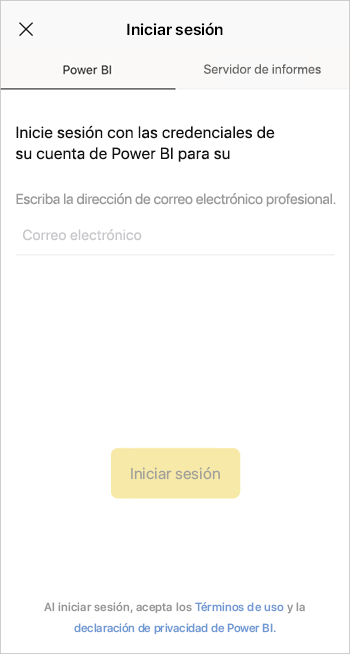
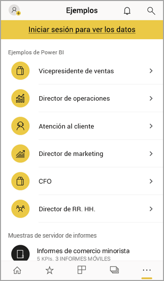
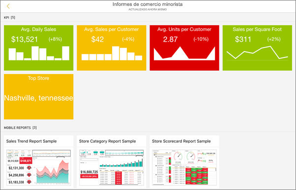
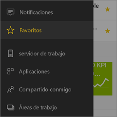
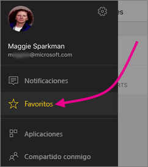
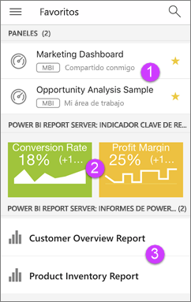

# Introducción a la aplicación móvil de Power BI en dispositivos iOS
La aplicación Microsoft Power BI para iOS en su iPhone, iPad o iPod Touch proporciona la experiencia de BI móvil para Power BI, Power BI Report Server y Reporting Services. Con el acceso móvil directo y táctil a la información importante local y en la nube de la empresa, puede ver los paneles de la empresa e interactuar con ellos fácilmente y desde cualquier lugar. Explore los datos de los paneles y compártalos con sus compañeros en mensajes de texto o correo electrónico. Y manténgase al día y a tiempo con los datos en su [Apple Watch](mobile-apple-watch.md).  

Podrá crear informes de Power BI en Power BI Desktop y publicarlos:

* [Publíquelos en el servicio Power BI](../../service-get-started.md) y cree paneles.
* [Publíquelos en Power BI Report Server](../../report-server/quickstart-create-powerbi-report.md).

De este modo, podrá interactuar con los paneles y los informes locales o en la nube en la aplicación móvil de Power BI para iOS.

Descubra las [novedades de las aplicaciones móviles de Power BI](mobile-whats-new-in-the-mobile-apps.md).

## Descargar la aplicación
[Descarga de la aplicación de iOS](http://go.microsoft.com/fwlink/?LinkId=522062 "Descargue la aplicación de iOS") desde App Store de Apple para su iPhone, iPad o iPod Touch.

Puede ejecutar la aplicación Power BI para iOS en cualquier dispositivo con iOS 11 o una versión posterior. 

## Suscribirse al servicio Power BI
Si aún no se ha registrado, vaya a [powerbi.com](https://powerbi.microsoft.com/get-started/) y, en **Power BI: colaboración y uso compartido en la nube**, seleccione **Probar gratis**.

## Introducción a la aplicación de Power BI
1. En su dispositivo iOS, abra la aplicación de Power BI.
2. Para ver los paneles de Power BI, puntee **Power BI**.  
   Para ver los informes móviles de Reporting Services y los KPI, pulse **SQL Server Reporting Services**.
   
   
   
   Cuando se encuentre en la aplicación, solo tiene que pulsar el botón de navegación global  de la esquina superior izquierda para pasar de una opción a otra. 

## Pruebe los ejemplos de Power BI y Reporting Services
Incluso sin registrarse, puede practicar con los ejemplos de Power BI y Reporting Services. Después de descargar la aplicación, puede ver los ejemplos o comenzar. Vuelva a los ejemplos siempre que quiera desde la navegación global.

### Ejemplos de Power BI
Puede ver los ejemplos de panel de Power BI e interactuar con ellos, pero hay algunas cosas que no puede hacer con ellos. No puede abrir los informes de los paneles, compartir los ejemplos con otros usuarios ni añadirlos a los favoritos.

1. Pulse el botón de navegación global  en la esquina superior izquierda.
2. Pulse el icono de engranaje en la parte superior derecha  y, luego, **Ejemplos de Power BI**.
3. Elija un rol y explore el panel del ejemplo para ese rol.  
   
   
   
   > [!NOTE]
   > No todas las características están disponibles en los ejemplos. Por ejemplo, no se pueden ver los informes de ejemplo que subyacen a los paneles. 
   > 
   > 

### Ejemplos de informes móviles de Reporting Services
1. Pulse el botón de navegación global  en la esquina superior izquierda.
2. Pulse el icono de engranaje en la parte superior derecha  y, luego, **Ejemplos de Reporting Services**.
3. Abra la carpeta Informes de venta directa o Informes de ventas para explorar los KPI e informes móviles.
   
   

## Buscar contenido en las aplicaciones móviles de Power BI
Sus paneles e informes se almacenan en distintos lugares en las aplicaciones móviles de Power BI, dependiendo de su procedencia. Obtenga información sobre cómo [buscar contenido en las aplicaciones móviles](mobile-apps-quickstart-view-dashboard-report.md). Además, siempre puede buscar algo que tenga en las aplicaciones móviles de Power BI. 

Obtenga más información sobre cómo [buscar contenido en las aplicaciones móviles](mobile-apps-quickstart-view-dashboard-report.md).

## Ver los informes, KPI y paneles favoritos
En la página Favoritos de las aplicaciones móviles verá todos sus paneles favoritos de Power BI, junto con los informes y los KPI del generador de informes de Power BI y de Reporting Services. Cuando define un panel como *favorito* en la aplicación móvil de Power BI, puede tener acceso a este desde todos sus dispositivos, incluido el servicio Power BI en el explorador. 

* Pulse **Favoritos**.
  
   
  
   Todos los favoritos se encuentran juntos en esta página:
  
   
  
  1. Paneles del servicio Power BI
  2. KPI en el servidor de informes de Power BI
  3. Informes de Power BI en el servidor de informes de Power BI

Obtenga más información sobre los [favoritos en las aplicaciones móviles Power BI](mobile-apps-favorites.md).

## Soporte técnico empresarial para las aplicaciones móviles de Power BI
Las organizaciones pueden usar Microsoft Intune para administrar dispositivos y aplicaciones, incluidas las aplicaciones móviles de Power BI para iOS y Android.

Microsoft Intune permite a las organizaciones controlar elementos como requerir un PIN de acceso, controlar la manera en que la aplicación gestiona los datos o incluso cifrar los datos de la aplicación cuando esta no está en uso.

> [!NOTE]
> Si usa la aplicación móvil de Power BI en el dispositivo iOS y su organización ha configurado Microsoft Intune MAM, la actualización de datos en segundo plano estará desactivada. La próxima vez que entre en la aplicación, Power BI actualizará los datos desde el servicio de Power BI en la web.
> 

Obtenga más información sobre cómo [configurar la aplicación móvil Power BI con Microsoft Intune](../../service-admin-mobile-intune.md). 

## Pasos siguientes

* [¿Qué es Power BI?](../../power-bi-overview.md)
* ¿Tiene alguna pregunta? [Pruebe a preguntar a la comunidad de Power BI](http://community.powerbi.com/)

