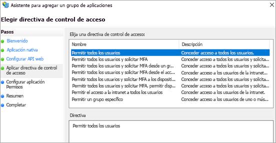
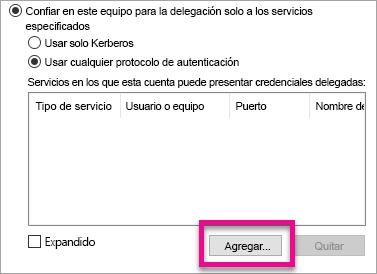
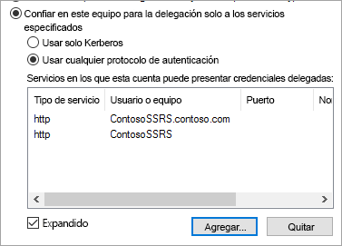

# <a name="using-oauth-to-connect-to-power-bi-report-server-and-ssrs"></a>Usar OAuth para conectarse a Power BI Report Server y a SSRS

Puede usar OAuth para conectarse a Power BI Report Server y a Reporting Services para mostrar informes móviles o KPI. Obtenga información sobre cómo configurar el entorno para admitir la autenticación de OAuth con la aplicación móvil de Power BI para conectarse a Power BI Report Server y a SQL Server Reporting Services 2016 o una versión posterior.

Vea que Adam se conecta desde Power BI Mobile a SSRS mediante OAuth:


<iframe width="560" height="350" src="https://www.youtube.com/embed/okzPAI2uUek" frameborder="0" allowfullscreen></iframe>


> [!NOTE]
> Ya se pueden ver informes de Power BI hospedados en Power BI Report Server mediante WAP para la autenticación en aplicaciones para iOS y Android.

## <a name="requirements"></a>Requisitos

Se necesita Windows Server 2016 para los servidores de proxy de aplicación web (WAP) y de servicios de federación de Active Directory (ADFS). No necesita tener un dominio de nivel funcional de Windows 2016.

## <a name="domain-name-services-dns-configuration"></a>Configuración de servicios de nombres de dominio (DNS)

La dirección URL pública será aquella a la que se conecte la aplicación móvil de Power BI. Por ejemplo, el aspecto debería ser similar al siguiente.

```https
https://reports.contoso.com
```

El registro DNS de **informes** para la dirección IP pública del servidor Web Application Proxy (WAP). También deberá configurar un registro DNS público para el servidor de ADFS. Por ejemplo, es posible que haya configurado el servidor de ADFS con la siguiente dirección URL.

```https
https://fs.contoso.com
```

El registro DNS de **fs** para la dirección IP pública del servidor Web Application Proxy (WAP) que se publicará como parte de la aplicación WAP.

## <a name="certificates"></a>Certificados

Deberá configurar los certificados de la aplicación de WAP y del servidor ADFS. Ambos certificados deben formar parte de una entidad de certificación válida que reconozcan sus dispositivos móviles.

## <a name="reporting-services-configuration"></a>Configuración de Reporting Services

No hay mucho que configurar con respecto a Reporting Services. Solo es necesario asegurarse de que tenemos un nombre de entidad de seguridad de servicio (SPN) válido para permitir que se produzca correctamente la autenticación Kerberos y que el servidor de Reporting Services está habilitado para la autenticación Negociar.

### <a name="service-principal-name-spn"></a>Nombre de entidad de seguridad de servicio (SPN)

El SPN es un identificador único para un servicio que usa la autenticación Kerberos. Debe asegurarse de que tiene un SPN de HTTP apropiado para el servidor de informes.

Para obtener información sobre cómo configurar el nombre de entidad de seguridad de servicio (SPN) correcto para el servidor de informes, consulte [Registrar un nombre principal de servicio (SPN) para un servidor de informes](https://msdn.microsoft.com/library/cc281382.aspx).

### <a name="enabling-negotiate-authentication"></a>Habilitar la autenticación Negociar

Para permitir que un servidor de informes use la autenticación Kerberos, debe configurar el tipo de autenticación del servidor de informes como RSWindowsNegotiate. Esto se realiza en el archivo rsreportserver.config.

```xml
<AuthenticationTypes>  
    <RSWindowsNegotiate />  
    <RSWindowsKerberos />  
    <RSWindowsNTLM />  
</AuthenticationTypes>
```

Para obtener más información, consulte [Modificar un archivo de configuración de Reporting Services](https://msdn.microsoft.com/library/bb630448.aspx) y [Configurar la autenticación de Windows en el servidor de informes](https://msdn.microsoft.com/library/cc281253.aspx).

## <a name="active-directory-federation-services-adfs-configuration"></a>Configuración de los servicios de federación de Active Directory (ADFS)

Tendrá que configurar ADFS en un servidor de Windows 2016 en su entorno. Para ello, puede usar el Administrador del servidor y seleccionar Agregar roles y características en Administrar. Para obtener más información, consulte [Servicios de federación de Active Directory](https://technet.microsoft.com/windows-server-docs/identity/active-directory-federation-services).

### <a name="create-an-application-group"></a>Crear un grupo de aplicaciones

En la pantalla Administración de AD FS, necesitará crear un grupo de aplicaciones de Reporting Services que incluya información de las aplicaciones de Power BI Mobile.

Puede crear el grupo de aplicaciones mediante los pasos siguientes.

1. Dentro de la aplicación Administración de AD FS, haga clic con el botón derecho en **Grupos de aplicaciones** y seleccione **Agregar grupo de aplicaciones…**

   

2. En el Asistente para agregar grupos de aplicaciones, proporcione un **nombre** para el grupo de aplicaciones y seleccione **Aplicación nativa accediendo a una API web**.

   

3. Seleccione **Siguiente**.

4. Proporcione un **nombre** para la aplicación que va a agregar. 

5. Aunque el **Id. de cliente** se genera automáticamente, escriba *484d54fc-b481-4eee-9505-0258a1913020* tanto para iOS como Android.

6. Deberá agregar las siguientes **URL de redireccionamiento**:

   **Entradas de Power BI Mobile para iOS:**  
   msauth://code/mspbi-adal://com.microsoft.powerbimobile  
   msauth://code/mspbi-adalms://com.microsoft.powerbimobilems  
   mspbi-adal://com.microsoft.powerbimobile  
   mspbi-adalms://com.microsoft.powerbimobilems

   **Las aplicaciones de Android solo necesitan los siguientes pasos:**  
   urn:ietf:wg:oauth:2.0:oob

   
7. Seleccione **Siguiente**.

8. Proporcione la dirección URL del servidor de informes. Se trata de la dirección URL externa que llamará al proxy de aplicación web. Debe tener el formato siguiente.

   > [!NOTE]
   > Esta dirección URL distingue mayúsculas de minúsculas.

   *https://<URL del servidor de informes>/*

   
9. Seleccione **Siguiente**.

10. Elija la **directiva de control de acceso** que se adapte a las necesidades de su organización.

    

11. Seleccione **Siguiente**.

12. Seleccione **Siguiente**.

13. Seleccione **Siguiente**.

14. Seleccione **Cerrar**.

Cuando haya finalizado, debería ver que las propiedades del grupo de aplicaciones tienen un aspecto similar al siguiente.


## <a name="web-application-proxy-wap-configuration"></a>Configuración del proxy de aplicación web (WAP)

Deberá habilitar el rol de Windows Web Application Proxy (rol) en un servidor de su entorno. Debe tratarse de un servidor de Windows 2016. Para obtener más información, consulte [Web Application Proxy in Windows Server 2016 (Proxy de aplicación web en Windows Server 2016)](https://technet.microsoft.com/windows-server-docs/identity/web-application-proxy/web-application-proxy-windows-server) y [Publishing Applications using AD FS Preauthentication (Publicar aplicaciones usando la autenticación previa de AD FS)](https://technet.microsoft.com/windows-server-docs/identity/web-application-proxy/publishing-applications-using-ad-fs-preauthentication#a-namebkmk14apublish-an-application-that-uses-oauth2-such-as-a-windows-store-app).

### <a name="constrained-delegation-configuration"></a>Configuración de la delegación restringida

Para realizar la transición de la autenticación de OAuth a la autenticación de Windows, es necesario usar la delegación restringida con transición de protocolo. Esto forma parte de la configuración de Kerberos. Ya se ha definido el SPN de Reporting Services en la configuración de Reporting Services.

Es necesario configurar la delegación restringida en la cuenta de equipo del servidor WAP dentro de Active Directory. Puede que tenga que trabajar con un administrador de dominio si no tiene derechos en Active Directory.

Para configurar la delegación restringida, deberá hacer lo siguiente.

1. En un equipo que tenga instaladas las herramientas de Active Directory, inicie **Usuarios y equipos de Active Directory**.

2. Busque la cuenta de equipo para el servidor WAP. De forma predeterminada, estará en el contenedor de equipos.

3. Haga clic con el botón derecho en el servidor WAP y vaya a **Propiedades**.

4. Seleccione la ficha **Delegación**.

5. Seleccione **Confiar en este equipo para la delegación solo a los servicios especificados** y, después, **Usar cualquier protocolo de autenticación**.

   

   Esta acción configura la delegación restringida para esta cuenta de equipo del servidor WAP. Después, es necesario especificar los servicios que se pueden delegar en esta máquina.

6. Seleccione **Agregar…** en el cuadro de servicios.

   

7. Seleccione **Usuarios o equipos…**

8. Escriba la cuenta de servicio que usa para Reporting Services. Esta es la cuenta a la que ha agregado el SPN en la configuración de Reporting Services.

9. Seleccione el SPN para Reporting Services y luego seleccione **Aceptar**.

   > [!NOTE]
   > Puede que solo vea el SPN de NetBIOS. Realmente seleccionará los SPN de NetBIOS y FQDN si existen ambos.

   

10. El resultado debería ser similar al siguiente cuando se activa la casilla **Expandido**.

    

11. Seleccione **Aceptar**.

### <a name="add-wap-application"></a>Agregar la aplicación WAP

Aunque puede publicar aplicaciones dentro de la consola de administración de acceso de informes, se debe crear la aplicación mediante PowerShell. A continuación se indica el comando para agregar la aplicación.

```powershell
Add-WebApplicationProxyApplication -Name "Contoso Reports" -ExternalPreauthentication ADFS -ExternalUrl https://reports.contoso.com/ -ExternalCertificateThumbprint "0ff79c75a725e6f67e3e2db55bdb103efc9acb12" -BackendServerUrl https://ContosoSSRS/ -ADFSRelyingPartyName "Reporting Services - Web API" -BackendServerAuthenticationSPN "http/ContosoSSRS.contoso.com" -UseOAuthAuthentication
```

| Parámetro | Comentarios |
| --- | --- |
| **ADFSRelyingPartyName** |El nombre de la API web que ha creado como parte del grupo de aplicaciones en ADFS. |
| **ExternalCertificateThumbprint** |El certificado que se usará para los usuarios externos. Es importante que el certificado sea válido en los dispositivos móviles y proceda de una entidad de certificación de confianza. |
| **BackendServerUrl** |La dirección URL al servidor de informes desde el servidor WAP. Si el servidor WAP está en una red perimetral, debe usar un nombre de dominio completo. Asegúrese de que puede visitar esta dirección URL desde el explorador web en el servidor WAP. |
| **BackendServerAuthenticationSPN** |El SPN que ha creado como parte de la configuración de Reporting Services. |

### <a name="setting-integrated-authentication-for-the-wap-application"></a>Configurar la autenticación integrada para la aplicación WAP

Después de agregar la aplicación WAP, debe establecer BackendServerAuthenticationMode para que use IntegratedWindowsAuthentication. Para configurarlo, necesita el identificador de la aplicación WAP.

```powershell
Get-WebApplicationProxyApplication “Contoso Reports” | fl
```


Ejecute el siguiente comando para establecer el BackendServerAuthenticationMode con el identificador de la aplicación WAP.

```powershell
Set-WebApplicationProxyApplication -id 30198C7F-DDE4-0D82-E654-D369A47B1EE5 -BackendServerAuthenticationMode IntegratedWindowsAuthentication
```


## <a name="connecting-with-the-power-bi-mobile-app"></a>Conectarse con la aplicación móvil de Power BI

Dentro de la aplicación móvil de Power BI, tendrá que conectarse a su instancia de Reporting Services. Para ello, proporcione la **dirección URL externa** para la aplicación WAP.


Cuando seleccione **Conectar**, se le dirigirá a la página de inicio de sesión de ADFS. Escriba unas credenciales válidas para su dominio.


Después de seleccionar **Iniciar sesión**, verá los elementos del servidor de Reporting Services.

## <a name="multi-factor-authentication"></a>Autenticación multifactor

Puede habilitar la autenticación multifactor para proporcionar seguridad adicional para su entorno. Para obtener más información, consulte [Configure AD FS 2016 and Azure MFA (Configurar AD FS 2016 y Azure MFA)](https://technet.microsoft.com/windows-server-docs/identity/ad-fs/operations/configure-ad-fs-2016-and-azure-mfa).

## <a name="troubleshooting"></a>Solución de problemas

### <a name="you-receive-the-error-failed-to-login-to-ssrs-server"></a>Recibirá el error "No se pudo iniciar sesión en el servidor de SSRS".


Puede configurar [Fiddler](https://www.telerik.com/fiddler) para que actúe como proxy para los dispositivos móviles para ver hasta dónde ha llegado la solicitud. Para habilitar un proxy de Fiddler para su dispositivo telefónico, deberá configurar [CertMaker para iOS y Android](https://www.telerik.com/fiddler/add-ons) en el equipo que ejecute Fiddler. El complemento es de Telerik para Fiddler.

Si el inicio de sesión funciona correctamente al usar Fiddler, puede que tenga un problema de certificado con la aplicación WAP o el servidor de ADFS. 

## <a name="next-steps"></a>Pasos siguientes

[Registrar un nombre principal de servicio (SPN) para un servidor de informes](https://msdn.microsoft.com/library/cc281382.aspx)  
[Modificar un archivo de configuración de Reporting Services](https://msdn.microsoft.com/library/bb630448.aspx)  
[Configurar la autenticación de Windows en el servidor de informes](https://msdn.microsoft.com/library/cc281253.aspx)  
[Servicios de federación de Active Directory](https://technet.microsoft.com/windows-server-docs/identity/active-directory-federation-services)  
[Web Application Proxy in Windows Server 2016 (Proxy de aplicación web en Windows Server 2016)](https://technet.microsoft.com/windows-server-docs/identity/web-application-proxy/web-application-proxy-windows-server)  
[Publishing Applications using AD FS Preauthentication (Publicar aplicaciones usando la autenticación previa de AD FS)](https://technet.microsoft.com/windows-server-docs/identity/web-application-proxy/publishing-applications-using-ad-fs-preauthentication#a-namebkmk14apublish-an-application-that-uses-oauth2-such-as-a-windows-store-app)  
[Configure AD FS 2016 and Azure MFA (Configurar AD FS 2016 y Azure MFA)](https://technet.microsoft.com/windows-server-docs/identity/ad-fs/operations/configure-ad-fs-2016-and-azure-mfa)  
¿Tiene más preguntas? [Pruebe la comunidad de Power BI](https://community.powerbi.com/)
