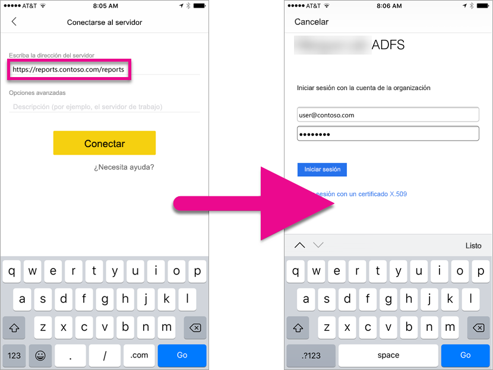
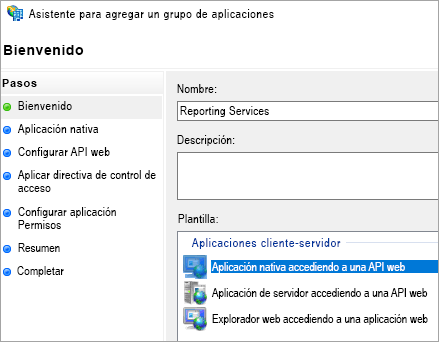
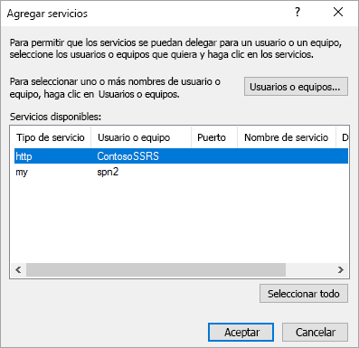
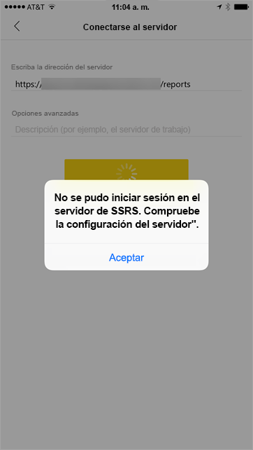

# <a name="using-oauth-to-connect-to-power-bi-report-server-and-ssrs"></a>Usar OAuth para conectarse a Power BI Report Server y a SSRS
Obtenga información sobre cómo configurar el entorno para admitir la autenticación de OAuth con la aplicación móvil de Power BI para conectarse a Power BI Report Server y a SQL Server Reporting Services 2016 o una versión posterior.



Puede usar OAuth para conectarse a Power BI Report Server y a Reporting Services para mostrar informes móviles o KPI. Windows Server 2016 ofrece algunas mejoras en el rol Proxy de aplicación web (WAP) para permitir este tipo de autenticación. Tenga en cuenta que en estos momentos no se permite visualizar informes de Power BI hospedados en Power BI Report Server mediante WAP para la autenticación.

## <a name="requirements"></a>Requisitos
Se necesita Windows Server 2016 para los servidores de proxy de aplicación web (WAP) y de servicios de federación de Active Directory (ADFS). No necesita tener un dominio de nivel funcional de Windows 2016.

## <a name="domain-name-services-dns-configuration"></a>Configuración de servicios de nombres de dominio (DNS)
Debe determinar cuál será la dirección URL pública a la que se conectará la aplicación móvil de Power BI. Por ejemplo, el aspecto debería ser similar al siguiente.

```
https://reports.contoso.com
```

Necesitará señalar el registro DNS para **informes** a la dirección IP pública del servidor de proxy de aplicación web (WAP). También necesitará configurar un registro DNS público para el servidor de ADFS. Por ejemplo, es posible que haya configurado el servidor de ADFS con la siguiente dirección URL.

```
https://fs.contoso.com
```

Necesitará señalar el registro DNS para **fs** a la dirección IP pública del servidor de proxy de aplicación web (WAP), ya que se publicará como parte de la aplicación WAP.

## <a name="certificates"></a>Certificados
Tendrá que configurar certificados para la aplicación de WAP y el servidor de ADFS. Ambos certificados deben formar parte de una entidad de certificación válida que reconozcan sus dispositivos móviles.

## <a name="reporting-services-configuration"></a>Configuración de Reporting Services
No hay mucho que configurar con respecto a Reporting Services. Solo es necesario asegurarse de que tenemos un nombre de entidad de seguridad de servicio (SPN) válido para permitir que se produzca correctamente la autenticación Kerberos y que el servidor de Reporting Services está habilitado para la autenticación Negociar.

### <a name="service-principal-name-spn"></a>Nombre de entidad de seguridad de servicio (SPN)
El SPN es un identificador único para un servicio que usa la autenticación Kerberos. Debe asegurarse de que tiene un SPN de HTTP apropiado presente para el servidor de informes.

Para obtener información sobre cómo configurar el nombre de entidad de seguridad de servicio (SPN) correcto para el servidor de informes, consulte [Registrar un nombre principal de servicio (SPN) para un servidor de informes](https://msdn.microsoft.com/library/cc281382.aspx).

### <a name="enabling-negotiate-authentication"></a>Habilitar la autenticación Negociar
Para habilitar que un servidor de informes use la autenticación Kerberos, debe configurar el tipo de autenticación del servidor de informes para que sea RSWindowsNegotiate. Esto se realiza dentro del archivo rsreportserver.config.

```
<AuthenticationTypes>  
    <RSWindowsNegotiate />  
    <RSWindowsKerberos />  
    <RSWindowsNTLM />  
</AuthenticationTypes>
```

Para obtener más información, consulte [Modificar un archivo de configuración de Reporting Services](https://msdn.microsoft.com/library/bb630448.aspx) y [Configurar la autenticación de Windows en el servidor de informes](https://msdn.microsoft.com/library/cc281253.aspx).

## <a name="active-directory-federation-services-adfs-configuration"></a>Configuración de los servicios de federación de Active Directory (ADFS)
Tendrá que configurar ADFS en un servidor de Windows 2016 en su entorno. Esto se puede realizar mediante el Administrador del servidor y al seleccionar Agregar roles y características en Administrar. Para obtener más información, consulte [Servicios de federación de Active Directory](https://technet.microsoft.com/windows-server-docs/identity/active-directory-federation-services).

### <a name="create-an-application-group"></a>Crear un grupo de aplicaciones
En la pantalla Administración de AD FS, necesitará crear un grupo de aplicaciones de Reporting Services que incluya información para las aplicaciones móviles de Power BI.

Puede crear el grupo de aplicaciones mediante los pasos siguientes.

1. Dentro de la aplicación de administración de AD FS, haga clic con el botón derecho en **Grupos de aplicaciones** y seleccione **Agregar grupo de aplicaciones…**
   
   
2. En el Asistente para agregar grupos de aplicaciones, proporcione un **nombre** para el grupo de aplicaciones y seleccione **Aplicación nativa accediendo a una API web**.
   
   
3. Seleccione **Siguiente**.
4. Proporcione un **nombre** para la aplicación que va a agregar. 
5. Aunque el **Id. de cliente** se genera automáticamente, escriba *484d54fc-b481-4eee-9505-0258a1913020* tanto para iOS como Android.
6. Deberá agregar las siguientes **URL de redireccionamiento**:
   
   **Entradas de Power BI Mobile para iOS:**  
   msauth://code/mspbi-adal://com.microsoft.powerbimobile  
   msauth://code/mspbi-adalms://com.microsoft.powerbimobilems  
   mspbi-adal://com.microsoft.powerbimobile  
   mspbi-adalms://com.microsoft.powerbimobilems
   
   **Las aplicaciones de Android solo necesitan la siguiente:**  
   urn:ietf:wg:oauth:2.0:oob
   
   
7. Seleccione **Siguiente**.
8. Proporcione la dirección URL del servidor de informes. Se trata de la dirección URL externa que llamará al proxy de aplicación web. Debe tener el formato siguiente.
   
   > [!NOTE]
   > Esta dirección URL distingue mayúsculas de minúsculas.
   > 
   > 
   
   *https://<url to report server>/reports*
   
   
9. Seleccione **Siguiente**.
10. Elija la **directiva de control de acceso** que se adapte a las necesidades de su organización.
    
    
11. Seleccione **Siguiente**.
12. Seleccione **Siguiente**.
13. Seleccione **Siguiente**.
14. Seleccione **Cerrar**.

Cuando haya finalizado, debería ver que las propiedades del grupo de aplicaciones tienen un aspecto similar al siguiente.


## <a name="web-application-proxy-wap-configuration"></a>Configuración del proxy de aplicación web (WAP)
Deberá habilitar el rol de Windows del proxy de aplicación web (rol) en un servidor en su entorno. Para ello, debe tratarse de un servidor de Windows 2016. Para obtener más información, consulte [Web Application Proxy in Windows Server 2016 (Proxy de aplicación web en Windows Server 2016)](https://technet.microsoft.com/windows-server-docs/identity/web-application-proxy/web-application-proxy-windows-server) y [Publishing Applications using AD FS Preauthentication (Publicar aplicaciones usando la autenticación previa de AD FS)](https://technet.microsoft.com/windows-server-docs/identity/web-application-proxy/publishing-applications-using-ad-fs-preauthentication#a-namebkmk14apublish-an-application-that-uses-oauth2-such-as-a-windows-store-app).

### <a name="constrained-delegation-configuration"></a>Configuración de la delegación restringida
Para realizar la transición de la autenticación de OAuth a la autenticación de Windows, es necesario usar la delegación restringida con transición de protocolo. Esto forma parte de la configuración de Kerberos. Ya se ha definido el SPN de Reporting Services en la configuración de Reporting Services.

Es necesario configurar la delegación restringida en la cuenta de equipo del servidor WAP dentro de Active Directory. Puede que tenga que trabajar con un administrador de dominio si no tiene derechos en Active Directory.

Para configurar la delegación restringida, deberá hacer lo siguiente.

1. En un equipo que tenga instaladas las herramientas de Active Directory, inicie **Usuarios y equipos de Active Directory**.
2. Busque la cuenta de equipo para el servidor WAP. De forma predeterminada, estará en el contenedor de equipos.
3. Haga clic con el botón derecho en el servidor WAP y vaya a **Propiedades**.
4. Seleccione la ficha **Delegación**.
5. Seleccione **Confiar en este equipo para la delegación solo a los servicios especificados** y, después, **Usar cualquier protocolo de autenticación**.
   
   
   
   Esta acción configura la delegación restringida para esta cuenta de equipo del servidor WAP. Después, es necesario especificar los servicios que se pueden delegar en esta máquina.
6. Seleccione **Agregar…** en el cuadro de servicios.
   
   
7. Seleccione **Usuarios o equipos…**
8. Escriba la cuenta de servicio que usa para Reporting Services. Se trata de la cuenta a la que ha agregado el SPN en la configuración de Reporting Services.
9. Seleccione el SPN para Reporting Services y luego seleccione **Aceptar**.
   
   > [!NOTE]
   > Puede que solo vea el SPN de NetBIOS. Realmente seleccionará los SPN de NetBIOS y FQDN si existen ambos.
   > 
   > 
   
   
10. El resultado debería ser similar al siguiente cuando se activa la casilla **Expandido**.
    
    
11. Seleccione **Aceptar**.

### <a name="add-wap-application"></a>Agregar la aplicación WAP
Aunque puede publicar aplicaciones dentro de la consola de administración de acceso de informes, se debe crear la aplicación mediante PowerShell. A continuación se indica el comando para agregar la aplicación.

```
Add-WebApplicationProxyApplication -Name "Contoso Reports" -ExternalPreauthentication ADFS -ExternalUrl https://reports.contoso.com/reports/ -ExternalCertificateThumbprint "0ff79c75a725e6f67e3e2db55bdb103efc9acb12" -BackendServerUrl http://ContosoSSRS/reports/ -ADFSRelyingPartyName "Reporting Services - Web API" -BackendServerAuthenticationSPN "http/ContosoSSRS.contoso.com" -UseOAuthAuthentication
```

| Parámetro | Comentarios |
| --- | --- |
| **ADFSRelyingPartyName** |Este es el nombre de la API Web que ha creado como parte del grupo de aplicaciones en AD FS. |
| **ExternalCertificateThumbprint** |Este es el certificado que se usará para los usuarios externos. Es importante que este certificado sea válido en dispositivos móviles y proceda de una entidad de certificación de confianza. |
| **BackendServerUrl** |Esta es la dirección URL para el servidor de informes desde el servidor WAP. Si el servidor WAP está en una red perimetral, debe usar un nombre de dominio completo. Asegúrese de que puede visitar esta dirección URL desde el explorador web en el servidor WAP. |
| **BackendServerAuthenticationSPN** |Este es el SPN que ha creado como parte de la configuración de Reporting Services. |

### <a name="setting-integrated-authentication-for-the-wap-application"></a>Configurar la autenticación integrada para la aplicación WAP
Después de agregar la aplicación WAP, debe establecer el BackendServerAuthenticationMode para que use IntegratedWindowsAuthentication. Para configurarlo, necesita el identificador de la aplicación WAP.

```
Get-WebApplicationProxyApplication “Contoso Reports” | fl
```


Ejecute el siguiente comando para establecer el BackendServerAuthenticationMode con el identificador de la aplicación WAP.

```
Set-WebApplicationProxyApplication -id 30198C7F-DDE4-0D82-E654-D369A47B1EE5 -BackendServerAuthenticationMode IntegratedWindowsAuthentication
```


## <a name="connecting-with-the-power-bi-mobile-app"></a>Conectarse con la aplicación móvil de Power BI
Dentro de la aplicación móvil de Power BI, tendrá que conectarse a su instancia de Reporting Services. Para ello, proporcione la **dirección URL externa** para la aplicación WAP.


Cuando seleccione **Conectar**, se le dirigirá a la página de inicio de sesión de ADFS. Escriba unas credenciales válidas para su dominio.


Después de seleccionar **Iniciar sesión**, verá los elementos del servidor de Reporting Services.


## <a name="multi-factor-authentication"></a>Autenticación multifactor
Puede habilitar la autenticación multifactor para proporcionar seguridad adicional para su entorno. Para obtener más información, consulte [Configure AD FS 2016 and Azure MFA (Configurar AD FS 2016 y Azure MFA)](https://technet.microsoft.com/windows-server-docs/identity/ad-fs/operations/configure-ad-fs-2016-and-azure-mfa).

## <a name="troubleshooting"></a>Solución de problemas

### <a name="you-receive-the-error-failed-to-login-to-ssrs-server-please-verify-server-configuration"></a>Recibirá el error "No se pudo iniciar sesión en el servidor de SSRS. Compruebe la configuración del servidor".



Puede configurar [Fiddler](http://www.telerik.com/fiddler) para que actúe como proxy para los dispositivos móviles para ver hasta dónde ha llegado la solicitud. Para habilitar un proxy de Fiddler para su dispositivo telefónico, deberá configurar el [CertMaker para iOS y Android](http://www.telerik.com/fiddler/add-ons) en el equipo que ejecute Fiddler. Se trata de un complemento de Telerik para Fiddler.

Si el inicio de sesión funciona correctamente al usar Fiddler, puede que tenga un problema de certificado con la aplicación WAP o el servidor de ADFS. Puede usar una herramienta como [Analizador de mensajes de Microsoft](https://www.microsoft.com/download/details.aspx?id=44226) para comprobar si los certificados son válidos.

## <a name="next-steps"></a>Pasos siguientes
[Registrar un nombre principal de servicio (SPN) para un servidor de informes](https://msdn.microsoft.com/library/cc281382.aspx)  
[Modificar un archivo de configuración de Reporting Services](https://msdn.microsoft.com/library/bb630448.aspx)  
[Configurar la autenticación de Windows en el servidor de informes](https://msdn.microsoft.com/library/cc281253.aspx)  
[Servicios de federación de Active Directory](https://technet.microsoft.com/windows-server-docs/identity/active-directory-federation-services)  
[Web Application Proxy in Windows Server 2016 (Proxy de aplicación web en Windows Server 2016)](https://technet.microsoft.com/windows-server-docs/identity/web-application-proxy/web-application-proxy-windows-server)  
[Publishing Applications using AD FS Preauthentication (Publicar aplicaciones usando la autenticación previa de AD FS)](https://technet.microsoft.com/windows-server-docs/identity/web-application-proxy/publishing-applications-using-ad-fs-preauthentication#a-namebkmk14apublish-an-application-that-uses-oauth2-such-as-a-windows-store-app)  
[Configure AD FS 2016 and Azure MFA (Configurar AD FS 2016 y Azure MFA)](https://technet.microsoft.com/windows-server-docs/identity/ad-fs/operations/configure-ad-fs-2016-and-azure-mfa)  
¿Tiene más preguntas? [Pruebe la comunidad de Power BI](http://community.powerbi.com/)

