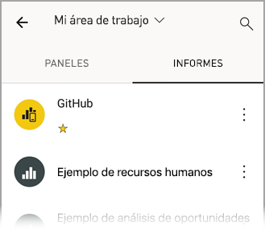
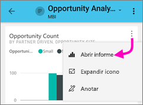
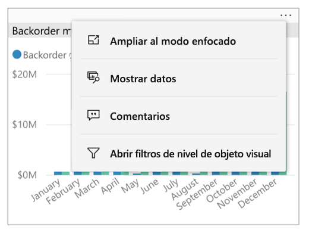
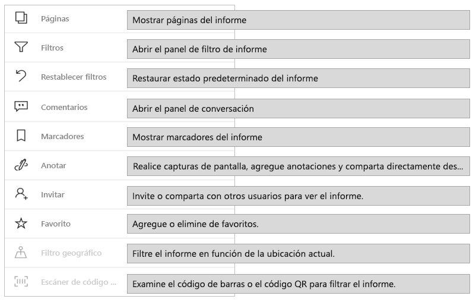
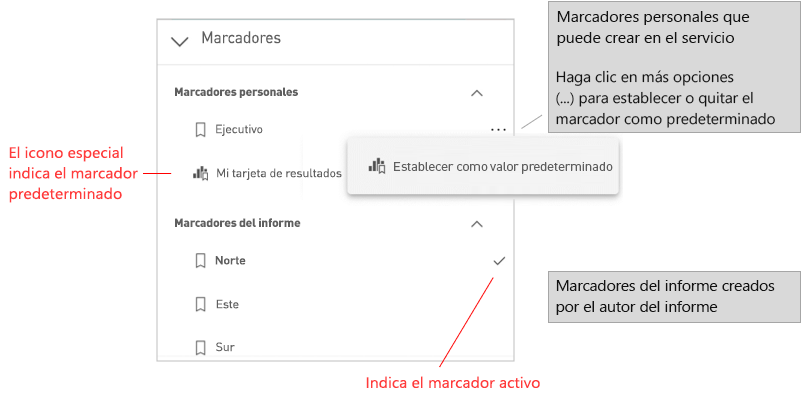
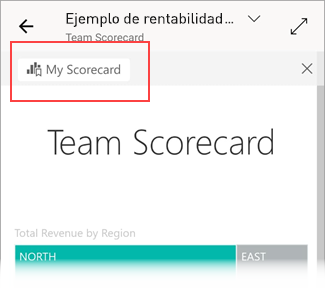

# Exploración de informes en las aplicaciones móviles de Power BI
Se aplica a:

|  |  |  |  |  |
|:---: |:---: |:---: |:---: |:---: |
| iPhone |iPad |Teléfonos Android |Tabletas Android |Dispositivos de Windows 10 |

Un informe de Power BI es una vista interactiva de los datos, con objetos visuales que describen distintas conclusiones e información de dichos datos. Ver informes en las aplicaciones móviles de Power BI es el tercer paso de un proceso de tres pasos:

1. [Crear informes en Power BI Desktop](../../desktop-report-view.md). Puede incluso [optimizar un informe para teléfonos](mobile-apps-view-phone-report.md) en Power BI Desktop.
2. Publique esos informes en el servicio Power BI [(https://powerbi.com)](https://powerbi.com) o [Power BI Report Server](../../report-server/get-started.md).  
3. Interactuar con los informes en las aplicaciones móviles de Power BI.

## Apertura de un informe de Power BI en la aplicación móvil
Los informes de Power BI se almacenan en distintos lugares de la aplicación móvil, en función de su procedencia. Pueden estar en Aplicaciones, Compartido conmigo, Áreas de trabajo (incluidos Mi área de trabajo) o en un servidor de informes. A veces, se desplaza por un panel relacionado para llegar a un informe y a veces aparecen en una lista.

En listas y menús, encontrará un icono junto al nombre de un informe, lo que ayuda a entender que este elemento es un informe:

En las aplicaciones móviles de Power BI Mobile hay dos iconos para los informes:

*  indica un informe que se presentará en orientación horizontal en la aplicación. Tendrá el mismo aspecto que en un explorador.

*  indica un informe que tiene al menos una página optimizada para teléfono, que se presentará en orientación vertical.

> [!NOTE]
> Al mantener el teléfono en orientación horizontal, siempre obtendrá el diseño horizontal, incluso si la página del informe tiene diseño de teléfono.

Para obtener un informe desde un panel, pulse **Más opciones** (...) en la esquina superior derecha de un icono y, después, pulse **Abrir informe**:
  
  
  
  No todos los iconos se pueden abrir como informes. Por ejemplo, los iconos que se crean cuando hace una pregunta en el cuadro de Preguntas y respuestas no abren informes al pulsarlos.
  
## Interacción con informes
Una vez que haya abierto un informe en la aplicación, puede empezar a trabajar con él. Con el informe y los datos puede hacer muchas cosas. En el pie de página del informe, encontrará acciones que puede realizar en el informe. También puede segmentar los datos mediante pulsaciones y pulsaciones largas en los datos mostrados en el informe.

### Interacción de pulsación única frente a pulsar dos veces
Al descargar la aplicación móvil de Power BI, está establecida para la interacción de pulsación única. Esto significa que, al pulsar un objeto visual para realizar una acción, como seleccionar un elemento de segmentación, resaltado cruzado, hacer clic en un vínculo o botón, etc., la pulsación selecciona el objeto visual y realiza la acción deseada.

Si lo prefiere, puede cambiar a la interacción de pulsar dos veces. Con la interacción de pulsar dos veces, primero debe pulsar un objeto visual para seleccionarlo y, después, volver a pulsarlo para realizar la acción deseada.

Para cambiar a la interacción de pulsar dos veces, o bien para recuperar la de pulsación única, vaya a la [configuración de las interacciones de la aplicación](./mobile-app-interaction-settings.md).

### Uso de pulsaciones y pulsaciones largas
Una pulsación es como un clic del mouse. Por tanto, si quiere resaltar el informe en función de un punto de datos, pulse ese punto de datos.
Al pulsar un valor de segmentación, se selecciona el valor y el resto del informe se segmenta por ese valor.
Al pulsar un vínculo, un botón o un marcador, se producirá la acción definida por el autor del informe.

Probablemente haya observado que al pulsar un objeto visual aparece un borde. En la esquina superior derecha del borde, verá **Más opciones** (...). Si pulsa los puntos suspensivos, verá un menú de acciones que puede realizar en ese objeto visual:

### Acciones relativas a la información en pantalla y la obtención de detalles
Al realizar una pulsación larga (pulsar y mantener presionado) en un punto de datos, se mostrará una información en pantalla con los valores que representa este punto de datos:

Si el autor del informe ha configurado la información en pantalla de la página del informe, la información en pantalla predeterminada se reemplazará por la de la página del informe:

> [!NOTE]
> La información en pantalla para informes se admite para los dispositivos de al menos 640 píxeles y 320 puntos de ventanilla de píxeles. Si el dispositivo es más pequeño, la aplicación muestra la información en pantalla predeterminada.

Los autores de informes pueden definir jerarquías en los datos y las relaciones entre las páginas del informe. Las jerarquías permiten explorar en profundidad, rastrear agrupando datos y obtener detalles de otra página de informe desde un objeto visual y un valor. Por tanto, al realizar una pulsación larga en un valor, además de la información en pantalla, en el pie de página aparecen las opciones de exploración pertinentes:

Al pulsar una parte específica de un objeto visual y la opción de *obtención de detalles*, Power BI le mostrará otra página del informe y la filtrará según el valor que haya pulsado. El autor de un informe puede definir una o más opciones de exploración de varias páginas, de modo que cada opción dirija a una página diferente. En ese caso, podrá elegir en qué opción quiere obtener detalles. El botón Atrás le dirigirá de vuelta a la página anterior.

Para obtener más información, consulte el artículo sobre cómo [agregar la obtención de detalles en Power BI Desktop](../../desktop-drillthrough.md).
   
   > [!IMPORTANT]
   > En las aplicaciones móviles de Power BI, las acciones de obtención de detalles de los objetos visuales de matriz y tabla se habilitan solamente a través de los valores de celda, no a través de los encabezados de columna o de fila.
   
   
   
### Uso de las acciones en el pie de página del informe
Desde el pie de página del informe, puede realizar varias acciones en la página del informe actual o en todo el informe. El pie de página proporciona acceso rápido a las acciones que se usan con más frecuencia. Para tener acceso a otras acciones, pulse el botón **Más opciones** (...):

Puede realizar las siguientes acciones desde el pie de página:
* Restablecer el filtro de informe y las selecciones de resaltado cruzado a su estado original.
* Abrir el panel de conversación para ver o agregar comentarios en el informe.
* Abrir el panel de filtro para ver o modificar el filtro aplicado actualmente en el informe.
* Enumerar todas las páginas del informe. Al pulsar el nombre de la página se cargará y presentará esa página.
Puede desplazarse entre las páginas del informe si desliza el dedo desde el borde de la pantalla hasta el centro.
* Ver todas las acciones del informe.

#### Todas las acciones del informe
Al pulsar el botón **Más opciones** (...) en el pie de página del informe, verá todas las acciones que puede realizar en un informe:

Es posible que algunas de las acciones estén deshabilitadas, ya que dependen de las funciones específicas del informe.
Por ejemplo:

**Marcadores** solo aparece si se han establecido [marcadores](mobile-reports-in-the-mobile-apps.md#bookmarks) en el informe. Se muestran tanto los marcadores personales que puede definir en el servicio Power BI como los definidos por el creador del informe. Si uno de los marcadores se ha definido como el marcador predeterminado, el informe se abrirá en esa vista cuando se cargue.

Es posible que **Anotar y compartir** esté desactivado si hay una [directiva de protección de Intune](https://docs.microsoft.com/intune/app-protection-policies) en la organización que prohíba el uso compartido desde la aplicación Power BI Mobile.

La opción **Invitar** solo está habilitada si tiene permiso para compartir el informe con otros usuarios. Solo tendrá permiso si es el propietario del informe o si el propietario le ha proporcionado permiso para volver a compartirlo.

**Filtrar por la ubicación actual** está habilitado si el autor del informe lo ha clasificado con datos geográficos. Para obtener más información, consulte el artículo sobre la [identificación de datos geográficos en un informe](https://docs.microsoft.com/power-bi/desktop-mobile-geofiltering).

**Examinar para filtrar el informe por código de barras** solo está habilitado si el conjunto de datos del informe se ha etiquetado como **Código de barras**. Para obtener más información, consulte el artículo sobre el [etiquetado de códigos de barra en Power BI Desktop](https://docs.microsoft.com/power-bi/desktop-mobile-barcodes).

### Marcadores

La aplicación móvil de Power BI admite los marcadores de informe que haya definido el creador del informe y los marcadores personales que puede definir en el servicio Power BI. Puede encontrar el menú de marcadores en **Más opciones** (...), en la [barra de herramientas de acciones del informe](mobile-reports-in-the-mobile-apps.md#all-report-actions).

Los marcadores predeterminados se indican mediante un icono especial. En el caso de los marcadores personales, puede establecer, desactivar o cambiar la configuración predeterminada pulsando **Más opciones (...)** junto al marcador que quiera cambiar y seleccionando **Establecer como valor predeterminado** o **Borrar valor predeterminado**.

Cuando se abre una vista de marcador de un informe, el nombre del marcador aparece en la parte superior del informe.

[Obtenga más información sobre los marcadores en el servicio Power BI](https://docs.microsoft.com/power-bi/consumer/end-user-bookmarks).

## Configuración de la experiencia con los informes
La aplicación móvil de Power BI tiene una serie de valores que le permiten controlar la experiencia con los informes. Actualmente, puede configurar lo siguiente:
* **Interacción con los objetos visuales**: puede optar por usar la interacción de pulsación única o de pulsar dos veces.
* **Método de actualización de datos**: puede elegir entre un botón de actualización o una acción de deslizar para actualizar los datos del informe.
* **Visibilidad del pie de página del informe**: puede elegir entre un pie de página acoplado siempre visible, o bien un pie de página dinámico que se oculte y se vuelva a mostrar en función de las acciones (desplazamiento, por ejemplo).

Vea la [configuración de las interacciones de la aplicación](./mobile-app-interaction-settings.md) para obtener información sobre cómo cambiar esta configuración.

## Pasos siguientes
* [Ver e interactuar con informes de Power BI optimizados para el teléfono](mobile-apps-view-phone-report.md)
* [Creación de versiones de informes optimizadas para teléfonos](../../desktop-create-phone-report.md)
* ¿Tiene alguna pregunta? [Pruebe a preguntar a la comunidad de Power BI](https://community.powerbi.com/)

