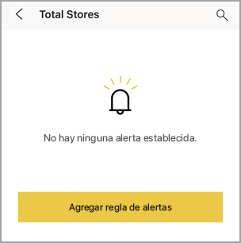
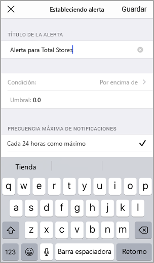
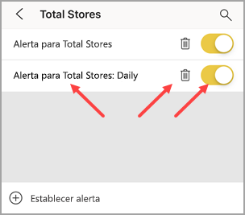
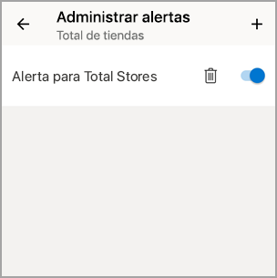
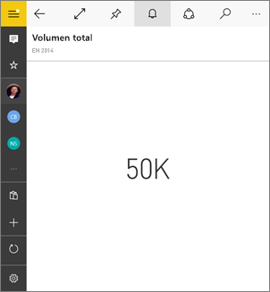
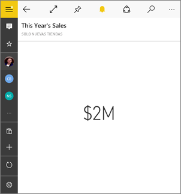

# Establecer alertas de datos en las aplicaciones móviles de Power BI
Se aplica a:

|  |  |  |  |  |
|:--- |:--- |:--- |:--- |:--- |
| iPhone |iPad |Teléfonos Android |Tabletas Android |Dispositivos de Windows 10 |

Puede establecer alertas en los paneles de las aplicaciones móviles de Power BI y del servicio Power BI. Las alertas sirven para notificarle si se producen cambios en los datos de un icono más allá de los límites establecidos. Las alertas funcionan en los iconos con un solo número, como las tarjetas y medidores, pero no con los datos de streaming. Puede establecer alertas de datos en su dispositivo móvil y verlos en el servicio Power BI, y viceversa. Solo puede ver las alertas de datos establecidas, incluso si comparte un panel o una instantánea de un icono.

Puede establecer alertas en los iconos si tiene una licencia de Power BI Pro o si el panel compartido está en una capacidad Premium. 

> [!WARNING]
> Las notificaciones de alerta controladas por datos proporcionan información acerca de los datos. Si le roban el dispositivo, recomendamos ir al servicio de Power BI para desactivar todas las reglas de alertas controladas por datos. 
> 
> Obtenga más información sobre [Administrar alertas de datos en el servicio de Power BI](../../service-set-data-alerts.md).
> 
> 

## Alertas de datos en un iPhone o iPad
### Establecer una alerta en un iPhone o iPad
1. Pulse un icono de número o medidor en un panel para abrirlo en modo enfocado.  
   
   
2. Pulse el icono de campana  para agregar una alerta.  
3. Pulse **Agregar regla de alertas**.
   
   
4. Elija recibir alertas cuando se esté por encima o por debajo de un valor y, a continuación, establezca el valor.
   
   
5. Decida si desea recibir alertas cada hora o cada día y si desea recibir además un correo electrónico cuando reciba la alerta.
   
   > [!NOTE]
   > No recibirá alertas cada hora o cada día, salvo que los datos se hayan actualizado en ese momento.
   > 
   > 
6. También puede cambiar el título de la alerta.
7. Puntee en **Guardar**.
8. Un solo icono puede contener alertas para los valores que estén por encima y por debajo de los umbrales. En **Administrar alertas**, pulse **Agregar regla de alertas**.
   
   

### Administrar alertas en su dispositivo iPhone o iPad
Puede administrar las alertas individualmente en su dispositivo móvil o [administrar todas las alertas en el servicio Power BI](../../service-set-data-alerts.md).

1. En un panel, pulse un icono de número o medidor que tenga una alerta.  
   
   
2. Pulse el icono de la campana .  
3. Pulse el nombre de la alerta para editarla, pulse el control deslizante para desactivar las alertas de correo electrónico o pulse la papelera para eliminar la alerta.
   
    

## Alertas de datos en un dispositivo Android
### Establecer una alerta en un dispositivo Android
1. En un panel de Power BI, pulse en un número o icono medidor para abrirlo.  
2. Pulse el icono de campana  para agregar una alerta.  
   
   
3. Pulse el icono del signo más (+).
   
   
4. Elija recibir alertas por encima o por debajo de un valor y escriba el valor.
   
   
5. Pulse **Hecho**.
6. Decida si desea recibir alertas cada hora o cada día y si desea recibir además un correo electrónico cuando reciba la alerta.
   
   > [!NOTE]
   > No recibirá alertas cada hora o cada día, salvo que los datos se hayan actualizado en ese momento.
   > 
   > 
7. También puede cambiar el título de la alerta.
8. Puntee en **Guardar**.

### Administrar alertas en un dispositivo Android
Puede administrar las alertas individuales en su aplicación móvil de Power BI o [administrar todas las alertas en el servicio Power BI](../../service-set-data-alerts.md).

1. En un panel, pulse un icono de carta o medidor que tenga una alerta.  
2. Pulse el icono de campana de color sólido .  
3. Pulse la alerta para cambiar un valor o desactivarla.
   
    
4. Pulse el icono de signo más (+) para agregar otra alerta para el mismo icono.
5. Para eliminar por completo la alerta, pulse el icono de papelera .

## Alertas de datos en un dispositivo Windows
### Establecer alertas de datos en un dispositivo Windows
1. Pulse un icono de número o medidor en un panel para abrirlo.  
2. Pulse el icono de campana  para agregar una alerta.  
   
   
3. Pulse el icono del signo más (+).
   
   
4. Elija recibir alertas por encima o por debajo de un valor y escriba el valor.
   
   
5. Decida si desea recibir alertas cada hora o cada día y si desea recibir además un correo electrónico cuando reciba la alerta.
   
   > [!NOTE]
   > No recibirá alertas cada hora o cada día, salvo que los datos se hayan actualizado en ese momento.
   > 
   > 
6. También puede cambiar el título de la alerta.
7. Pulse la marca de verificación.
8. Un solo icono puede contener alertas para los valores que estén por encima y por debajo de los umbrales. En **Administrar alertas**, pulse el signo más (+).
   
   

### Administrar alertas en un dispositivo Windows
Puede administrar las alertas individuales en su aplicación móvil de Power BI o [administrar todas las alertas en el servicio Power BI](../../service-set-data-alerts.md).

1. En un panel, pulse un icono de carta o medidor que tenga una alerta.  
2. Pulse el icono de la campana .  
   
   
3. Pulse la alerta para cambiar un valor o desactivarla.
   
    
4. Para eliminar por completo la alerta, haga clic con el botón derecho o mantenga seleccionado > **Eliminar**.

## Recibir alertas
Recibirá alertas en el [Centro de notificaciones](mobile-apps-notification-center.md) de Power BI en su dispositivo móvil o en el servicio Power BI junto con notificaciones de los nuevos paneles que otro usuario haya compartido con usted.

Los orígenes de datos se configuran a menudo para actualizarse diariamente, aunque algunos se actualicen con más frecuencia. Cuando se actualizan los datos en el panel, si los datos de seguimiento llegan a uno de los umbrales que ha establecido, se realizarán varias acciones.

1. Power BI comprueba si han pasado más de una hora o más de 24 horas (según la opción seleccionada) desde la última alerta que se ha enviado.
   
   Siempre que los datos superen el umbral, obtendrá una alerta cada hora o cada 24 horas.
2. Si ha configurado la alerta para que se envíe un correo electrónico, encontrará algo parecido a esto en su bandeja de entrada.
   
   
3. Power BI añade un mensaje a su **Centro de notificaciones** y una nueva alerta en el icono aplicable .
4. Pulse el botón de navegación global  para [abrir su **Centro de notificaciones**](mobile-apps-notification-center.md) y ver los detalles de la alerta.
   
      

> [!NOTE]
> Las alertas solo funcionan en los datos que se actualizan. Cuando los datos se actualizan, Power BI busca si se ha configurado una alerta para esos datos. Si los datos han alcanzado un umbral de alerta, se activará una alerta.
> 
> 

## Sugerencias y solución de problemas
* Las alertas no se admiten actualmente para los iconos de Bing o los iconos de tarjeta con medidas de fecha y hora.
* Las alertas solo funcionan con datos numéricos.
* Las alertas solo funcionan en los datos que se actualizan. No funcionan con datos estáticos.
* Las alertas no funcionan con los iconos que contienen datos de streaming.

## Pasos siguientes
* [Administrar las alertas en el servicio Power BI](../../service-set-data-alerts.md)
* [Centro de notificaciones de Power BI Mobile](mobile-apps-notification-center.md)
* ¿Tiene alguna pregunta? [Pruebe a preguntar a la comunidad de Power BI](http://community.powerbi.com/)

