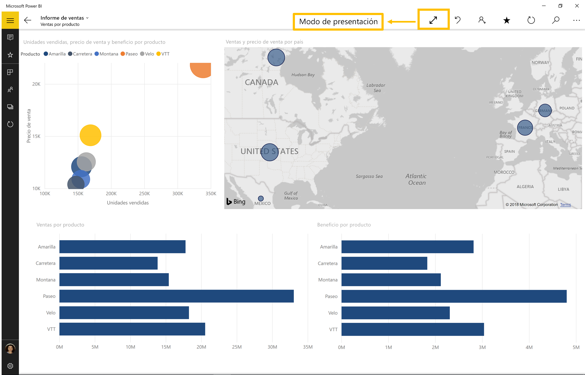

# Visualización de informes y paneles en modo de presentación en Surface Hub y dispositivos Windows 10
Use el modo de presentación para mostrar los informes y paneles en pantalla completa en dispositivos Windows 10 y Surface Hub. 

El modo de presentación es útil para mostrar Power BI en una reunión o una conferencia, para visualizarlo en un proyector dedicado en una oficina o incluso para aprovechar al máximo el espacio de una pantalla pequeña. 

En el modo de presentación de la aplicación móvil de Power BI para Windows 10, se quita todo el "cromo", como las barras de navegación y de menú, para permitir que usted y los miembros de su equipo se centren en los datos del informe. Habrá disponible una barra de herramientas con acciones con la que podrá interactuar y colaborar con sus datos en el modo de presentación.

También puede [mostrar paneles e informes en el modo de pantalla completa desde el servicio Power BI](../end-user-focus.md) en la Web.

> [!NOTE]
> El modo de presentación es diferente del [modo Enfoque para los iconos](mobile-tiles-in-the-mobile-apps.md).

>[!NOTE]
>El soporte técnico de la aplicación móvil de Power BI con **teléfonos con Windows 10 Mobile** finalizará el 16 de marzo de 2021. [Más información](https://go.microsoft.com/fwlink/?linkid=2121400)

## Usar el modo de presentación
En la aplicación de Power BI para móviles, pulse el icono **Pantalla completa** para pasar a ese modo.
 El cromo de la aplicación desaparecerá y aparecerá una barra de herramientas en la parte inferior o a ambos lados de la pantalla (según el tamaño de la pantalla).

En la barra de herramientas puede pulsar para realizar las siguientes acciones:

1. **Volver**  a la página anterior. Si pulsa de forma prolongada el icono, aparecerán las ventanas de ruta de navegación, lo que le permitirá ir a la carpeta que contiene su informe o panel.
2. **Elegir el color de la tinta**  cuando utilice el lápiz de Surface para dibujar y realizar anotaciones en la página del informe.
3. **Borrar las marcas de lápiz**  que haya realizado con el lápiz de Surface al dibujar y realizar anotaciones en la página del informe.  
4. **Cambiar de una página**  a otra del informe en la presentación.
5. **Reproducir la presentación de diapositivas** , lo que oculta la barra de acciones e inicia la presentación de diapositivas. La aplicación rotará automáticamente por las páginas del informe. 
6. **Buscar**  otros artefactos en Power BI.
7. **Actualizar**  el informe.
8. **Salir**  del modo de presentación.
8. **Compartir**  una imagen de la vista de presentación con sus compañeros. La imagen incluirá las anotaciones que haya realizado con el lápiz de Surface durante la presentación.

Puede desacoplar la barra de herramientas y arrastrarla para ubicarla en cualquier lugar de la pantalla. Esto es útil en el caso de pantallas grandes en las que quiera centrarse en un área específica del informe y desee tener cerca las herramientas. Basta con colocar el dedo sobre la barra de herramientas y deslizarlo hacia el lienzo del informe.

## Pasos siguientes
* [Mostrar paneles e informes en el modo de pantalla completa desde el servicio Power BI](../end-user-focus.md)
* ¿Tiene alguna pregunta? [Pruebe a preguntar a la comunidad de Power BI](https://community.powerbi.com/)

