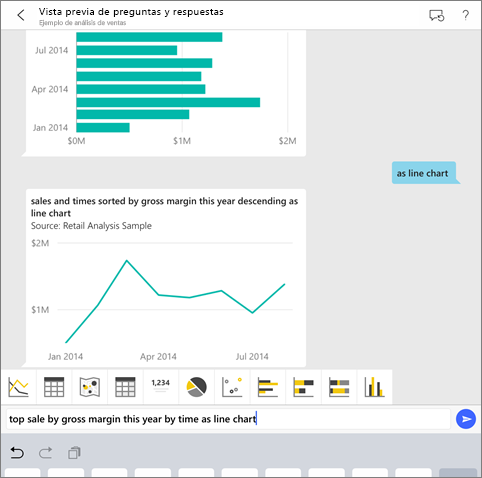
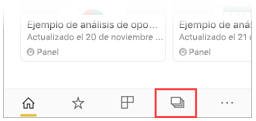
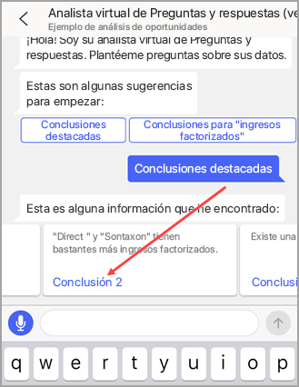
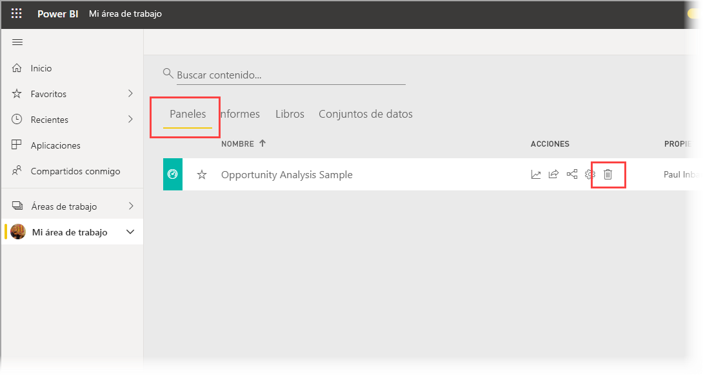
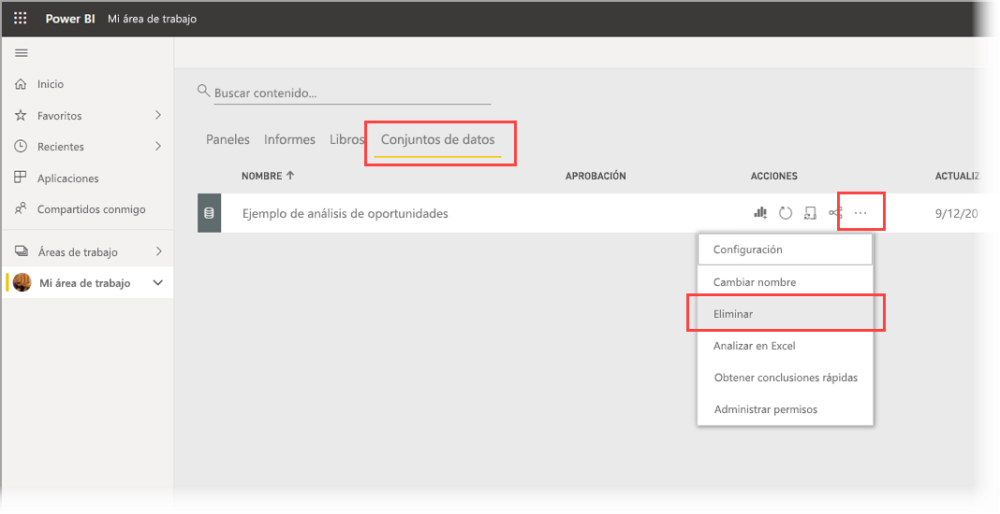

# Tutorial: Formular preguntas sobre los datos con el analista virtual de Preguntas y respuestas en las aplicaciones de Power BI de iOS

La manera más fácil de obtener información acerca de los datos es realizar preguntas con sus propias palabras. En este tutorial, puede plantear preguntas y ver información destacada sobre los datos de ejemplo con el analista virtual de Preguntas y respuestas en la aplicación móvil de Microsoft Power BI en su iPad o iPhone. 

Se aplica a:

|  |  |
|:--- |:--- |
| iPhone |iPad |

El analista virtual de Preguntas y respuestas es una experiencia de inteligencia empresarial de conversación que accede a los datos subyacentes de Preguntas y respuestas del [servicio Power BI](https://powerbi.com). Sugiere información sobre los datos, y puede escribir o expresar sus propias preguntas.

En este tutorial, tendrá que:

> [!div class="checklist"]
> * Instalar la aplicación móvil Power BI para iOS
> * Descargar un panel e informe de ejemplo de Power BI
> * Ver qué información destacada sugiere la aplicación móvil

## Requisitos previos

* **Suscribirse en Power BI**: Si no está registrado en Power BI, [regístrese para obtener una evaluación gratuita](https://app.powerbi.com/signupredirect?pbi_source=web) antes de empezar.
* **Instale la aplicación de Power BI para iOS**: [Descargue la aplicación iOS](https://apps.apple.com/app/microsoft-power-bi/id929738808) desde App Store de Apple para iPad, iPhone o iPod Touch. Las versiones siguientes admiten la aplicación de Power BI para iOS:
  * iPad con iOS 11 o posterior.
  * iPhone 5 y versiones posteriores, con iOS 11 o posterior. 
  * iPod Touch con iOS 11 o posterior.
* **Descarga de los datos de ejemplo**: El primer paso consiste en descargar el **Ejemplo de análisis de oportunidades** en el servicio Power BI. Vea [Descarga de ejemplos en Mi área de trabajo en el servicio Power BI](./mobile-apps-download-samples.md) para obtener instrucciones sobre cómo hacerlo.

Una vez que haya completado los requisitos previos y haya descargado los datos de ejemplo, estará listo para ver los ejemplos en el dispositivo iOS.

## Probar la información destacada
1. En su iPhone o iPad, abra la aplicación de Power BI e inicie sesión con las credenciales de la cuenta de Power BI, las mismas que usó en el servicio Power BI en el explorador.

2. En la barra de navegación de la página de inicio, pulse el icono **Áreas de trabajo**.

    

3. Cuando se abra la página Áreas de trabajo, pulse **Mis áreas de trabajo** y, después, el panel **Ejemplo de análisis de oportunidades** para abrirlo.

3. En el panel Ejemplo de análisis de oportunidades, pulse el icono del analista virtual de Preguntas y respuestas en el menú de acción.

    

    El analista virtual de Preguntas y respuestas ofrece algunas sugerencias para empezar a trabajar.

    

3. Pulse **featured insights** (información destacada).

4. El analista virtual de Preguntas y respuestas sugiere información. Desplácese a la derecha y pulse **Insight 2** (Información 2).

    

   El analista virtual de Preguntas y respuestas muestra Insight 2 (Información 2).

    

5. Pulse el gráfico para abrirlo en modo de enfoque.

    

6. Pulse la flecha de la esquina superior izquierda para volver a la ventana de la experiencia del analista virtual de Preguntas y respuestas.

## Limpieza de recursos

Cuando complete el tutorial, puede eliminar el panel, el informe y el conjunto de datos del ejemplo de análisis de oportunidades.

1. Abra el servicio Power BI ([servicio Power BI](https://app.powerbi.com)) e inicie sesión.

2. En el panel de navegación, seleccione **Mi área de trabajo**.

3. Haga clic en la pestaña de paneles y, después, en la línea del ejemplo de análisis de oportunidades, haga clic en la papelera.

    

    Ahora, seleccione la pestaña Informes y repita la operación.

4. Luego, seleccione la pestaña Conjuntos de datos, haga clic en el botón **Más opciones** (...) y elija **Eliminar**.

    

## Pasos siguientes

Ha probado el asistente virtual de Preguntas y respuestas en las aplicaciones móviles de Power BI para iOS. Obtenga más información sobre Preguntas y respuestas en el servicio Power BI.
> [!div class="nextstepaction"]
> [Preguntas y respuestas en el servicio Power BI](../end-user-q-and-a.md)