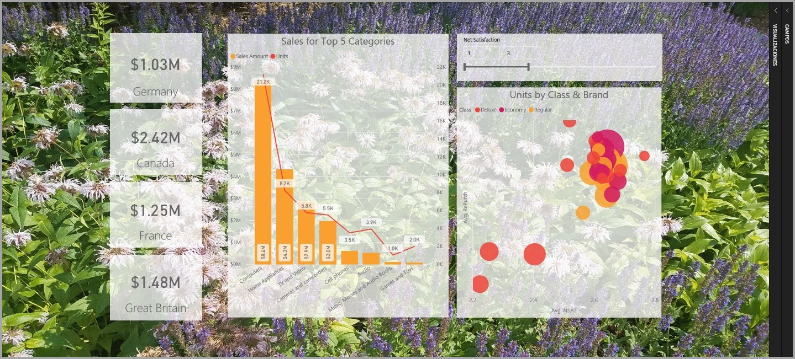
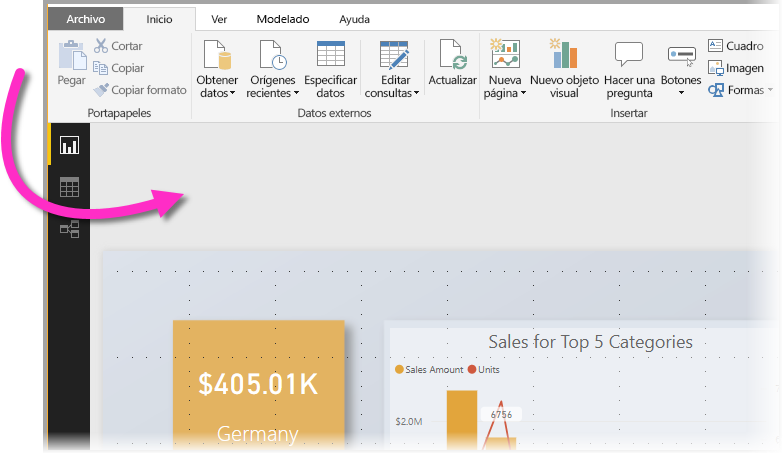
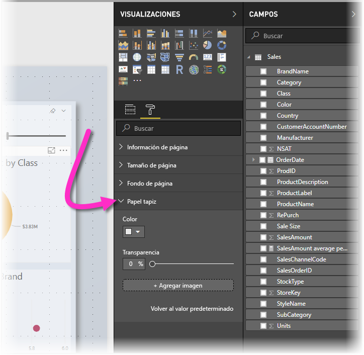
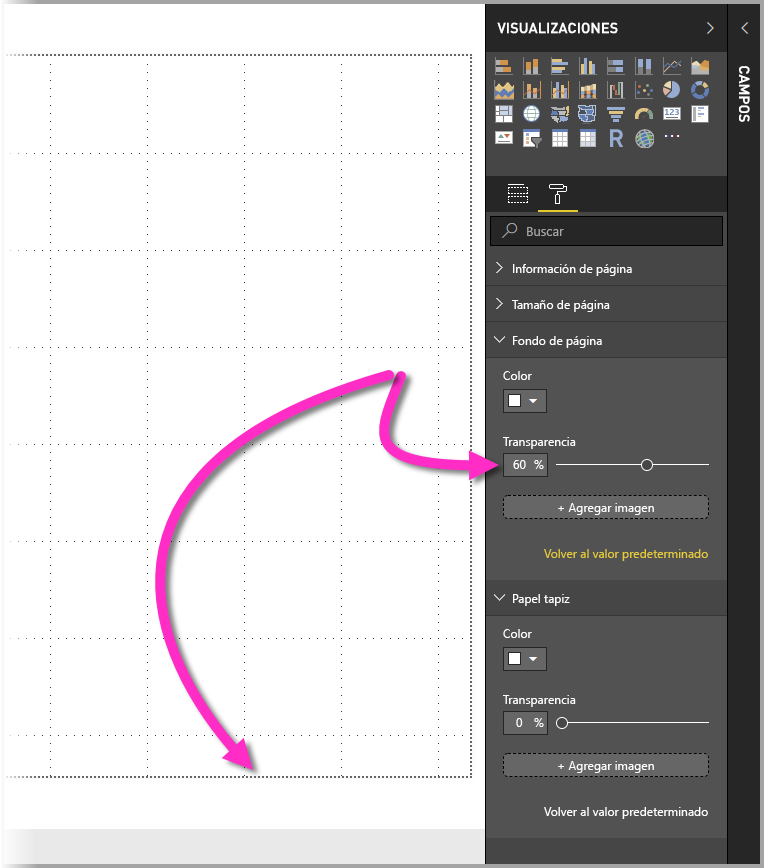
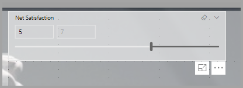
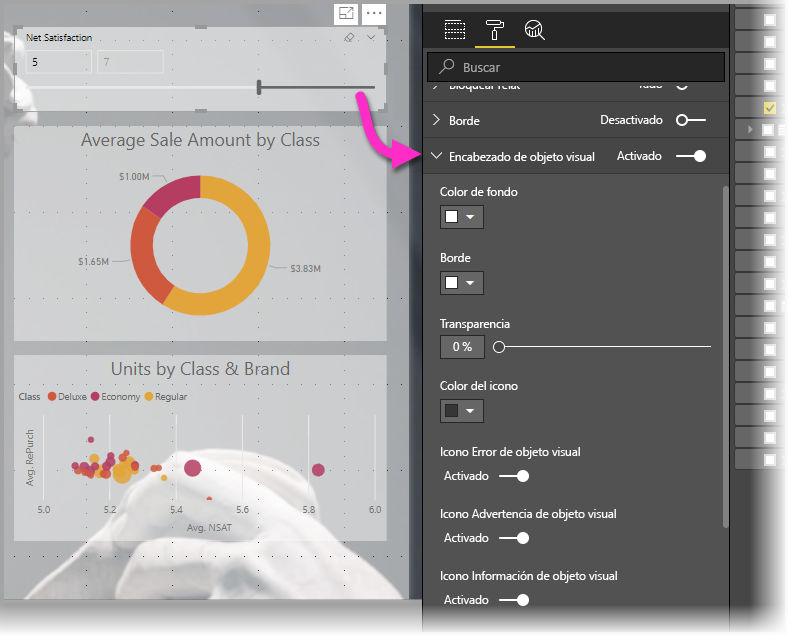

# Uso de elementos visuales para mejorar los informes de Power BI

Con **Power BI Desktop** puede usar elementos visuales, como papel tapiz y encabezados visuales mejorados para las visualizaciones con el fin de mejorar la apariencia de los informes.

A partir de la versión de **Power BI Desktop** de julio de 2018, puede agregar mejoras para usarlas en los informes y hacer que sus análisis e informes sean incluso más atractivos que antes. Las mejoras que se describen en este artículo incluyen las siguientes: 

* Aplicar **papel tapiz** a los informes para que el fondo pueda mejorar o resaltar los elementos de la historia que quiere contar con los datos.
* Usar **encabezados visuales** mejorados para visualizaciones individuales con el fin de crear objetos visuales perfectamente alineados en el lienzo del informe. 

En las secciones siguientes se describe cómo usar estas mejoras y cómo aplicarlas a los informes.

## Uso de papel tapiz en los informes de Power BI

Puede usar el **papel tapiz** para dar formato al área gris fuera de la página del informe. En la imagen siguiente, una flecha indica claramente dónde se aplica el área del papel tapiz. 

Puede establecer el papel tapiz por página del informe, o bien puede tener el mismo papel tapiz para cada página del informe. Para establecer el papel tapiz, pulse o haga clic en el icono **Formato** cuando no haya ningún objeto visual seleccionado en el informe y aparecerá la tarjeta **Papel tapiz** en el panel.

Puede elegir aplicar un color como **papel tapiz** si selecciona el menú desplegable **Color**, o bien puede seleccionar el botón **Add Image** (Agregar imagen) para seleccionar una imagen que aplicar como papel tapiz. También puede aplicar transparencia al papel tapiz, ya sea que se trate de un color o una imagen, con el control deslizante **Transparency** (Transparencia).

Resulta útil tener en cuenta las siguientes definiciones que se refieren al **papel tapiz**:

* El área gris fuera del área del informe es el área del **papel tapiz**
* El área del lienzo donde puede colocar objetos visuales se conoce como la **página** del informe y se puede modificar en el **panel de formato** mediante la lista desplegable **Page background** (Fondo de página).

La **página** del informe siempre está en primer plano (en comparación con el papel tapiz), mientras que el **papel tapiz** está detrás y es el elemento que está más al fondo de la pagina del informe. Cuando aplica transparencia a la página, también se aplica a los objetos visuales del informe, lo que permite que el papel tapiz esté visible en el fondo a través de los objetos visuales.

Estos son los valores predeterminados para todos los informes nuevos:

* La **página** del informe está establecida en **blanco** y su transparencia en **100 %**
* El **papel tapiz** está establecido en **blanco** y su transparencia, en **0 %**

Al establecer el fondo de la página en una transparencia superior al 50 %, aparece un borde punteado mientras crea o edita el informe para mostrar el límite del borde del lienzo del informe. 

Es importante tener en cuenta que el límite punteado *solo* aparece al editar el informe y *no* es visible para quienes ven el informe publicado, como cuando se ve en el **servicio Power BI**.

> [!NOTE]
> Si usa fondos de colores oscuros para el papel tapiz y establece el color del texto en blanco o muy claro, tenga en cuenta que la característica **Exportar a PDF** no incluye el papel tapiz, por lo que las exportaciones con fuentes de color blanco serán casi invisibles en el archivo PDF exportado. Vea [Export to PDF](desktop-export-to-pdf.md) (Exportar a PDF) para obtener más información sobre **Exportar a PDF**.

## Uso de encabezados visuales mejorados en los informes de Power BI

A partir de la versión de **Power BI Desktop** de julio de 2018, los encabezados de los objetos visuales en los informes mejoraron de manera considerable. Las mejoras principales son que el encabezado se separó del objeto visual, por lo que se puede ajustar su posición según su preferencia de diseño y posicionamiento, y que el encabezado ahora aparece dentro del objeto visual mismo en lugar de flotar sobre él. 

De manera predeterminada, el encabezado aparece dentro del objeto visual alineado con el título. En la imagen siguiente, puede ver el encabezado (el icono de anclaje, el icono de expansión y el icono de puntos suspensivos) dentro del objeto visual y alineado a la derecha, junto con la misma posición horizontal que tiene el título del objeto visual.

Si el objeto visual no tiene título, el encabezado flota sobre la parte superior del objeto visual alineado a la derecha, tal como se muestra en la imagen siguiente. 

Si el objeto visual está posicionado en la parte superior del informe, el encabezado visual se ajusta a la parte inferior del objeto visual. 

Cada objeto visual también tiene una tarjeta en la sección **Formato** del panel **Visualizaciones** que se denomina **Encabezado visual**. En esa tarjeta puede ajustar todo tipo de características del encabezado visual

> [!NOTE]
> La visibilidad de las alternancias no afecta el informe cuando lo crea o edita. Debe publicar el informe y verlo en el modo de lectura para ver el efecto. Este comportamiento garantiza que las numerosas opciones que se proporcionan en los encabezados visuales son importantes durante la edición, especialmente los iconos de advertencia que alertan sobre problemas al editar.

En el caso de los informes que solo aparecen en el **servicio Power BI**, puede ajustar el uso de los encabezados visuales si va a **Mi área de trabajo > Informes** y luego selecciona el icono **Configuración**. Ahí verá la configuración del informe para el cual seleccionó la opción **Configuración** y podrá ajustar esa configuración desde ahí, como se muestra en la imagen siguiente.

### Habilitación de los encabezados visuales mejorados para los informes existentes

El encabezado visual nuevo es el comportamiento predeterminado de todos los informes nuevos. En el caso de los informes existentes, debe habilitar este comportamiento en **Power BI Desktop** si va a **Archivo > Opciones y configuración > Opciones** y luego en la sección **Configuración de informes**, activa la casilla de verificación **Use the modern visual header with updated styling options** (Usar el encabezado visual moderno con opciones de estilo actualizadas).

## Pasos siguientes
Para más información acerca de **Power BI Desktop** y cómo empezar a trabajar, consulte los siguientes artículos.

* [¿Qué es Power BI Desktop?](../fundamentals/desktop-what-is-desktop.md)
* [Información general sobre consultas con Power BI Desktop](../transform-model/desktop-query-overview.md)
* [Orígenes de datos en Power BI Desktop](../connect-data/desktop-data-sources.md)
* [Conectarse a los datos en Power BI Desktop](../connect-data/desktop-connect-to-data.md)
* [Combinar datos y darles forma con Power BI Desktop](../connect-data/desktop-shape-and-combine-data.md)
* [Tareas de consultas comunes en Power BI Desktop](../transform-model/desktop-common-query-tasks.md)   
