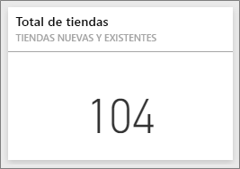
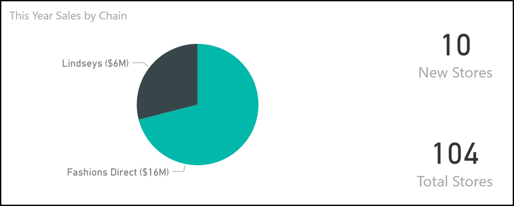
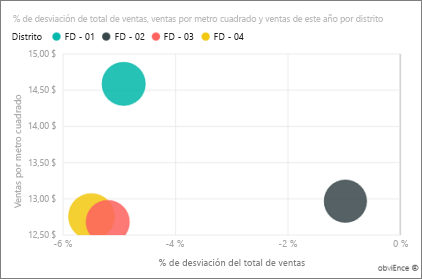
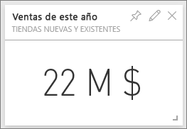
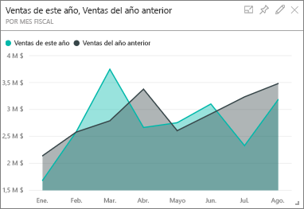
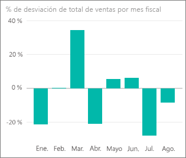
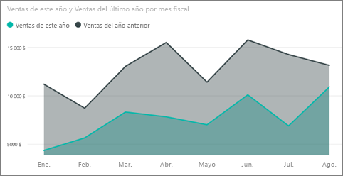
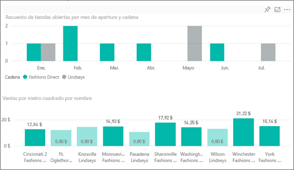

# Ejemplo de análisis de minoristas para Power BI: Dar un paseo

El paquete de contenido del ejemplo de análisis de minoristas contiene un panel, un informe y un conjunto de datos donde se analizan los datos de las ventas minoristas de los artículos vendidos en varias tiendas y distritos. Las métricas comparan el rendimiento de este año con el del año anterior en ventas, unidades, margen bruto y desviación, así como el análisis de tiendas nuevas. 

Este ejemplo forma parte de una serie en la que se muestra cómo puede usar Power BI con datos, informes y paneles empresariales. Se ha creado mediante [obviEnce](http://www.obvience.com/) con datos reales anonimizados. Los datos están disponibles en varios formatos: paquete de contenido, archivo .pbix de Power BI Desktop o libro de Excel. Consulte [Ejemplos de Power BI](sample-datasets.md). 

En este tutorial se explora el paquete de contenido de ejemplo de análisis de minoristas del servicio Power BI. Dado que la experiencia de informes es similar en Power BI Desktop y en el servicio, también puede proceder con el archivo .pbix de ejemplo de Power BI Desktop. 

Para explorar los ejemplos de Power BI Desktop, no necesita una licencia de Power BI. Si no tiene una licencia de Power BI Pro, puede guardar el ejemplo en Mi área de trabajo del servicio Power BI. 

## Obtención del ejemplo

 Para poder usar el ejemplo, primero debe descargarlo como un [paquete de contenido](#get-the-content-pack-for-this-sample), un [archivo .pbix](#get-the-pbix-file-for-this-sample) o un [libro de Excel](#get-the-excel-workbook-for-this-sample).

### Obtención del paquete de contenido de este ejemplo

1. Abra el servicio Power BI (app.powerbi.com), inicie sesión y abra el área de trabajo donde desea guardar el ejemplo. 

    Si no tiene una licencia de Power BI Pro, puede guardar el ejemplo en Mi área de trabajo.

2. En la esquina inferior izquierda, seleccione **Obtener datos**.

    
3. En la página **Obtener datos**, seleccione **Ejemplos**.
   
4. Seleccione **Ejemplo de análisis de minoristas** y, luego, elija **Conectar**.  
  
   
   
5. Power BI importa el paquete de contenido y agrega un panel, un informe y un conjunto de datos nuevos en el área de trabajo actual.
   
   
  
### Obtención del archivo .pbix de este ejemplo

Como alternativa, puede descargar el ejemplo de análisis de minoristas como un [archivo .pbix](https://download.microsoft.com/download/9/6/D/96DDC2FF-2568-491D-AAFA-AFDD6F763AE3/Retail%20Analysis%20Sample%20PBIX.pbix), que está diseñado para su uso con Power BI Desktop. 

### Obtención del libro de Excel de este ejemplo

Si desea ver el origen de datos de este ejemplo, también está disponible como un [libro de Excel](https://go.microsoft.com/fwlink/?LinkId=529778). El libro contiene hojas de Power View que puede ver y modificar. Para ver los datos sin procesar, habilite los complementos de análisis de datos y, a continuación, seleccione **Power Pivot > Administrar**. Para habilitar los complementos Power View y Power Pivot, vea [Exploración de los ejemplos de Excel en Excel](sample-datasets.md#explore-excel-samples-inside-excel) y obtendrá más información.

## Iniciar el panel y abrir el informe

1. En el área de trabajo donde guardó el ejemplo, abra la pestaña **Paneles** y elija el panel **Ejemplo de análisis de minoristas**. 
2. En el panel, seleccione el icono **Total Stores New & Existing Stores** (Total de tiendas nuevas y tiendas existentes), lo que abre la página **Información general de las ventas de la tienda** en el informe Ejemplo de análisis de minoristas. 

     

   En esta página del informe, verá que tiene un total de 104 tiendas, donde 10 de las cuales son nuevas. Tenemos dos cadenas, Fashions Direct y Lindseys. En promedio, las tiendas Fashions Direct son más grandes.
3. En el gráfico circular **Ventas de este año por cadena**, seleccione **Fashions Direct**.

     

   Observe el resultado en el gráfico de burbujas **% de desviación del total de ventas**:

     

   El distrito **FD-01** tiene el mayor promedio de **ventas por pie cuadrado**, mientras que el distrito FD-02 tiene la menor **desviación de ventas totales** en comparación con el año pasado. FD-03 y FD-04 son los que menos cumplen.
4. Seleccione las burbujas individuales o en los otros gráficos para ver de forma transversal el impacto de las selecciones resaltado.
5. Para volver al panel, seleccione **Ejemplo de análisis de minoristas** en el panel de navegación superior.

   
6. En el panel, seleccione el icono **Tiendas nuevas y existentes por ventas de este año**, que equivale a escribir *Ventas de este año* en el cuadro de pregunta Preguntas y respuestas.

   

   Aparecen los resultados de Preguntas y respuestas:

   

## Revisar un icono creado con Preguntas y respuestas de Power BI
Seamos más específicos.

1. Agregue la pregunta a _ventas de este año **por distrito**_ . Observe el resultado: Preguntas y respuestas coloca automáticamente la respuesta en un gráfico de barras y sugiere otras frases:

   
2. Ahora, cambie la pregunta a _ventas de este año **por código postal y cadena**_ .

   Observe cómo Power BI responde a la pregunta a medida que se escribe y muestra el gráfico correspondiente.
3. Experimente con más preguntas y observe qué tipo de resultados obtiene.
4. Cuando esté listo, vuelva al panel.

## Explorar los datos en profundidad
Ahora vamos a explorar en un nivel más detallado, observando el rendimiento de los distritos.

1. En el panel, seleccione el icono **Ventas de este año, ventas del año anterior**, con lo que se abre la página **Ventas mensuales del distrito** del informe.

   

   En el gráfico **% de desviación de ventas totales por mes fiscal**, observe la gran variabilidad en el % de desviación en comparación con el año anterior, con los meses de enero, abril y julio especialmente malos.

   

   Veamos si podemos delimitar dónde pueden encontrarse los problemas.
2. En el gráfico de burbujas, seleccione la burbuja **020-Hombres**.

     

   Observe que si bien la categoría de hombres no se vio tan gravemente afectada en abril como el negocio en general, los meses de enero y julio siguieron siendo meses problemáticos.
1. Seleccione la burbuja **010-Mujeres**.

   

   Observe que la categoría de mujeres tuvo un rendimiento mucho peor que el negocio en general a lo largo de todos los meses y en casi cada mes en comparación con el año anterior.
1. Seleccione la burbuja de nuevo para borrar el filtro.

## Probar la segmentación
Echemos un vistazo al progreso de los distritos específicos.

1. Seleccione **Allan Guinot** en la segmentación **Administrador del distrito** en la parte inferior izquierda.

   

   Observe que el distrito de Allan tuvo un rendimiento mayor en marzo y junio, en comparación con el año pasado.
2. Con **Allan Guinot** todavía seleccionado, seleccione la burbuja **Mujeres-10** en el gráfico de burbujas.

   

   Observe que el distrito de Allan no cumplió con el volumen del año pasado en la categoría Mujeres-10.
3. Explore los demás administradores y categorías del distrito: ¿qué otra información útil pueden encontrar?
4. Cuando esté listo, vuelva al panel.

## Qué dicen los datos sobre el crecimiento de las ventas este año
La última área que deseamos explorar es nuestro crecimiento y lo haremos examinando las nuevas tiendas que se han abierto este año.

1. Seleccione el icono **Tiendas abiertas este año por mes de apertura, cadena**, con lo que se abre la página **Análisis de nuevas tiendas** del informe.

   

   Como puede deducirse a partir del icono, se abrieron más tiendas Fashions Direct este año que tiendas Lindseys.
2. Observe el gráfico **Ventas por pie cuadrado por nombre**:

   

    Observe la diferencia en las ventas promedio por pie cuadrado entre las tiendas nuevas.
3. Seleccione el elemento de la leyenda **Fashions Direct** en el gráfico **Recuento de tiendas abiertas por mes de apertura y cadena** que se encuentra en la esquina superior derecha. Observe que, incluso para la misma cadena, la mejor tienda (Winchester Fashions Direct) supera significativamente a la peor tienda (Cincinnati 2 Fashions Direct): USD 21,22 frente a USD 12,86, respectivamente.

   
4. Seleccione **Winchester Fashions Direct** en la segmentación **Nombre** y observe el gráfico de líneas. Las primeras cifras de ventas se notificaron en febrero.
5. Seleccione **Cincinnati 2 Fashions Direct** en la segmentación y observe el gráfico de líneas que se abrió en junio y que parece ser la tienda con peor rendimiento.
6. Para explorar, seleccione otras barras, líneas y burbujas de los gráficos y vea qué información útil puede obtener.

## Pasos siguientes: Conexión con los datos
Este entorno es seguro porque puede elegir no guardar los cambios. Pero si los guarda, en **Obtener datos** podrá obtener una nueva copia de este ejemplo siempre que lo desee.

Esperamos que este paseo le haya mostrado cómo los paneles de Power BI, Preguntas y respuestas y los informes pueden ofrecer recomendaciones sobre los datos de ejemplo. Ahora es su turno: conéctese a sus propios datos. Con Power BI puede conectarse a una gran variedad de orígenes de datos. Para obtener más información, consulte [Introducción al servicio Power BI](../fundamentals/service-get-started.md).
